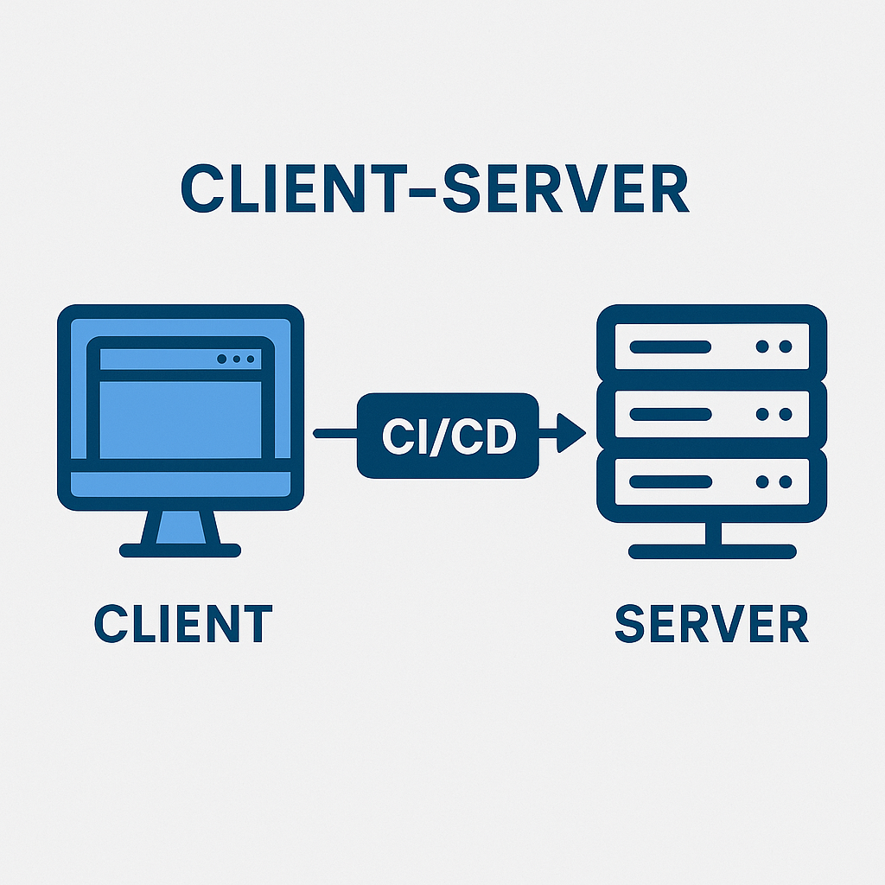

# 🖥️ CI / CD

CI/CD é a sigla para Integração Contínua (Continuous Integration) e Entrega/Implantação Contínua (Continuous Delivery/Deployment).

É uma prática de desenvolvimento que automatiza testes, builds e deploys, permitindo que mudanças no código sejam integradas, testadas e publicadas com rapidez, segurança e frequência.

O modelo **Client-Server** se encaixa como a arquitetura típica onde essas mudanças são aplicadas.

No modelo **Client-Server**, o **cliente** (navegador, app, etc.) faz requisições e o **servidor** responde com dados ou serviços.

O CI/CD entra como mecanismo para automatizar atualizações no servidor (backend) e no cliente (frontend), garantindo que novas versões do sistema sejam entregues de forma rápida e confiável, sem interrupção no funcionamento do serviço.

Vamos evitar trabalhos manuais e erros comuns, bora automatizar.

## 🏨 Hospedando arquivos

Precisamos de um servidor na nuvem que fique sempre disponível na internet 24h para qualquer um acessar.

Vamos usar a Vercel pra hospedar o projeto.

1. Crie uma conta e vincule ao GitHub.
2. De permissão ao seu projeto **clone-tabnews**.
3. Avance e por fim, faça o deploy padrão.

Será gerado link de produção similar a [esse](https://clone-tabnews-steel-kappa.vercel.app/).

A cada nova alteração no projeto, empurrada via **git push**, irá ativar o robô da Vercel. 🤖

Ele irá fazer o processo de publicação das atualizações automagicamente. 🪄
