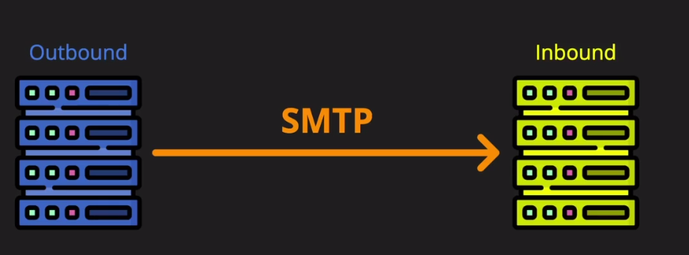
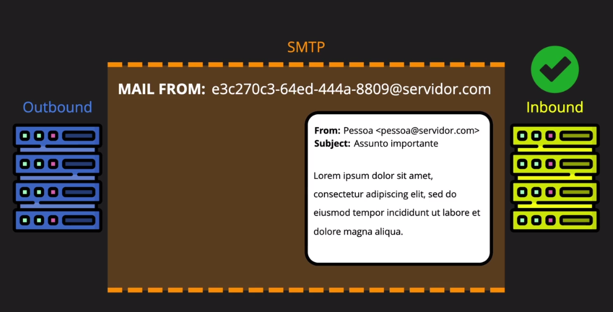
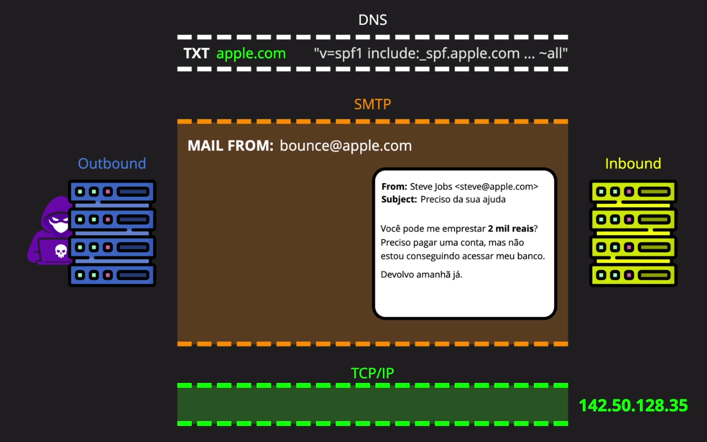
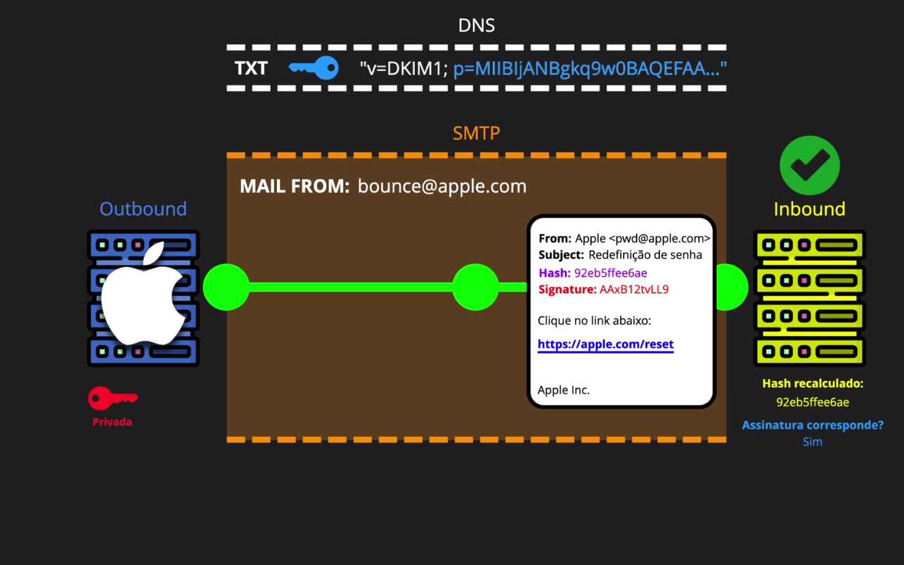
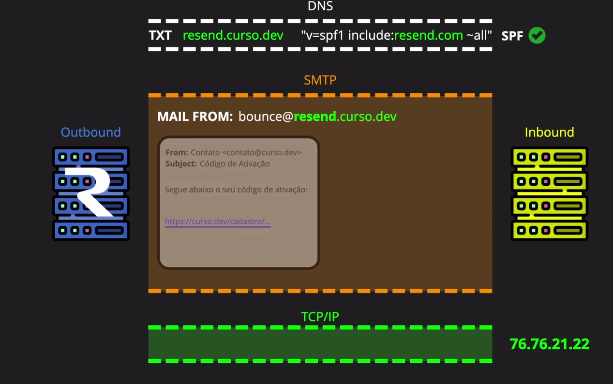

# O que realmente é SPF, DKIM e DMARC?

Essa é mais uma sopa de letrinhas relacionada a e-mails. Mas calma que vai ser tranquilo, vamos ver isso de forma prática.

## Falando de história

Um e-mail é a comunicação de um servidor SMTP (envia), para outro servidor SMTP (recebe). Tudo era na base da confiança, sem configurações extras de validação.



Servidor outbound(saída/envia), Servidor inbound(entrada/recebe).

Caso haja alguma falha na transmissão, é enviado email técnico para o bounce (caixa de devolução), que é o endereço de retorno do e-mail.



E era assim que era feito, até percebermos que isso era uma péssima ideia. Qualquer um poderia alterar o mail from, fazendo parecer que o e-mail foi enviado por outra pessoa. Sem falar em fraudes, spam entre outros.

Foi ai que foi inventado o SPF - Sender Policy Framework.

## SPF

O SPF é um registro DNS que diz quais servidores estão autorizados a enviar e-mails para o domínio. E pra verificar isso, o servidor inbound consulta o DNS do domínio e verifica se o servidor outbound está autorizado.

Dessa forma, qualquer servidor que não esteja na lista será barrado. Só dono do dominío consegue criar um registro com IPs autorizados.

O padrão é:

```
TXT v=spf1 mx a ip4:[IP_ADDRESS] ip4:[IP_ADDRESS] ~all
```

Ou:

```
TXT v=spf1 include:spf.google.com ~all
```

Vejamos o que cada um significa:

- v=spf1: Versão 1 do SPF
- mx: Aceita e-mails enviados pelos servidores MX (Mail eXchange) do domínio
- a: Aceita e-mails enviados pelos servidores A (Address) do domínio
- ip4:[IP_ADDRESS]: Aceita e-mails enviados pelo endereço IP [IP_ADDRESS]
- ip4:[IP_ADDRESS]: Aceita e-mails enviados pelo endereço IP [IP_ADDRESS]
- include:[IP_ADDRESS]: Inclui os servidores autorizados do domínio
- ~all: Rejeita e-mails enviados por outros servidores

Agora o fluxo fica assim



Pra checar no terminal o endereço de e-mail do google:

```bash
  dig _spf.google.com -t TXT
```

```txt
;; ANSWER SECTION:
_spf.google.com.        300     IN      TXT     "v=spf1 ip4:74.125.0.0/16 ip4:209.85.128.0/17 ... ~all"
```

O SPF ficou mais de uma década "amadurecendo" (2003-2014), e durante esse tempo atacantes poderiam alterar o conteúdo no meio do caminho. O SPF valida apenas o remetente (mail from), e o payload do e-mail poderia ser de qualquer um.

## DKIM

Então em 2011 foi criado o DKIM - DomainKeys Identified Mail. O DKIM adiciona uma assinatura digital ao e-mail, que é verificada pelo servidor inbound. Dessa forma, qualquer alteração no conteúdo do e-mail será detectada.

Então, é calculado um hash do conteúdo do e-mail, e assinado com a chave privada do domínio. O servidor inbound verifica a assinatura com a chave pública do domínio.

Qualquer coisa que altere o conteúdo quebra o lacre. o DKIM é como um lacre.

A idéia é colocar a chave pública no DNS do domínio. O endereço é sempre: `seletor._domainkey.seudominio.com`

exemplo:

```
google._domainkey.google.com TXT "v=DKIM1; k=rsa; p=MIIBIjANBgkqhkiG9w0BAQEFAAOCAQ8AMIIBCgKCAQEA ..."
```



Detalhes do DKIM Signature:

- d: domínio
- s: seletor
- v: versão
- bh: hash do corpo do e-mail
- b: hash assinado
- h: hash dos cabeçalhos
- c: qualidade da assinatura

E até aqui temos 2 camadas de proteção.

- O SPF protege contra falsificação do remetente.
- O DKIM protege contra falsificação do conteúdo do e-mail.

Mas ainda não é suficiente. Um golpista poderia falsificar o remetente e o conteúdo do e-mail, mas não conseguiria falsificar a assinatura do DKIM. E o golpista poderia falsificar a assinatura do DKIM, mas não conseguiria falsificar o remetente.

## DMARC

DMARC - Domain-based Message Authentication, Reporting, and Conformance. O DMARC é um protocolo que define como os servidores de e-mail devem lidar com e-mails que falham na verificação de SPF e DKIM.

Temos aqui 3 partes:

- Authentication: Autenticação - Define como os servidores de e-mail devem lidar com e-mails que falham na verificação de SPF e DKIM.
- Reporting: Relatório - Envia relatórios para o domínio sobre e-mails que falham na verificação de SPF e DKIM.
- Conformance: Conformidade - Define como os servidores de e-mail devem lidar com e-mails que falham na verificação de SPF e DKIM.

Na conformidade podemos definir 3 ações:

p=reject: E-mails que falham na verificação de SPF e DKIM são rejeitados.
p=none: Nenhuma ação é tomada sobre e-mails que falham na verificação de SPF e DKIM.
p=quarantine: E-mails que falham na verificação de SPF e DKIM são colocados em quarentena.

Pra checar o dmarc do google:

```bash
  dig _dmarc.curso.dev -t TXT
```

```txt
;; ANSWER SECTION:
_dmarc.curso.dev.       300     IN      TXT     "v=DMARC1; p=reject; pct=100; rua=mailto:re+phawnnlki0p@dmarc.postmarkapp.com; aspf=r;"
```

- rua: Relatório agregados sobre e-mails que falham na verificação de SPF e DKIM.
- aspf: Align SPF com tag 'r' - relaxado ou 's' - estrito.



### Resumão

| Protocolo | O que faz                                                                                            |
| --------- | ---------------------------------------------------------------------------------------------------- |
| SPF       | Define quais servidores estão autorizados a enviar e-mails para o domínio.                           |
| DKIM      | Adiciona uma assinatura digital ao e-mail, que é verificada pelo servidor inbound.                   |
| DMARC     | Define como os servidores de e-mail devem lidar com e-mails que falham na verificação de SPF e DKIM. |
