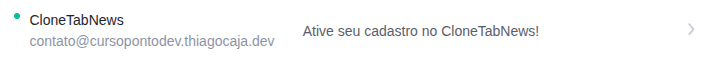

# Configurando email na Resend

Crie uma conta na [resend.com](https://resend.com/)

Agora adicione seu dominio e libere os acessos pra configuração. Se você usa Vercel ou Cloudflare, atualize conforme as indicações da plataforma.

No meu caso ficou cursopontodev.thiagocaja.dev -> configurações geradas:

- DKIM -> TXT -> resend.\_domainkey.cursopontodev -> O DKIM é uma assinatura digital para autenticar o domínio
- SPF -> MX -> send.cursopontodev -> O MX aponta para o servidor que deve receber os emails
- SPF -> TXT -> send.cursopontodev -> O TXT aponta para o servidor que pode enviar emails

Obs: Se o seu dominio principal ja tiver um DMARC, ele é herdado para subdominios. Caso contrario, adicione um DMARC para o seu dominio.

Pra testar no terminal, use o `dig`

```bash
dig send.cursopontodev.thiagocaja.dev TXT
```

## Fluxo de envio de emails

Então a Resend faz da seguinte forma. O serviço usa Amazon SES por baixo dos panos:

1. O email é enviado para o servidor SMTP da Resend
2. O servidor SMTP da Resend autentica com o seu domínio
3. A Resend entrega o email para o destinatário

## Configurando API KEY na Resend

Pra aplicação poder ser conectar no serviço de envio de emails da resend, precisamos informar a API KEY no arquivo `.env`.

Ex: STAGING_CURSO_PONTO_DEV

## Configurando o uso da API da Resend na Vercel

Acesse seu dominio e configure com os mesmos nomes definidos na aplicação

```js
  EMAIL_SMTP_HOST=smtp.resend.com
  EMAIL_SMTP_PORT=465
  EMAIL_SMTP_USER=resend
  EMAIL_SMTP_PASSWORD=<API_KEY>
```

Para as configurações serem atualizadas, faça um redeploy da aplicação (preview).

## Configurando o postmarkapp.com

No postmarkapp.com temos um processo similar. O domínio é configurado no painel do Postmark e ele vai gerar os registros pra você configurar no seu DNS.

## Testando o envio do e-mail

```js
fetch("/api/v1/users", {
  method: "POST",
  headers: {
    "Content-Type": "application/json",
  },
  body: JSON.stringify({
    username: "test50",
    password: "test",
    email: "seu-email-aqui-pra-testar@seu-dominio.com",
  }),
});
```

No meu caso, tive que fazer alguns ajustes removendo referencias do FinTab no arquivo models/activation.js e nos testes.

Depois disso, tudo ok no fluxo de envio e recebimento de emails.



Testei com a ferramenta https://temp-mail.org/ para gerar emails temporarios.
