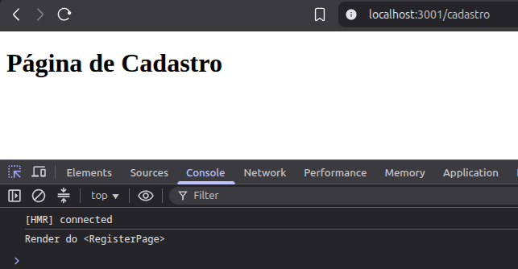
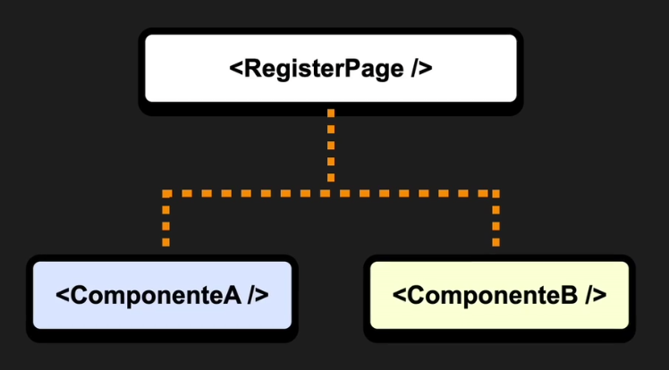
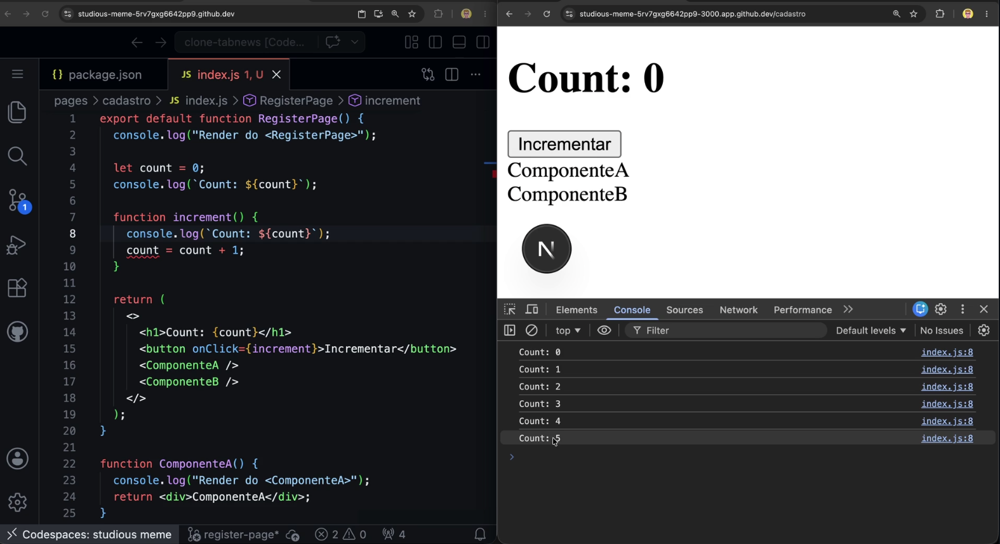

# Mão na massa

Vamos então usar de trilha a criação da página pra rota `/cadastro`.

```js
// nova rota criada em pt-BR mesmo, pois é o caminho que será exibido pro usuário final
pages/cadastro/index.js

// e dentrodo arquivo temos
export default function RegisterPage() {
  return <h1>Página de Cadastro</h1>;
}
```

O React diferencia tags e componentes observando a letra inicial. Então, temos que escrever componentes usando `PascalCase`.

## Intensivão de React

Vamos começar pelo básico, analisando a saída do `console.log`:

```js
export default function RegisterPage() {
  console.log("Render do <RegisterPage>");
  return <h1>Página de Cadastro</h1>;
}
```




O `console.log` foi executado porque o React chamou a função `RegisterPage()`. Essa função representa o componente e será executada novamente sempre que o React precisar renderizá-lo.

Isso acontece porque, no React, renderizar um componente significa **executar sua função novamente** para descobrir qual deve ser a próxima interface.

Após essa execução, o React compara o resultado da renderização atual com o da renderização anterior. Esse processo de comparação é conhecido como **reconciliação (reconciliation)** e é realizado pela arquitetura moderna do React, chamada **Fiber Tree** (antigamente era comum explicar esse processo apenas como uma comparação do *Virtual DOM*).

Com essa comparação, o React identifica exatamente o que mudou e aplica apenas as alterações necessárias ao DOM real, tornando as atualizações mais eficientes.

### Modo Estrito

Se no log aparecerem 2 vezes a execução do componente, pode ser que o `strict mode` esteja habilitado. E o React traz isso em modo desenvolvimento pra testar a aplicação e forçar bugs. Ele pode estar habilitado em Pages Router e App Router, do NextJS.

Esse é um recurso bom, porém para aprendizado, acaba atrapalhando a compreensão e didatica.

### Criando componentes

Então vamos criar 2 componentes filhos e ver novamente o log do console.

```js
export default function RegisterPage() {
  console.log("Render do <RegisterPage>");
  return (
    <>
      <h1>Cadastro</h1>
      <ComponenteA />
      <ComponenteB />
    </>
  );
}

function ComponenteA() {
  console.log("Render do <ComponenteA>");
  return <h1>Componente A</h1>;
}

function ComponenteB() {
  console.log("Render do <ComponenteB>");
  return <h1>Componente B</h1>;
}
```
O que temos então é essa estrutura



Agora o react precisa de um gatilho pra se mexer. O gatilho inicial é o boot(carregamento) da aplicação.


### Mais um pouco sobre Closures do JavaScript

Veja o exemplo abaixo:



Pelo escopo lexico (agrupamento), a função `increment` tem acesso a variável `contador` e a função `console.log`, mesmo estando fora dela.

```js
export default function RegisterPage() {
  console.log("Render do <RegisterPage>");

  let count = 0;
  console.log(`Count: ${count}`);

  function increment() {
    console.log(`Count: ${count}`);
    count = count + 1;
  }

  return (
    <>
      <h1>Count: {count}</h1>
      <button onClick={increment}>Incrementar</button>
      <ComponenteA />
      <ComponenteB />
    </>
  );
}

function ComponenteA() {
  console.log("Render do <ComponenteA>");
  return <h1>Componente A</h1>;
}

function ComponenteB() {
  console.log("Render do <ComponenteB>");
  return <h1>Componente B</h1>;
}
```

Isso acontece porque, no JavaScript, **funções aninhadas retêm acesso ao ambiente léxico onde foram criadas**, ou seja, elas "lembram" das variáveis e funções que estavam disponíveis no momento da sua criação.

É possivel ver no console do navegador que o valor do contador é atualizado a cada clique, porém na tela não é renderizado.

> [NOTE]  
> Cada vez que o React renderiza, ele faz um snapshot do estado atual e renderiza novamente o componente.  
> É como se ele tirasse uma foto da página, guardando os valores a cada atualização.

Ou seja, se a cada vez que a página for atualizada por algum motivo, o contador volta ao estado inicial. E temos então, um contador que não conta.