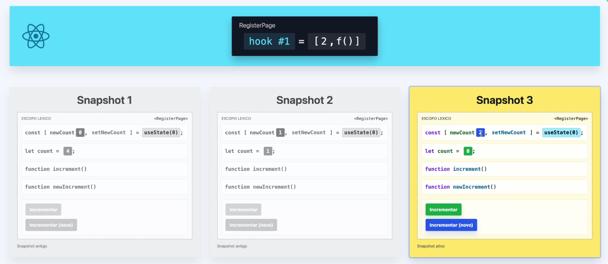

# Como manter a memória

Manter a memória ou estado entre os renders (atualizações) é crucial toda vez que o React precisa recriar um snapshot. E a resposta pra isso
é a utilização de `Hooks` (Ganchos)

## Trabalhando com Hooks

Eles não servem só pra guardar memória. Eles servem pra fazer um **enganchamento** entre o seu componente e recursos que existem fora da execução normal.

### Hook especializado: useState

`useState` é o hook que serve pra gerenciar memória interna do componente. Pra usa-lo é bem simples:

```js
import { useState } from "react";

export default function RegisterPage() {
  console.log("Render do <RegisterPage>");

  useState("Valor inicial"); // <--- Hook iniciado. É uma função normal, executada a cada render.

  let count = 0;
  console.log(`Count: ${count}`);
  // demais codigos...
}
```

Ao executar o código acima o React vai devolver um Array:
```js
[
  "Valor inicial",
  null
]
```

O primeiro item é o valor atual do estado e o segundo item é uma função que atualiza o valor do estado. Como o `useState` retorna um Array
tradicionalmente usamos o destructuring do Javascript para nomear as variáveis:

```js
const [valorAtual, funcaoDeAtualizacao] = useState("Valor inicial");

// Seguindo as convenções da comunidade do React, o nome da variável é sempre
// o nome do estado seguido de "set" para a função que atualiza o estado.

// Exemplo: valor atual "newCount" e função "setNewCount"
const [newCount, setNewCount] = useState(0);
```
### Renderizar vs Pintar

A diferença entre renderizar (atualizar) um componente e pintar (desenhar ele na tela) é sutil mas importante:

* **Renderizar**: Calcula a arvore dos componentes, faz a conciliação com a DOM e atualiza apenas o que precisa
* **Pintar**: Desenha o componente na tela


# O problema de Closures Obsoletos

Na imagem abaixo, temos a explicação visual do que acontece quando executamos ambas as funções de incrementar.



Uma delas atualiza o contador no escopo lexico. A outra irá criar um novo snapshot e atualiza e chama a função do useState, que renderiza o componente e atualiza o valor na tela. Porém com o novo snapshot, os valores count local são perdidos. E a referência ao snapshot anterior é perdida, ficando candidato ao garbage collector.

## Trabalhando com efeitos colaterais

Se tivermos por exemplo uma função fora do React que interage apenas com navegador. ex: `setInterval`. Ele fica preso ao escopo do componente e com isso, ao renderizar o componente novamente, é criado um novo `setInterval`. Para resolver isso é preciso criar uma função que limpe o efeito colateral antes de criar um novo. Para isso usamos `useEffect`.

```js
useEffect(() => {
  console.log("[Effect setup] isso vai ser impresso depois do commit")

  return () => {
    console.log("[Effect cleanup] isso vai ser impresso antes do proximo setup")
  };
});
```
Esse hook do React permite fazer duas coisas:
- Executar código "depois" do commit
- Limpar o efeito "antes" do proximo commit

Vamos a mais um exemplo:

```js
useEffect(() => {
    const intervalId = setInterval(function () {
        console.log(`[setInterval] count: ${count} | newCount: ${newCount}`);
        console.log("");
    }, 2000);

    return () => {
        console.log(
            "[effect cleanup] Isso vai ser impresso antes do próximo effect"
        );

        console.log(
            `[effect cleanup] count: ${count} | newCount: ${newCount}`
        );

        clearInterval(intervalId);
    };
}, [newCount]);
```


O ponto principal é entender que o `useEffect` está **amarrado ao valor de `newCount`**:

```js
}, [newCount]);
```

Isso significa:

> Execute este effect novamente quando `newCount` mudar.

### Fluxo

Quando `newCount` muda:

```text
newCount mudou
      ↓
cleanup do effect anterior
      ↓
clearInterval()
      ↓
novo effect
      ↓
novo setInterval()
```

### Em outras palavras

1. O `useEffect` cria um `setInterval`.
2. O `setInterval` começa a executar a cada 2 segundos.
3. `newCount` muda.
4. Antes de executar o novo effect, o React executa o **cleanup** anterior.
5. O `clearInterval()` encerra o interval antigo.
6. O React executa o effect novamente.
7. Um novo `setInterval` é criado.

O `return` dentro do `useEffect` é o **cleanup**. Ele serve para limpar o que o effect criou antes que um novo effect seja executado ou que o componente seja desmontado.