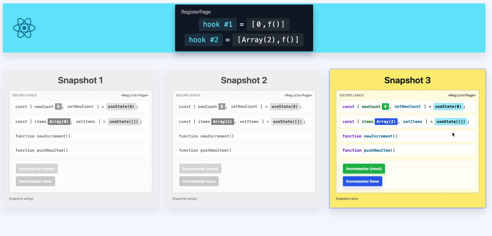

# O problema de Identidade por Referência

Um dos "bugs" mais clássicos e traiçoeiros do React acontece assim: você altera um Array, chama a função atualizadora do state, espera a tela atualizar... e nada acontece.

O motivo não é o React estar quebrado. É que ele **não olha o conteúdo** do valor pra decidir se precisa renderizar de novo. Ele compara **a identidade** (a referência) do valor antigo com a do novo, usando `Object.is()`.

Se a referência for a mesma, o React entende que nada mudou e cancela a renderização, mesmo que o conteúdo lá dentro esteja diferente.

## Valor por cópia vs valor por referência

No JavaScript existem dois grupos de tipos, e eles se comportam de formas bem diferentes quando atribuídos:

- **Primitivos** (`number`, `string`, `boolean`, `null`, `undefined`, `symbol`, `bigint`): são copiados **por valor**. Cada variável guarda a sua própria cópia.
- **Objetos** (`object`, `array`, `function`, `Date`, `Map`, `Set`...): são copiados **por referência**. A variável guarda apenas o endereço de memória de onde o valor mora.

### Primitivo: cada um na sua caixa

```js
let a = 10;
let b = a; // b recebe uma CÓPIA do valor

b = 20;

console.log(a); // 10  <- não foi afetado
console.log(b); // 20
```

### Objeto: duas etiquetas, uma caixa só

```js
const listaOriginal = ["banana", "maçã"];
const listaCopia = listaOriginal; // NÃO é uma cópia, é o MESMO endereço

listaCopia.push("uva");

console.log(listaOriginal); // ["banana", "maçã", "uva"]  <- mudou junto!
console.log(listaCopia); // ["banana", "maçã", "uva"]

console.log(listaOriginal === listaCopia); // true, é o mesmo objeto
```

E é justamente esse `true` que faz o React ignorar a atualização.

```js
const a = { nome: "Thiago" };
const b = { nome: "Thiago" };

console.log(a === b); // false, conteúdo igual mas endereços diferentes
console.log(Object.is(a, b)); // false
console.log(a.nome === b.nome); // true, aqui comparamos primitivos
```

## O bug na prática

Vamos reproduzir na página de cadastro. Um botão que sorteia um número e empurra dentro de um array de itens:

```js
export default function RegisterPage() {
  const [items, setItems] = useState([]);

  function pushNewItem() {
    const newItem = Math.random();

    items.push(newItem); // mutação: mexeu DENTRO do array existente
    console.log("Items:", items);

    setItems(items); // mesma referência de antes
  }

  return (
    <>
      <h1>Items: {items.length}</h1>
      <button onClick={pushNewItem}>Incrementar itens</button>
    </>
  );
}
```

Clicando duas vezes no botão, o console mostra que o array **está crescendo**:

```
Items: ▸ [0.4203230277778083]
Items: ▸ (2) [0.4203230277778083, 0.3264011592606345]
```

Mas na tela continua escrito `Items: 0`. E repare no console: depois do primeiro `Render do <RegisterPage>` inicial, **nenhum render novo aconteceu**.

### Por que a tela não atualiza

Vamos seguir o passo a passo do que o React faz em cada clique:

1. `items.push(newItem)` altera o array **por dentro**. O dado realmente entrou, e é por isso que o `console.log` mostra ele lá.
2. `setItems(items)` entrega ao React exatamente **o mesmo endereço de memória** que ele já tinha guardado.
3. O React compara: `Object.is(itemsAntigo, itemsNovo)`. Como é a mesma caixa, o resultado é `true`.
4. Concluindo que nada mudou, o React faz um **bail out**: cancela a renderização.
5. Sem renderização, a função `RegisterPage()` não é executada de novo, o JSX não é recalculado e o `{items.length}` que está pintado na tela continua sendo o do primeiro render, quando o array estava vazio.

> O `console.log` mente pra você aqui. Ele lê a memória no instante do clique e mostra o array já atualizado, dando a impressão de que o state funcionou. Quem está desatualizado é a **tela**, não o dado.

### Provando no console

Não precisa acreditar na explicação, dá pra reproduzir tudo na mão. Abra o console do navegador e digite linha por linha:

```js
> items;
< []                        // array vazio, como o state começou

> items.push(123);
< 1                         // repare: NÃO devolveu o array

> items;
< [123]                     // o conteúdo mudou de verdade

> Object.is(items, items);
< true                      // mas continua sendo o MESMO objeto
```

Três lições saem daí:

1. **O `push()` devolve o novo tamanho do array, não o array.** Por isso `setItems(items.push(newItem))` é um erro ainda maior: o state viraria o número `1` em vez de uma lista.
2. **O conteúdo mudou** (`[]` virou `[123]`), então o dado está lá, exatamente como o `console.log` da aplicação mostrou.
3. **`Object.is(items, items)` devolve `true`.** E essa última linha é literalmente a conta que o React faz por baixo dos panos antes de decidir se renderiza. Ela deu `true`, então pro React não houve mudança alguma.

### Conteúdo igual não é o mesmo valor

Continuando o experimento, agora comparando o `items` com um array escrito à mão, de conteúdo idêntico:

```js
> items;
< [123]

> Object.is(items, items);
< true                      // mesma variável, mesma caixa

> Object.is(items, [123]);
< false                     // MESMO conteúdo, caixas diferentes

> Object.is([123], [123]);
< false                     // dois literais idênticos, e ainda assim diferentes
```

Esse último resultado é o que fecha o entendimento. Dois arrays escritos lado a lado, com exatamente o mesmo número dentro, **não são o mesmo valor**. Cada vez que o JavaScript encontra um `[`, ele constrói uma caixa nova, num endereço novo. O que está escrito dentro dela não interessa pra comparação.

Compare com o que acontece entre primitivos:

```js
> Object.is(123, 123);
< true                      // primitivo: mesmo valor é o mesmo valor
```

Aí está a assimetria que causa toda a confusão: com número, "igual" e "o mesmo" são a mesma coisa. Com array e objeto, não são. E o React usa sempre a régua do "é o mesmo?", nunca a do "está igual?".

> Ou seja, o React **nunca vai olhar dentro** do seu array pra descobrir que você adicionou um item. Ele só olha a etiqueta de endereço.

### O outro lado: a versão que funciona

```js
> const novo = [...items, 456];
> novo;
< [123, 456]                // conteúdo novo

> Object.is(items, novo);
< false                     // e, principalmente, identidade nova
```

É esse `false` que faz o React trabalhar. Repare que ele não veio de o conteúdo ser diferente, e sim de o spread ter construído uma caixa nova. Mesmo um `[...items]` sem adicionar nada já daria `false`.

### A tela "acorda" quando outra coisa muda

Aqui o bug fica ainda mais traiçoeiro. Sem tocar no botão de itens, clique no outro botão, o `Incrementar (novo)`:

```js
function newIncrement() {
  setNewCount(newCount + 1); // number é primitivo: 0 e 1 são valores diferentes
}
```

De repente a tela mostra `newCount: 1` **e** `Items: 2`. Os dois itens apareceram de uma vez, sem que ninguém clicasse em "Incrementar itens" de novo.

Repare na ordem do console, que conta a história inteira:

```
Items: ▸ [0.4203230277778083]                              <- clique 1 no "Incrementar itens"
Items: ▸ (2) [0.4203230277778083, 0.3264011592606345]      <- clique 2 no "Incrementar itens"
Render do <RegisterPage>                                   <- só agora, no clique do "Incrementar (novo)"
Render do <ComponenteA>
Render do <ComponenteB>
```

Os dois `push` aconteceram **antes** de qualquer render. Nenhum deles conseguiu renderizar nada.

#### Por que agora atualizou

1. `setNewCount(newCount + 1)` passa um **número**, que é primitivo. O React compara `Object.is(0, 1)` e o resultado é `false`.
2. Detectando a mudança, ele agenda a renderização e executa `RegisterPage()` de novo. Daí os logs de render aparecerem (os filhos `ComponenteA` e `ComponenteB` renderizam junto, por serem filhos).
3. Ao reexecutar a função, o JSX é recalculado **do zero**. A linha `<h1>Items: {items.length}</h1>` vai ler o `items.length` **agora**, e `items` é aquele mesmo array que já foi mutado duas vezes lá atrás.
4. Como o array tem 2 posições, a tela pinta `Items: 2`.

Colocando os dois cliques lado a lado fica fácil de enxergar a diferença:

| Pergunta                  | "Incrementar itens"   | "Incrementar (novo)"        |
| ------------------------- | --------------------- | --------------------------- |
| Tipo do valor             | array (objeto)        | number (primitivo)          |
| Como foi alterado         | mutado com `push()`   | novo valor calculado (`+1`) |
| A referência mudou?       | não, mesmo endereço   | sim, é outro valor          |
| `Object.is(antigo, novo)` | `true`                | `false`                     |
| O React renderizou?       | não, fez bail out     | sim                         |
| A tela atualizou?         | não, continuou em `0` | sim, mostrou `2` de uma vez |

O ponto central: **o clique no outro botão não salvou nada**. Os itens já estavam no array desde o primeiro clique. O que faltava era alguém pedir um render, e quem pediu foi o `setNewCount`, por um motivo que não tem relação nenhuma com a lista.

> É a diferença entre o React ser reativo ao **dado** e ser reativo à **notificação de mudança**. Ele é a segunda opção. Se você altera o dado sem notificar corretamente, o estado fica certo e a tela fica mentindo.

E isso não é um "jeitinho" que dá pra usar. Você fica dependendo de um render que talvez nunca aconteça, ou que aconteça na hora errada, mostrando uma lista velha pro usuário por um tempo indeterminado. O resultado é aquele bug clássico de "só atualiza quando eu mexo em outra coisa".

### A correção

A ideia é parar de mexer no array existente e passar a **construir um novo**. Pra deixar didático, vamos guardar o array novo numa variável separada e imprimir os dois lado a lado:

```js
export default function RegisterPage() {
  console.log("Render do <RegisterPage>");

  const [newCount, setNewCount] = useState(0);
  const [items, setItems] = useState([]);

  function newIncrement() {
    setNewCount(newCount + 1);
  }

  function pushNewItem() {
    const newItem = Math.random();

    const newItems = [...items, newItem]; // caixa nova, com o conteúdo antigo + o item
    console.log("Items:", items);
    console.log("New Items:", newItems);

    setItems(newItems); // agora sim a referência é diferente
  }

  return (
    <>
      <h1>newCount: {newCount}</h1>
      <button onClick={newIncrement}>Incrementar (novo)</button>

      <h1>Items: {items.length}</h1>
      <button onClick={pushNewItem}>Incrementar itens</button>
    </>
  );
}
```

Clicando no botão, o console mostra os dois arrays convivendo:

```
Items:     ▸ []                         <- o array antigo, intacto
New Items: ▸ [0.5251981...]             <- o array novo, com o item
Render do <RegisterPage>                <- e o render aconteceu!
```

E dessa vez a tela vai pra `Items: 1` na hora.

#### O que mudou, passo a passo

1. `[...items, newItem]` **não altera** o `items`. O spread lê o conteúdo do array antigo e usa esses valores pra montar um array **novo**, num endereço novo. Por isso o log de `Items:` continua mostrando a lista antiga.
2. `setItems(newItems)` entrega ao React uma referência que ele nunca viu.
3. O React compara `Object.is(items, newItems)` e recebe `false`.
4. Detectando a mudança, ele renderiza. `RegisterPage()` roda de novo, o JSX é recalculado e `{items.length}` agora lê o array novo.

Ter os dois logs lado a lado é o que torna a diferença visível: **existem duas caixas**. No exemplo quebrado só existia uma, e era por isso que o React não tinha como notar nada.

#### Onde o React guarda tudo isso

Aqui surge a pergunta natural: se a função `RegisterPage()` roda inteira de novo a cada render, e todas as variáveis dela são recriadas do zero, como o array sobrevive de um render pro outro sem se perder?



A resposta está na faixa azul do topo: **o state não mora dentro do componente**. Ele mora fora, numa estrutura que o React mantém pra cada componente montado na tela. O componente apenas se **engancha** nela a cada execução, e é daí que vem o nome "hook" (gancho).

Repare no formato do que o React guarda:

```
RegisterPage
  hook #1 = [ 0, f() ]
  hook #2 = [ Array(2), f() ]
```

Cada chamada de hook tem a sua própria gaveta, e dentro dela está o par `[valor atual, função atualizadora]`, exatamente o que o `useState` devolve pro seu código. O `hook #2` guarda `Array(2)`, ou seja, **a referência do array**, o endereço da caixa. Não uma cópia do conteúdo.

#### O pareamento 1 pra 1

E como o React sabe qual gaveta pertence a qual variável?

Não é pelo nome. O React não faz a menor ideia de que você chamou de `newCount` ou de `items`, você poderia ter chamado de `a` e `b` que daria no mesmo. **Ele se guia pela ordem das chamadas.**

```js
const [newCount, setNewCount] = useState(0); // 1ª chamada -> gaveta #1
const [items, setItems] = useState([]); // 2ª chamada -> gaveta #2
```

A cada novo render, o React zera um contador interno e vai entregando as gavetas na mesma sequência: a primeira chamada de hook recebe a `#1`, a segunda recebe a `#2`, e assim por diante. Como o código executado é sempre o mesmo, a ordem também é, e cada `const [x, setX]` recebe de volta exatamente aquilo que era dele.

É esse pareamento posicional que faz a referência **não se perder** entre os snapshots. O array não some quando o render antigo é descartado, porque quem está segurando ele não é a variável `items` daquela execução, e sim a gaveta `#2` lá do React, que fica por fora e sobrevive a tudo. A variável `items` de cada render é só um crachá temporário apontando pra mesma caixa.

> É exatamente por isso que existe a regra "não chame hooks dentro de `if`, de laço ou depois de um `return` antecipado". Se a ordem das chamadas mudar entre um render e outro, as gavetas se desalinham e o valor que era do `items` vai parar na variável do `newCount`.

#### Lendo os snapshots

Os três quadros de baixo são a mesma função executada três vezes, cada uma com seu escopo léxico próprio e seus valores congelados:

- **Snapshot 1**: primeiro render. A gaveta `#2` devolve `Array(0)`, então `items` é `[]` e a tela mostra `Items: 0`.
- **Snapshot 2**: depois do primeiro clique. O `setItems` recebeu um array novo, o React trocou o **conteúdo da gaveta** `#2` e mandou renderizar de novo. Nessa execução, `useState([])` devolve `Array(1)`.
- **Snapshot 3**: depois do segundo clique, com `Array(2)`. É o snapshot **ativo**, o único que está pintado na tela e o único cujos botões respondem aos cliques.

Duas coisas valem a atenção:

O argumento `useState([])` continua escrito ali nos três snapshots, mas ele só foi usado no primeiro. Do segundo render em diante o React ignora esse valor inicial e devolve o que está guardado na gaveta.

E o `newCount` permanece `0` nos três. Mexer no `items` não encosta na gaveta `#1`, porque cada hook é uma memória independente.

Agora dá pra enxergar o bug do começo do documento sob essa ótica: o `items.push()` alterava o conteúdo da caixa que a gaveta `#2` já apontava. Na hora do `setItems(items)`, o React comparava o endereço guardado na gaveta com o endereço recebido, via que eram o mesmo, e não criava snapshot nenhum. A tela ficava eternamente presa no **Snapshot 1**.

> Detalhe pra reforçar o que vimos em [Closures Obsoletos](92-como-manter-a-memoria.md): mesmo depois do `setItems(newItems)`, se você imprimir `items` ali dentro da função, ele ainda vai mostrar a lista antiga. A variável `items` pertence ao snapshot atual e não muda no meio da execução. Quem enxerga o valor novo é o **próximo** render.

E o array antigo? Ninguém mais aponta pra ele depois do render, então o coletor de lixo do JavaScript o descarta sozinho. Criar valores novos a cada atualização não é desperdício, é o funcionamento normal e esperado.

## A regra geral: sempre um valor novo

A regra é sempre gerar uma **nova referência** em vez de mutar a existente. Com objetos, o raciocínio é o mesmo:

```js
const [usuario, setUsuario] = useState({ nome: "Thiago", idade: 30 });

// ERRADO: muta o objeto atual
usuario.idade = 31;
setUsuario(usuario);

// CERTO: cria um objeto novo com os campos atualizados
setUsuario({ ...usuario, idade: 31 });
```

### Operações que ajudam

Prefira sempre as operações que **retornam** um valor novo em vez das que alteram o original:

| Muta o original (evite no state) | Retorna um valor novo (use)           |
| -------------------------------- | ------------------------------------- |
| `array.push(item)`               | `[...array, item]`                    |
| `array.unshift(item)`            | `[item, ...array]`                    |
| `array.splice(i, 1)`             | `array.filter((_, idx) => idx !== i)` |
| `array.sort()`                   | `[...array].sort()`                   |
| `array.reverse()`                | `[...array].reverse()`                |
| `objeto.campo = valor`           | `{ ...objeto, campo: valor }`         |

> Atenção ao spread: ele faz uma cópia **rasa** (shallow). Objetos aninhados continuam compartilhando referência, então numa estrutura profunda é preciso recriar cada nível que você quer alterar.

```js
const [form, setForm] = useState({
  usuario: { nome: "Thiago", email: "thiago@email.com" },
});

// ERRADO: form é novo, mas form.usuario é a MESMA referência de antes
const copia = { ...form };
copia.usuario.email = "novo@email.com";

// CERTO: recria o caminho até o campo alterado
setForm({
  ...form,
  usuario: { ...form.usuario, email: "novo@email.com" },
});
```

## E o `useRef()`?

O `useRef()` costuma entrar nessa conversa, mas ele não é o vilão do bug acima. Ele é uma ferramenta com um propósito diferente: guardar um valor **que sobrevive entre os renders sem disparar re-renderização**.

```js
const contador = useRef(0);

contador.current = contador.current + 1; // muda o valor, mas a tela NÃO atualiza
```

Ou seja, o `useRef()` é justamente a mutação por referência sendo usada de propósito. Ele devolve sempre o mesmo objeto `{ current: ... }` a cada render, e é por isso que o valor persiste.

Use `useRef()` quando o valor **não** faz parte da interface:

- referência a um elemento do DOM (`inputRef.current.focus()`)
- id de um `setTimeout` / `setInterval` pra poder limpar depois
- guardar o valor anterior de algo pra comparação

Se o valor precisa aparecer na tela, ele é `useState`, não `useRef`.

## E o `useEffectEvent()`?

Vale a menção porque ele resolve **a mesma questão de identidade**, só que num outro lugar: o array de dependências do `useEffect`.

Funções em JavaScript também são objetos, então elas seguem a mesma regra de tudo que vimos até aqui. Uma função declarada dentro do componente é **construída de novo a cada render**, com um endereço novo:

```js
function Chat({ roomId, theme }) {
  function mostrarNotificacao() {
    alert(`Conectado na sala ${roomId} com o tema ${theme}`);
  }
  // a cada render, "mostrarNotificacao" é uma função diferente
}
```

O `useEffect` compara as dependências com `Object.is()`, exatamente como o state. Se algo na lista tiver identidade nova, ele roda o efeito de novo:

```js
useEffect(() => {
  const conexao = conectar(roomId);
  conexao.on("conectado", () => mostrarNotificacao());
  return () => conexao.desconectar();
}, [roomId, theme]); // <- o theme está aqui só porque a notificação usa ele
```

O problema: trocar o tema da tela **derruba e refaz a conexão do chat**, mesmo o tema não tendo relação nenhuma com conectar. Mas remover `theme` da lista também não serve, porque aí o efeito ficaria preso num valor velho, o closure obsoleto de novo.

O `useEffectEvent()` existe pra separar essas duas coisas:

```js
const onConectado = useEffectEvent(() => {
  alert(`Conectado na sala ${roomId} com o tema ${theme}`); // sempre lê o valor mais recente
});

useEffect(() => {
  const conexao = conectar(roomId);
  conexao.on("conectado", onConectado);
  return () => conexao.desconectar();
}, [roomId]); // <- o theme sumiu daqui, e isso é intencional
```

A função devolvida tem **identidade estável** entre os renders, mas lê sempre os valores mais recentes. Por isso ela não entra na lista de dependências: ela não é reativa. O efeito volta a reconectar só quando a sala muda, que é o comportamento que a gente queria desde o começo.

Cuidados na hora de usar:

- É uma API **experimental**. Neste projeto estamos no React 18.3.1, onde ela ainda não existe. Confira a versão antes de tentar usar.
- Chame apenas no topo do componente, como qualquer hook.
- Use a função devolvida **apenas dentro de efeitos** do próprio componente. Não passe ela como prop nem pra outros hooks.
- Ela não é um atalho pra esvaziar array de dependência. Se o efeito **deve** reagir a um valor, esse valor continua sendo dependência.

> Assim como o `useRef()`, ele também não tem nada a ver com o array que não atualiza a tela. O ponto em comum entre os três assuntos é outro: **identidade**. O `useState` compara identidade pra decidir se renderiza, o `useEffect` compara identidade pra decidir se roda de novo, e o `useEffectEvent()` serve justamente pra manter uma identidade estável quando você **não** quer disparar nada.

## Resumo

- O React decide renderizar comparando **referências** com `Object.is()`, não o conteúdo.
- Primitivos são copiados por valor; objetos e arrays são compartilhados por referência.
- Mutar o state existente e chamar o setter com ele não muda a referência, e o React ignora.
- Sempre produza um valor novo (`[...array]`, `{ ...objeto }`) ao atualizar o state.
- Se a tela só atualiza quando você mexe em outra parte da interface, o sinal é claro: em algum lugar o state está sendo mutado em vez de recriado.
- `useRef()` não é bug nem aberração: é o hook para valores que devem persistir **sem** provocar renderização.
- Funções também são objetos, então ganham identidade nova a cada render. É isso que faz um `useEffect` reexecutar sem necessidade, e é o problema que o `useEffectEvent()` (experimental) veio resolver.
