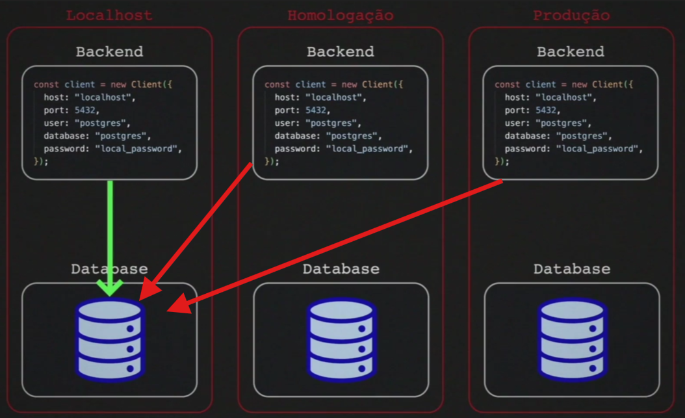
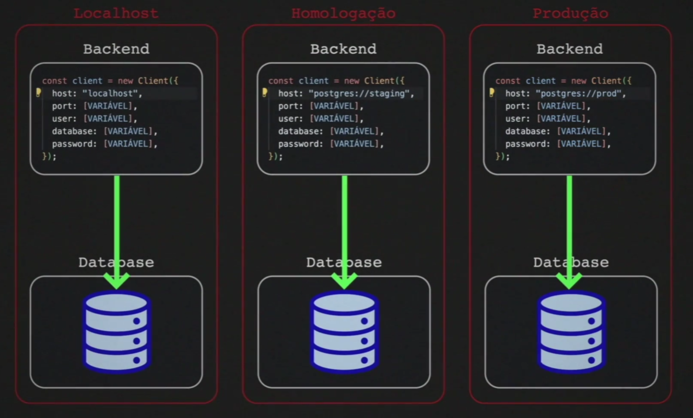

# ⚙️ Variáveis de Ambiente

Para evitar deixar espalhados no código credenciais e configurações fixas, centralizamos essas informações em **variáveis de ambiente**.

O ideal é pensar nas aplicações em camadas, onde elas são `stateless` — ou seja, **sem estado**.

Isso permite alterar valores e comportamentos de forma simples, de acordo com o ambiente em que a aplicação está rodando.

### ❌ Exemplo com configurações fixas (hardcoded)



### ✅ Exemplo usando variáveis de ambiente



Veja que usamos variáveis específicas para cada ambiente: local, teste, homologação, qualidade, produção.

Essas configurações podem ser usadas para definir qualquer serviço: banco de dados, e-mail, hospedagem, AWS, Azure, Vercel, entre outros.

Para a aplicação, não importa qual serviço está sendo usado — ela só precisa saber **qual deve utilizar**.  
Esse é o poder do isolamento entre camadas e responsabilidades em um código bem estruturado.

---

## 🔧 Configurando

Para visualizar as variáveis de ambiente via terminal:

No Bash (Linux):

```bash
env
```

No PowerShell (Windows):

```powershell
gci env:
```

Cada terminal aberto equivale a um novo processo.  
Ou seja, se você subir um servidor web dentro do terminal, ele irá carregar apenas as variáveis disponíveis naquele momento.

Também é possível definir uma variável no mesmo comando em que o servidor é iniciado:

```js
// código parcial do database.js
async function query(queryObject) {
  const client = new Client({
    host: "localhost",
    port: 5432,
    user: "postgres",
    database: "postgres",
    password: process.env.POSTGRES_PASSWORD, // aqui é informado para usar a variável carregada no terminal
  });
}
```

```bash
# Criando a variável e subindo o servidor web no mesmo processo (válida apenas para o terminal atual)
POSTGRES_PASSWORD=local_password npm run dev
```

⚠️ **Importante:**  
Essa prática **não é recomendada** em ambientes reais, pois expõe informações sensíveis no histórico do terminal.

> 💡 Dica: no Bash, adicione um espaço antes do comando para que ele não apareça ao usar `history`.

---

## 📁 Trabalhando com o .env

O `dotenv` (ou `.env`) é praticamente um padrão de mercado. Ele é um módulo que carrega variáveis de ambiente para o `process.env`.

No **Next.js**, o uso de `.env` já é suportado nativamente. Basta criar o arquivo `.env` na raiz do projeto:

```env
NOME_DA_VARIAVEL=valor_da_variavel
```

Copie e cole as declarações de conexão do `database.js` para o `.env`, ajustando o formato de `:` com espaço para o sinal de `=`.

> 💡 Dica de atalho no VS Code:  
> Selecione os `:` com `Ctrl + D` e edite em múltiplas linhas ao mesmo tempo.

Exemplo de `.env`:

```env
POSTGRES_HOST="localhost"
POSTGRES_PORT=5432
POSTGRES_USER="postgres"
POSTGRES_DATABASE="postgres"
POSTGRES_PASSWORD=local_password
```

E o `database.js`:

```js
const client = new Client({
  host: process.env.POSTGRES_HOST,
  port: process.env.POSTGRES_PORT,
  user: process.env.POSTGRES_USER,
  database: process.env.POSTGRES_DATABASE,
  password: process.env.POSTGRES_PASSWORD,
});
```

---

## 🐳 Refatorando o compose.yaml

Vamos agora fazer o `Docker Compose` utilizar as variáveis de ambiente:

```yaml
services:
  database:
    image: "postgres:16.0-alpine3.18"
    env_file:
      - ../.env
    ports:
      - "5432:5432"
```

Agora é só subir o banco novamente e depois o servidor web.

> 💡 Dica extra:  
> Existe um fallback (como uma contenção) caso a variável de ambiente `POSTGRES_DATABASE` não seja encontrada.  
> Apesar de funcionar, o nome correto segundo a documentação oficial no DockerHub é `POSTGRES_DB`.
