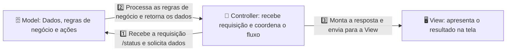

# 🔌 Finalizando o endpoint

Um endpoint de status normalmente é usado para trazer informações sobre a saúde do sistema:

- Data de atualização, com as informações daquele momento;
- Dados sobre o banco de dados, como versão, latência, conexões;
- Dados do servidor web, como versão, tempo disponível, etc.

Vamos então limpar o endpoint e o teste feito nele:

```js
// api/v1/status/index.js
import database from "infra/database.js";

async function status(request, response) {
  response.status(200).json({});
  // Removemos os dados hardcoded do JSON, chamadas ao banco e o console.log
}

export default status;

// api/v1/status/get.test.js
test("GET to /api/v1/status should return 200", async () => {
  const response = await fetch("http://localhost:3000/api/v1/status");
  expect(response.status).toBe(200);

  const responseBody = await response.json();
  console.log(responseBody);
  // Fazemos o parse convertendo o texto puro do corpo para um objeto JSON
});
```

---

## ✍🏻 Preenchendo com dados reais

Agora, onde devemos colocar os dados reais para alimentar o endpoint?

No modelo MVC, seguimos este fluxo:



**Resumo do fluxo MVC para o endpoint `/status`:**

1️⃣ **Controller**: recebe a requisição do usuário no endpoint `/status`.  
2️⃣ **Controller chama o Model**: o Model aplica as regras de negócio, busca e processa os dados.  
3️⃣ **Model retorna ao Controller**: com as informações processadas.  
4️⃣ **Controller monta a resposta**: e envia para a View, que apresenta o resultado ao usuário.

> No nosso caso, a apresentação final dos dados será em **JSON**.

**Resumo geral:**

- `Controllers`: coordenam operações, orquestrando um ou vários Models.
- `Models`: executam as regras de negócio, processam dados e retornam resultados.
- `Views`: exibem esses resultados prontos para os consumidores (clientes).

### 🤔 Mas por que não fazer tudo no Controller?

Se fizermos tudo na Controller, ela acabaria sobrecarregada com responsabilidades de regras de negócio, validação e acesso a dados. Isso dificultaria a manutenção, os testes e o reaproveitamento de código.

Separando cada responsabilidade no Model, o código fica:

- Mais organizado;
- Mais fácil de testar;
- Reutilizável e escalável.

---

Mas... **vamos fazer do jeito errado, só por diversão.** 😄

Agora alterando o endpoint:

```js
async function status(request, response) {
  const updatedAt = new Date().toISOString();
  // Formatamos a data no padrão ISO 8601, fácil de ler e manipular

  response.status(200).json({
    updated_at: updatedAt,
  });
}
```

> Por convenção, muitas APIs REST retornam chaves no formato `snake_case` (ex.: `updatedAt` → `updated_at`),
> mas isso não é uma regra obrigatória.

Agora o retorno vem nesse formato:

```json
{ "updated_at": "2025-05-30T18:53:16.140Z" }
```

Muito mais legível e amigável para humanos e máquinas.

---

## 👁️‍🗨️ Melhorando os testes

Vamos também evoluir o teste:

```js
test("GET to /api/v1/status should return 200", async () => {
  const response = await fetch("http://localhost:3000/api/v1/status");
  expect(response.status).toBe(200);

  const responseBody = await response.json();
  expect(responseBody.updated_at).toBeDefined();
  // Verificamos que a chave existe
});
```

Porém, o `.toBeDefined()` aceita qualquer valor, até um texto inválido. Vamos refinar o teste:

```js
const responseBody = await response.json();
expect(responseBody.updated_at).toBeDefined();

// Validamos se o valor informado realmente é uma data válida no padrão ISO
const parsedUpdatedAt = new Date(responseBody.updated_at).toISOString();
expect(responseBody.updated_at).toEqual(parsedUpdatedAt);
```

Dessa forma, garantimos que o valor retornado é realmente uma data ISO válida e não um texto aleatório.

## ❌🟢🔁 Red, Green, Refactor

**Red, Green, Refactor (RGR)** é uma abordagem comum no desenvolvimento orientado a testes (TDD), seguindo um ciclo simples:


### Os 3 passos do ciclo:

1. ❌ **Red** — Escrevemos um teste que inicialmente falha (o código ainda não atende ao requisito).
2. 🟢 **Green** — Implementamos o código mínimo necessário para fazer o teste passar.
3. 🔁 **Refactor** — Melhoramos o código (design, legibilidade, desempenho) mantendo o teste passando. Caso necessário, novos testes são criados e o ciclo se repete.
