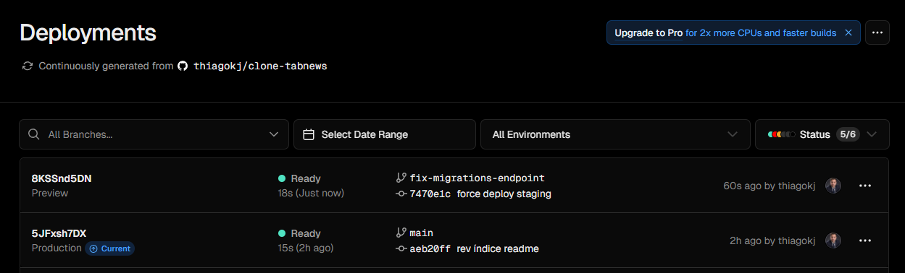

# Deploy em Homologação

Homologação, também chamada de `Staging`, é o ambiente de testes final antes da liberação para Produção.

> Definição em grego e Latin Homólogo pode ser traduzido para Concordar ou Aprovar

Esse ambiente é uma garantia de alinhamento do que está sendo preparado, feito.

O Produto foi homologado e agora pode ser produzido em escala.

## Criando banco de dados Staging

Vamos criar uma nova base de dados na Neon.

Aqui temos opções variadas:

1. Criar um novo projeto para Homologação
1. Usando o mesmo projeto, selecionar a branch development e criar um banco stating
1. Apenas criar um novo banco no mesmo projeto e branch chamado `staging`.

Por enquanto, vamos apenas criar um novo banco.

## Apontando credenciais Vercel

Abra o projeto, selecione Settings -> Environment Variables.

Deixe somente o ambiente `Preview`.

Adicionar as variáveis. Obs: Os nomes padrão da Neon são diferentes do arquivo `.env`, então substituir conforme `.env`

### Criando nova branch

Usando o git log, conseguimos enxergar o ponteiro (HEAD) confirmando o ultimo commit local e o remoto

```bash
HEAD -> main
origin/main
origin/HEAD
```

Quando você roda git log e vê essas informações (HEAD -> main, origin/main, origin/HEAD), elas representam referências aos branches e commits no seu repositório Git. Vou explicar cada uma delas:

1. HEAD -> main
   HEAD é um ponteiro que indica onde você está no repositório no momento (o commit atual).

HEAD -> main significa que o HEAD está apontando para o branch local chamado main (ou seja, você está no branch main).

Isso também indica que o branch main está no commit que está sendo exibido no log.

2. origin/main
   origin/main é a versão remota do branch main (ou seja, como o branch main está no repositório remoto chamado origin).

Se origin/main estiver alinhado com main, significa que seu branch local está sincronizado com o remoto.

Se main estiver à frente de origin/main, significa que você fez commits localmente que ainda não foram enviados (push) para o remoto.

Se origin/main estiver à frente de main, significa que há commits no remoto que você ainda não baixou (pull) para o local.

3. origin/HEAD
   origin/HEAD é um ponteiro que indica o branch padrão do repositório remoto (origin).

Geralmente, origin/HEAD aponta para origin/main (ou origin/master em repositórios mais antigos), mostrando qual branch é o principal no remoto.

Resumo:
HEAD -> main: Você está no branch main local.

origin/main: Estado do branch main no repositório remoto (origin).

origin/HEAD: Branch padrão do repositório remoto (normalmente main ou master).

Então, hora de criar a nova branch para homologação:

```powershell
# jeito mais verboso, criando branch pra depois fazer checkout para usá-la
git branch fix-migrations-endpoint
git checkout fix-migrations-endpoint

# atalho mais pratico, onde já cria a branch e faz o checkout
git checkout -b fix-migrations-endpoint

# log
@thiagokj ➜ /workspaces/clone-tabnews (main) $ git checkout -b fix-migrations-endpoint
Switched to a new branch 'fix-migrations-endpoint'
@thiagokj ➜ /workspaces/clone-tabnews (fix-migrations-endpoint) $

# executando um git log
@thiagokj ➜ /workspaces/clone-tabnews (fix-migrations-endpoint) $ git log
commit aeb20ff8cbe8f50a0413634a1747e80a4daae983 (HEAD -> fix-migrations-endpoint, origin/main, origin/HEAD, main)
Author: Thiago Cajaíba <51033018+thiagokj@users.noreply.github.com>
Date:   Tue Jun 10 13:23:27 2025 +0000

  rev índice readme
```

Após criar a nova branch local, é preciso fazer o vinculo dos dados dela com uma nova branch remota.

Quando trabalhamos na main, isso já é feito automaticamente. Esse vinculo é chamado de `upstream`.

```powershell
# aqui indicamos pra onde vamos empurrar as alterações da branch
# o set upstream configura o rastreio das alterações entre a branch local e remoto
git push --set-upstream origin fix-migrations-endpoint

#log

@thiagokj ➜ /workspaces/clone-tabnews (fix-migrations-endpoint) $ git push --set-upstream origin fix-migrations-endpoint
Total 0 (delta 0), reused 0 (delta 0), pack-reused 0 (from 0)
remote:
remote: Create a pull request for 'fix-migrations-endpoint' on GitHub by visiting:
remote:      https://github.com/thiagokj/clone-tabnews/pull/new/fix-migrations-endpoint
remote:
To https://github.com/thiagokj/clone-tabnews
 * [new branch]      fix-migrations-endpoint -> fix-migrations-endpoint
branch 'fix-migrations-endpoint' set up to track 'origin/fix-migrations-endpoint'.
```

### Deploy na Vercel

Esse push dispara uma action na vercel, gerando um deploy do ambiente de homologação (preview).

Obs: caso não seja gerada action, só alterar qualquer coisa, fazer commit e push nessa branch.



Ao clicar no deploy, temos acesso a URL apontando para a branch. Por esse link, podemos fazer testes via cURL.

> Atenção: desative o Deployment Protection -> Vercel Authentication para poder acessar o link
> de forma externa.
> Essa segurança é uma boa prática, mas como estamos em testes controlados
> não tem problema

```powershell
# log do cURL
@thiagokj ➜ /workspaces/clone-tabnews (fix-migrations-endpoint) $ curl https://clone-tabnews-git-fix-migrations-endpoint-thiagokjs-projects.vercel.app/api/v1/status
{"updated_at":"2025-06-10T15:09:38.704Z","dependencies":{"database":{"version":"16.9","max_connections":901,"opened_connections":1}}}
```

Melhorando o comando:

```powershell
# No Codespaces, ja temos o Python rodando
# Podemos combinar o cURL e o Python pra formatar
# o json usando | (PIPE ou "Cano")
curl https://clone-tabnews-git-fix-migrations-endpoint-thiagokjs-projects.vercel.app/api/v1/status | python3 -m json.tool

# saida no log
@thiagokj ➜ /workspaces/clone-tabnews (fix-migrations-endpoint) $ curl https://clone-tabnews-git-fix-migrations-endpoint-thiagokjs-projects.vercel.app/api/v1/status | python3 -m json.tool
  % Total    % Received % Xferd  Average Speed   Time    Time     Time  Current
                                 Dload  Upload   Total   Spent    Left  Speed
100   133  100   133    0     0     34      0  0:00:03  0:00:03 --:--:--    34
{
    "updated_at": "2025-06-10T15:18:53.330Z",
    "dependencies": {
        "database": {
            "version": "16.9",
            "max_connections": 901,
            "opened_connections": 1
        }
    }
}

# o mesmo comando com a instrução -s (silencioso), mostra só o json
curl -s https://clone-tabnews-git-fix-migrations-endpoint-thiagokjs-projects.vercel.app/api/v1/status | python3 -m json.tool


curl -s -X GET https://clone-tabnews-git-fix-migrations-endpoint-thiagokjs-projects.vercel.app/api/v1/migrations | python3 -m json.tool

curl -s -X POST https://clone-tabnews-git-fix-migrations-endpoint-thiagokjs-projects.vercel.app/api/v1/migrations | python3 -m json.tool
```

## Pegando Bug 🐞

Se forçarmos outros verbos no endpoint migrations, teremos exceções não tratadas, vazando conexões.

```powershell
# OK
curl -s -X GET https://clone-tabnews-git-fix-migrations-endpoint-thiagokjs-projects.vercel.app/api/v1/migrations | python3 -m json.tool

# OK
curl -s -X POST https://clone-tabnews-git-fix-migrations-endpoint-thiagokjs-projects.vercel.app/api/v1/migrations | python3 -m json.tool

# Esse método não possui nenhuma definição no endpoint
curl -s -X DELETE  https://clone-tabnews-git-fix-migrations-endpoint-thiagokjs-projects.vercel.app/api/v1/migrations | python3 -m json.tool


```

Ao executa-lo algumas vezes, teremos um problema e a conexão ficará em aberto.

```powershell
@thiagokj ➜ /workspaces/clone-tabnews (fix-migrations-endpoint) $ curl -s -X DELETE  https://clone-tabnews-git
-fix-migrations-endpoint-thiagokjs-projects.vercel.app/api/v1/migrations | python3 -m json.tool
Expecting value: line 1 column 1 (char 0)
@thiagokj ➜ /workspaces/clone-tabnews (fix-migrations-endpoint) $ curl -s -X DELETE  https://clone-tabnews-git-fix-migrations-endpoint-thiagokjs-projects.vercel.app/api/v1/migrations | python3 -m json.tool
Expecting value: line 1 column 1 (char 0)
@thiagokj ➜ /workspaces/clone-tabnews (fix-migrations-endpoint) $ curl -s -X DELETE  https://clone-tabnews-git-fix-migrations-endpoint-thiagokjs-projects.vercel.app/api/v1/migrations | python3 -m json.tool
Expecting value: line 1 column 1 (char 0)

# Agora ao fazer uma request no endpoint status
# Teremos 4 conexões (3 de erro do DELETE e 1 Atual pro GET)
@thiagokj ➜ /workspaces/clone-tabnews (fix-migrations-endpoint) $ curl -s https://clone-tabnews-git-fix-migrations-endpoint-thiagokjs-projects.vercel.app/api/v1/status | python3 -m json.tool
{
    "updated_at": "2025-06-10T16:15:03.009Z",
    "dependencies": {
        "database": {
            "version": "16.9",
            "max_connections": 901,
            "opened_connections": 4
        }
    }
}
```

### Refatorando endpoint migrations

Vamos refatorar para melhorar essa questão (futuramente ficará melhor):

```js
// api/v1/migrations
import migrationRunner from "node-pg-migrate";
import { join } from "node:path";
import database from "infra/database.js";

export default async function migrations(request, response) {
  const dbClient = await database.getNewClient();

  const defaultMigrationsConfig = {
    dbClient: dbClient,
    dryRun: true,
    dir: join("infra", "migrations"),
    direction: "up",
    verbose: true,
    migrationsTable: "pgmigrations",
  };

  // só temos tratamento pro GET e POST mesmo
  if (request.method === "GET") {
    console.log("Método GET");

    const pendingMigrations = await migrationRunner(defaultMigrationsConfig);

    await dbClient.end(); // só fecha a conexão se passar aqui

    return response.status(200).json(pendingMigrations);
  }

  if (request.method === "POST") {
    console.log("Método POST");

    const migratedMigrations = await migrationRunner({
      ...defaultMigrationsConfig,
      dryRun: false,
    });

    await dbClient.end(); // só fecha a conexão se passar aqui

    if (migratedMigrations.length > 0) {
      return response.status(201).json(migratedMigrations);
    }

    return response.status(200).json(migratedMigrations);
  }

  return response.status(405).end();
}
```

```js
// api/v1/migrations
export default async function migrations(request, response) {
  // aqui já aplicamos uma boa prática de programação defensiva
  // retornando rapidamente erro caso haja exceção
  const allowedMethods = ["GET", "POST"];
  if (!allowedMethods.includes(request.method)) {
    return response.status(405).json({
      error: `Method "${request.method}" not allowed`,
    });
  }

  // alteramos o escopo da conexão pra poder validar
  // no bloco try catch
  let dbClient;

  try {
    dbClient = await database.getNewClient();

    const defaultMigrationOptions = {
      dbClient: dbClient,
      dryRun: true,
      dir: join("infra", "migrations"),
      direction: "up",
      verbose: true,
      migrationsTable: "pgmigrations",
    };

    if (request.method === "GET") {
      const pendingMigrations = await migrationRunner(defaultMigrationOptions);
      return response.status(200).json(pendingMigrations);
    }

    if (request.method === "POST") {
      const migratedMigrations = await migrationRunner({
        ...defaultMigrationOptions,
        dryRun: false,
      });

      if (migratedMigrations.length > 0) {
        return response.status(201).json(migratedMigrations);
      }

      return response.status(200).json(migratedMigrations);
    }
  } catch (error) {
    console.error(error);
    throw error;
  } finally {
    // agora o finally ficou com a responsabilidade
    // de encerrar a conexão
    await dbClient.end();
  }
}
```

Realizando os testes locais e passando com sucesso. Hora de fazer o commit e push.

Será executado deploy na Vercel. Com o link que aponta para esse branch `preview`, hora de executar requests no endpoint:

```powershell
# somente 1 conexão aberta
@thiagokj ➜ /workspaces/clone-tabnews (fix-migrations-endpoint) $ curl -s https://clone-tabnews-git-fix-migrations-endpoint-thiagokjs-projects.vercel.app/api/v1/status | python3 -m json.tool
{
    "updated_at": "2025-06-10T17:32:20.193Z",
    "dependencies": {
        "database": {
            "version": "16.9",
            "max_connections": 901,
            "opened_connections": 1
        }
    }
}

# tentativas de estressar o endpoint, igual feito anteriormente
# antes de alterar o código
@thiagokj ➜ /workspaces/clone-tabnews (fix-migrations-endpoint) $ curl -s -X GET https://clone-tabnews-git-fix-migrations-endpoint-thiagokjs-projects.vercel.app/api/v1/migrations | python3 -m json.tool
[]

@thiagokj ➜ /workspaces/clone-tabnews (fix-migrations-endpoint) $ curl -s -X POST https://clone-tabnews-git-fix-migrations-endpoint-thiagokjs-projects.vercel.app/api/v1/migrations | python3 -m json.tool
[]

@thiagokj ➜ /workspaces/clone-tabnews (fix-migrations-endpoint) $ curl -s -X DELETE  https://clone-tabnews-git-fix-migrations-endpoint-thiagokjs-projects.vercel.app/api/v1/migrations | python3 -m json.tool
{
    "error": "Method \"DELETE\" not allowed"
}

@thiagokj ➜ /workspaces/clone-tabnews (fix-migrations-endpoint) $ curl -s -X DELETE  https://clone-tabnews-git-fix-migrations-endpoint-thiagokjs-projects.vercel.app/api/v1/migrations | python3 -m json.tool
{
    "error": "Method \"DELETE\" not allowed"
}

@thiagokj ➜ /workspaces/clone-tabnews (fix-migrations-endpoint) $ curl -s -X DELETE  https://clone-tabnews-git-fix-migrations-endpoint-thiagokjs-projects.vercel.app/api/v1/migrations | python3 -m json.tool
{
    "error": "Method \"DELETE\" not allowed"
}

@thiagokj ➜ /workspaces/clone-tabnews (fix-migrations-endpoint) $ curl -s -X POST https://clone-tabnews-git-fix-migrations-endpoint-thiagokjs-projects.vercel.app/api/v1/migrations | python3 -m json.tool
[]

# fazendo uma nova solicitação pro endpoint status
# pra ver se ficaram conexões penduradas
@thiagokj ➜ /workspaces/clone-tabnews (fix-migrations-endpoint) $ curl -s https://clone-tabnews-git-fix-migrations-endpoint-thiagokjs-projects.vercel.app/api/v1/status | python3 -m json.tool
{
    "updated_at": "2025-06-10T17:32:58.369Z",
    "dependencies": {
        "database": {
            "version": "16.9",
            "max_connections": 901,
            "opened_connections": 1
        }
    }
}
```

e agora não há mais problema de conexões abertas (em homologaçã0)!!!! 🎉

> Lei de Linus diz que "dado um número suficientemente grande de olhos, todos os bugs são superficiais"
> A ideia é: escreva o código, deixe “esfriar” e depois revise com calma — assim os bugs ficam mais fáceis de encontrar.

O próximo passo é fazer o merge, mesclar as alterações em homologação para produção.
