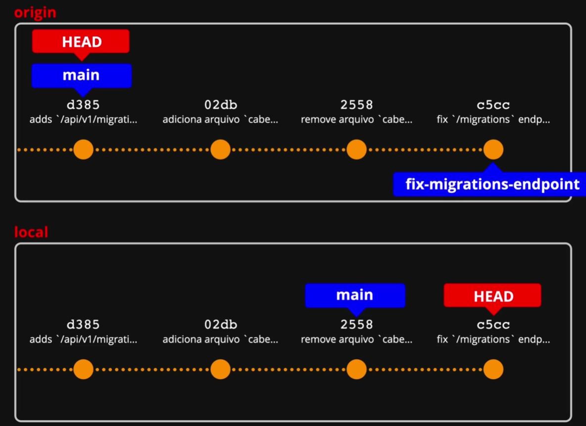

# 🔍 Git - Por baixo dos panos

Legal, temos 2 branches no projeto, porém ainda não foi realizado o `merge` (mescla, união, junção).

Então imagine esquecer ou executar um comando por engano antes de mandar as alterações pra produção, e perder dias ou semanas de trabalhos... 😢

A boa notícia é que temos formas de reverter esse cenário caótico com comandos no git.

```powershell
# exibe todas as branches do projeto
git branch

# no momento, 3 branches disponíveis e o asterisco indicando a que está em uso
@thiagokj ➜ /workspaces/clone-tabnews/docs (main) $ git branch
  fix-migrations-endpoint
* main
  tamanho-do-cabelo
```

Antes de apagar uma branch, é interessante fazer um checkout pra ela e analisar o git log para ver últimos commits.

```powershell
# aqui não tem nada de relevante, mas não foi feito merge nesse caso
@thiagokj ➜ /workspaces/clone-tabnews/docs (main) $ git checkout tamanho-do-cabelo
Switched to branch 'tamanho-do-cabelo'
@thiagokj ➜ /workspaces/clone-tabnews/docs (tamanho-do-cabelo) $ git log
commit b590e27f729b65fb227f4f85d73c28e747ea67b6 (HEAD -> tamanho-do-cabelo)
Author: Thiago Cajaíba <51033018+thiagokj@users.noreply.github.com>
Date:   Fri Jun 6 18:34:27 2025 +0000

    altera `cabelo.txt` para `curto`

commit 8e9a24ad153f8a55dc7150c02bd242a170910ea5
Author: Thiago Cajaíba <51033018+thiagokj@users.noreply.github.com>
Date:   Fri Jun 6 18:11:24 2025 +0000

    adicionando cabelo.txt

# apagando a branch com git branch -d
# o comando não funciona se vc está usando a branch
@thiagokj ➜ /workspaces/clone-tabnews/docs (tamanho-do-cabelo) $ git branch -d tamanho-do-cabelo
error: cannot delete branch 'tamanho-do-cabelo' used by worktree at '/workspaces/clone-tabnews'

# o git alerta que não foi feito merge com a main
@thiagokj ➜ /workspaces/clone-tabnews/docs (main) $ git branch -d tamanho-do-cabelo
error: the branch 'tamanho-do-cabelo' is not fully merged
hint: If you are sure you want to delete it, run 'git branch -D tamanho-do-cabelo'
hint: Disable this message with "git config set advice.forceDeleteBranch false"

# pra forçar, podemos usar o -D
git branch -D tamanho-do-cabelo
@thiagokj ➜ /workspaces/clone-tabnews/docs (main) $ git branch -D tamanho-do-cabelo
Deleted branch tamanho-do-cabelo (was b590e27).
```

Agora vamos apagar a branch que contém alterações e que não foram pra main.

```powershell
@thiagokj ➜ /workspaces/clone-tabnews/docs (main) $ git branch -D fix-migrations-endpoint
Deleted branch fix-migrations-endpoint (was e606936).

@thiagokj ➜ /workspaces/clone-tabnews/docs (main) $ git branch
* main
```

Poxa.... perdemos tudo... como faz pra recuperar?

## Movendo o ponteiro

A branch foi realmente deletada, mas as alterações nela ficam salvas pelo último commit. Então podemos fazer um checkout pelo inicio do hash para aquele commit.

> Ao fazer checkout novamente para branch deletada, é criada um nova branch local.

```powershell
# use o git log para pegar o hash. ex: e606936
# realizada a exclusão novamente da branch, apagando a ref local
@thiagokj ➜ /workspaces/clone-tabnews/docs (main) $ git branch -d fix-migrations-endpoint
warning: deleting branch 'fix-migrations-endpoint' that has been merged to
         'refs/remotes/origin/fix-migrations-endpoint', but not yet merged to HEAD
Deleted branch fix-migrations-endpoint (was e606936).

# fazendo checkout para o ultimo commit daquela branch
@thiagokj ➜ /workspaces/clone-tabnews/docs (main) $ git checkout e606936
Note: switching to 'e606936'.

You are in 'detached HEAD' state. You can look around, make experimental
changes and commit them, and you can discard any commits you make in this
state without impacting any branches by switching back to a branch.

If you want to create a new branch to retain commits you create, you may
do so (now or later) by using -c with the switch command. Example:

  git switch -c <new-branch-name>

Or undo this operation with:

  git switch -

Turn off this advice by setting config variable advice.detachedHead to false

HEAD is now at e606936 fix `/migration` endpoint connection bug
```

Nesse modo, estamos com o ponteiro livre, navegando via commit.



No detalhe da imagem, veja que estamos no commit local.

Analisando via git log

```powershell
# git log direto no hash e606936
# o HEAD não está apontando pra lugar nenhum
@thiagokj ➜ /workspaces/clone-tabnews/docs (e606936) $ git log
commit e606936ed145488cd484876d6c2ee0acefd8be6f (HEAD, origin/fix-migrations-endpoint)
Author: Thiago Cajaíba <51033018+thiagokj@users.noreply.github.com>
Date:   Tue Jun 10 17:22:37 2025 +0000

    fix `/migration` endpoint connection bug

commit 7470e1c31fab2f2633e7053ec6cb97ff40f6621b
Author: Thiago Cajaíba <51033018+thiagokj@users.noreply.github.com>
Date:   Tue Jun 10 14:59:39 2025 +0000

    force deploy staging
```

Nesse momento, o commit está `pendurado`. Os commits que ficam nesse estado são apagados pela rotina do git de coleta de lixo (GC) periodicamente.

Então pra criar uma branch para esse commit:

```powershell
# comando pra criar uma nova branch
@thiagokj ➜ /workspaces/clone-tabnews/docs (e606936) $ git checkout -b fix-migrations-endpoint
Switched to a new branch 'fix-migrations-endpoint'

# olhando o git log
# o HEAD aponta para essa branch criada
# e o rastreio pra branch remota está para o mesmo lugar
@thiagokj ➜ /workspaces/clone-tabnews/docs (fix-migrations-endpoint) $ git log
commit e606936ed145488cd484876d6c2ee0acefd8be6f (HEAD -> fix-migrations-endpoint, origin/fix-migrations-endpoint)
Author: Thiago Cajaíba <51033018+thiagokj@users.noreply.github.com>
Date:   Tue Jun 10 17:22:37 2025 +0000

    fix `/migration` endpoint connection bug

commit 7470e1c31fab2f2633e7053ec6cb97ff40f6621b
Author: Thiago Cajaíba <51033018+thiagokj@users.noreply.github.com>
Date:   Tue Jun 10 14:59:39 2025 +0000

    force deploy staging
```

## git reflog

E se por acaso for apagada branch e limpo o terminal?

Ai não teríamos mais forma de pegar o hash do commit para voltar.

Para esse tipo de situação, temos o `git reflog`.

Ele registra todas as alterações realizadas no repositório.

```powershell
# apagando a nova branch criada
@thiagokj ➜ /workspaces/clone-tabnews/docs (main) $ git branch -d fix-migrations-endpoint
error: the branch 'fix-migrations-endpoint' is not fully merged
hint: If you are sure you want to delete it, run 'git branch -D fix-migrations-endpoint'
hint: Disable this message with "git config set advice.forceDeleteBranch false"
@thiagokj ➜ /workspaces/clone-tabnews/docs (main) $ git branch -D fix-migrations-endpoint
Deleted branch fix-migrations-endpoint (was e606936).

# usando git reflog
# para onde o HEAD se mexe, é gerado um registro de referência
@thiagokj ➜ /workspaces/clone-tabnews/docs (main) $ git reflog
24ffbdb (HEAD -> main) HEAD@{0}: checkout: moving from fix-migrations-endpoint to main
e606936 (origin/fix-migrations-endpoint) HEAD@{1}: checkout: moving from main to fix-migrations-endpoint
24ffbdb (HEAD -> main) HEAD@{2}: checkout: moving from fix-migrations-endpoint to main
e606936 (origin/fix-migrations-endpoint) HEAD@{3}: checkout: moving from e606936ed145488cd484876d6c2ee0acefd8be6f to fix-migrations-endpoint
e606936 (origin/fix-migrations-endpoint) HEAD@{4}: checkout: moving from main to e606936
24ffbdb (HEAD -> main) HEAD@{5}: checkout: moving from fix-migrations-endpoint to main
e606936 (origin/fix-migrations-endpoint) HEAD@{6}: checkout: moving from main to fix-migrations-endpoint
24ffbdb (HEAD -> main) HEAD@{7}: checkout: moving from tamanho-do-cabelo to main
b590e27 HEAD@{8}: checkout: moving from main to tamanho-do-cabelo
24ffbdb (HEAD -> main) HEAD@{9}: commit: rev readme
f7aa763 (origin/main, origin/HEAD) HEAD@{10}: commit: rev documentação
aeb20ff HEAD@{11}: checkout: moving from fix-migrations-endpoint to main
e606936 (origin/fix-migrations-endpoint) HEAD@{12}: commit: fix `/migration` endpoint connection bug

# para confirmar qual o hash correto do commit, só procurar pela linha
# que tem a mensagem com o commit
e606936 (origin/fix-migrations-endpoint) HEAD@{12}: commit: fix `/migration` endpoint connection bug
```

Então agora temos o atalho pra criar uma nova branch, apontando pra esse commit, sem rodeios ou perda de tempo.

```powershell
# git checkout -b nome-da-branch hash-do-commit
@thiagokj ➜ /workspaces/clone-tabnews/docs (main) $ git checkout -b fix-migrations-endpoint e606936
Switched to a new branch 'fix-migrations-endpoint'

# executando git log
# head apontando pra branch local com commit
# que está vinculada a branch remota
@thiagokj ➜ /workspaces/clone-tabnews/docs (fix-migrations-endpoint) $ git log
commit e606936ed145488cd484876d6c2ee0acefd8be6f (HEAD -> fix-migrations-endpoint, origin/fix-migrations-endpoint)
Author: Thiago Cajaíba <51033018+thiagokj@users.noreply.github.com>
Date:   Tue Jun 10 17:22:37 2025 +0000

    fix `/migration` endpoint connection bug

commit 7470e1c31fab2f2633e7053ec6cb97ff40f6621b
Author: Thiago Cajaíba <51033018+thiagokj@users.noreply.github.com>
Date:   Tue Jun 10 14:59:39 2025 +0000

    force deploy staging
```

Resumindo:

HEAD -> fix-migrations-endpoint: você está na branch local fix-migrations-endpoint, é a branch ativa.

origin/fix-migrations-endpoint: essa branch local está vinculada à remota de mesmo nome no GitHub.

O commit e606936... está presente em ambas — local e remota —, ou seja, estão sincronizadas.
