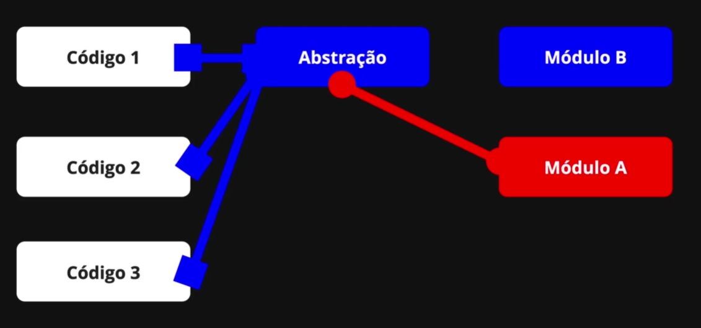
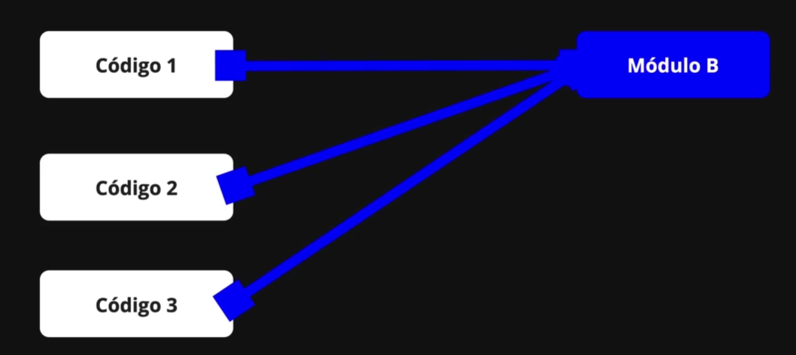

# 🏗️ Modelos de Trabalho

Em Tecnologia a evolução é constante. Os processos vão melhorando ao longo do tempo
conforme as metodologias vão sendo aprimoradas.

## 🌊 Waterfall ou Cascata

Esse modelo segue a ideia de queda d'Água.

Vem de cima pra baixo, com desdobramentos:

```flow
📝 Requisitos
└── 📈 Projeto
    └── 📜 Implementação - Devs
        └── 🔍 Validação
            └── 🤖 Implantação - Ops
```

Requisitos: Time de requisitos junto aos clientes internos e externos faz o levantamento da necessidade e definição da entrega final.

Projeto: Time de projetos analisa os requisitos e gera as definições: qual tecnologia a ser utilizada, qual arquitetura, linguagens, modelagens, estrutura de dados, libs, hospedagem, banco de dados, etc.

Implementação: Time de desenvolvedores `(Devs)` analisa as a documentação do projeto para implementar (desenvolver) do início ao fim.

Validação: Time de validação analisa o artefato (versão) gerada pelos desenvolvedores e faz as validações necessárias.

Implantação: Time de operações `(Ops)` recebe a validação e tem a responsabilidade de colocar pra funcionar a aplicação, fazendo o deploy em produção. Esse time recebe a maior carga, pois tem que fazer os ajustes finos pra tudo dar certo.

E aqui da muito problema, pois implantação fala com o cliente final. Se algo sai fora do planejado... e sempre sai, gera aquele desgaste 🧨🧨🧨

Ciclos cascate são longos. Imagina descobrir no final de 1 ano que será necessário mais 1 ano pra ajustar alguns pontos não observados nas etapas anteriores? Trágico.

Os desenvolvedores ficam ali no meio do caminho, sem poder participar de perto da implantação.

## ⏩ Surgimento do Ágil

Com esses problemas recorrentes, um time de especialistas se reuniu em 2001 para criar o Manifesto Ágil, para o desenvolvimento de software de forma ágil.

- `Indivíduos e interações primeiro`, depois processos e ferramentas.
- `Software em funcionamento primeiro`, depois documentação abrangente.
- `Colaboração com o cliente primeiro`, depois negociações de contratos.
- `Responder a mudanças primeiro`, depois seguir um plano.

Resumindo a prioridade de valor:

```code
Pessoas > Processos
Software funcionando > Documentação
Cliente junto > Contrato rígido
Adaptação > Plano fixo
```

Esse plano foi muito adotado. Mas, infelizmente como é algo interpretativo, algumas empresas começaram a escrever em pedra e criar processos rígidos em cima.

O ciclo de conflitos começou a se repetir.

Realmente é difícil vender o melhorar pessoas ao invés de processos. Quando o caminho pra tudo na vida é: `equilíbrio`.

## DevOps

No modelo em cascata, times de desenvolvimento e operações trabalhavam separados. Para resolver os problemas causados por essa divisão, surgiu o movimento DevOps — unindo esses times e promovendo integração e validação contínua entre os processos, facilitando a entrega e a implantação de software.

O fluxo foi melhorando até o que temos hoje: Continuous Integration, Delivery e Deployment.

### CI - Integração Contínua

Com isso, o ciclo de feedback foi reduzido, dando origem ao conceito de CI (Continuous Integration), ou Integração Contínua: código novo é integrado com frequência ao repositório principal, permitindo testes e validações automáticas.

No modelo cascata, qualquer mudança exigia voltar do zero — da análise de requisitos até a reprogramação.
Com CI, o processo é muito mais rápido, com ajustes e entregas sendo feitos de forma contínua e integrada.

Então o primeiro passo foi focar em automatizar o `build` para implantação.

> Quanto menos pessoas participam de processos complexos, menor é o atrito.

Depois veio a automação da etapa de validação, surgindo os `Testes automatizados`, muito impulsionadas pelas startups com modelo ágil.

Com o build e os testes automatizados, foi preciso integrar as alterações de volta ao projeto com um `controle de versão`. E ai o Git pra ajudar.

### CD - Entrega Contínua

A estratégia é: Fazer o deploy com 1 click. Pra chegar nesse nível, as rotinas tem que estar 100% automatizadas.

Aqui então temos a união do termo CI/CD tão famoso, porém estarem sempre juntos no processo.

### CD - Implantação contínua

A sigla acabou ficando igual a de entrega contínua, mas aqui falamos de Continuous Deploy, que é o deploy automatizado.

Esse é processo final. Então, após toda a esteira de build e testes serem aprovados, essa etapa é executada, colocando na produção ou outro ambiente a última versão.

Com a implantação contínua, é evitado erro humano por não clicar em uma caixinha de opções antes de fazer o deploy.

Esse processo também é chamado de `robô`. Ex: Há, tem um robô da Vercel que faz o processo de deploy automatizado.

# Não existem branches especiais

O git não possui limitações nas branches ou que uma seja mais importante que a outra.

`master`ou `main` são apenas mais branches.

Nós temos o poder de escolher qual é a branch principal.

Por que devemos ter essa obsessão pela integração contínua? Por causa da `entropia`.

Quanto mais tempo trabalhamos em uma branch isolada da branch de produção, maior a aleatoriedade de alterações nesse tempo podem estar ocorrendo.

Aí, quando for feito o merge, podem haver muito mais conflitos a serem resolvidos, aumentando a complexidade.

## Estratégias de Branching

Não existe uma estratégia que seja melhor que outra, mas a que se adéqua melhor ao tipo de projeto e ao entrosamento do time de DEVs.

Até o momento nesse projeto, temos usado a `Trunk Base Development` ou Estratégia Baseada em Tronco.

### Trunk Base Development

O nome é meio estranho, mas vamos imaginar que a linha do tempo parte da branch `main`, que é a ramificação principal, servindo como `trunk` ou tronco do projeto.

Aqui todas as alterações são feitas diretamente nela.

No caso de um bug emergencial, basta fazer `git stash `no seu repo local, e focar na correção do bug. Depois, um git stash pop para voltar a trabalhar de onde parou.

```powershell
git stash       # guarda alterações e limpa a branch
git stash pop   # traz as alterações de volta e remove o stash
```

Essa estratégia é a mais simples a ser adotada, porém devem ser criados fluxos de trabalho para não afetar o ambiente de produção.

### Feature Branch

A cada modificação no sistema, seja uma correção de bug ou novo recurso, se cria uma branch.

Assim as branches serão ramificações da linha do tempo da branch principal, se integrando a ela no merge.

Para não ser afetado pela entropia no caso de longo tempo de desenvolvimento, pode ser feito um merge da main para essa branch, atualizando os arquivos alterados até então.

Ai, após todos os testes, é feito o merge da branch feature para main, integrando os novos recursos para linha do tempo principal.

> - merge branch main -> feat/improve-speed-queries
> - feat/improve-speed-queries -> merge main

Essa dinâmica é uma das mais populares e começou a ser chamada de `GitHub Flow`, devido ao fluxo de criar Pull Requests solicitando a revisão e aprovação para o merge.

A desvantagem é a mesma da Trunk Base, sendo necessário criar fluxos de trabalho para não afetar o ambiente de produção.

### Git Flow

Essa estratégia pode gerar debate em alguns times, porém o conceito é muito robusto.

Aqui, a branch main não recebe nenhuma modificação direta, ela fica direcionada apenas a produção.

> A única exceção é para alterações de emergências.
> Nesse caso especial, é criada uma branch de `Hotfix` para aplicar o patch de correção.

Então, o fluxo padrão, criamos uma branch `develop`. A partir dessa branch de desenvolvimento, são criadas as branches de features ou bugfixes.

Com essa estratégia, é mais fácil gerenciar ambientes de testes e ações automatizadas, publicando de forma controlada as alterações.

Após tudo estar testado e aprovado, é feito merge da `main` para `develop`, integrando qualquer alteração emergencial que tenha vindo de produção.


Esse fluxo é útil quando é necessário manter várias versões diferentes do sistema.

## Como as Big Techs trabalham?

Google, Spotify, Netflix e Facebook utilizam da estratégia de Trunk Based. Para controlar as alterações, utilizam o conceito de `Feature Flags`.

Essa estratégia é a melhor para integrar o mais rápido possível para produção.

> Feature Flags são como botões liga/desliga. Assim um novo recurso pode ser lançado desabilitado, sem impacto.

Caso precise habilitar um recurso, pode ser feito de forma controlada, para grupos ou usuários específicos.

Esse recurso precisa de muito bom gerenciamento.

### Branch by Abstraction

Um outro cenário é fazer `Branch by Abstraction` ou Ramificação por abstração:

1. Você cria uma abstração (ex: uma interface ou uma camada extra).

2. O código atual usa essa abstração.

3. Você implementa a nova versão por trás da abstração, sem quebrar nada.

4. Quando tudo estiver pronto, você ativa a nova implementação e remove a antiga.



Por que usar isso?
Pra evitar conflitos de merge e deploys demorados. Tudo acontece na mesma branch, de forma segura.

Exemplo leigo:
Você quer trocar o motor de um carro em movimento.
Cria um sistema que permite trocar o motor sem parar o carro.
Quando o motor novo estiver pronto, você liga ele e desliga o velho.



Simples assim.

Então, podemos criar uma branch de release, protegendo a versão que vai pra produção sem travar o time que continua desenvolvendo.


Objetivos:

- Separar o ciclo de entrega (release) do ciclo de desenvolvimento contínuo.

- Permitir Hotfixes ou ajustes na release (como R1, R2) sem parar a main.

- Evitar travar o time esperando bugfix ou testes da versão que será entregue.

Você basicamente "congela" a main num ponto estável pra preparar a release, sem interromper o trabalho da galera. Depois, pode corrigir só na release, e se quiser, mesclar essas correções de volta na main.

# Resumão

Pra esse projeto, vamos usar `GitHub Flow` e `Feature Branches`.

O GitHub Flow permite entregas rápidas e seguras com deploy contínuo na main.

E o Feature Branches isolam o desenvolvimento de cada funcionalidade, evitando conflitos e garantindo código testado antes do merge.
