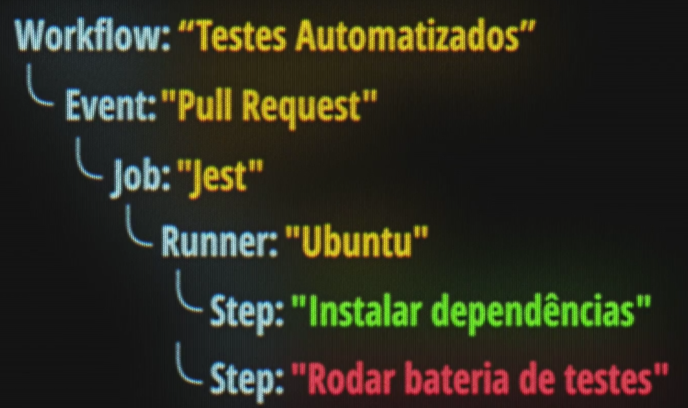
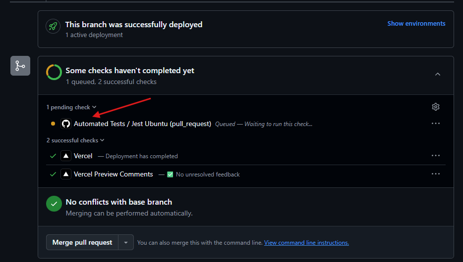
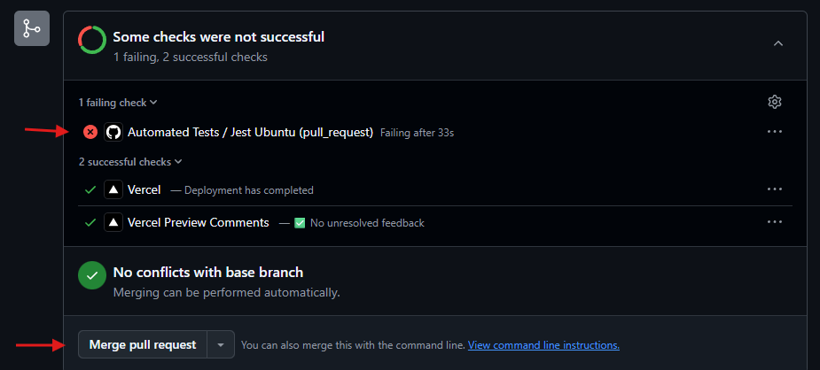
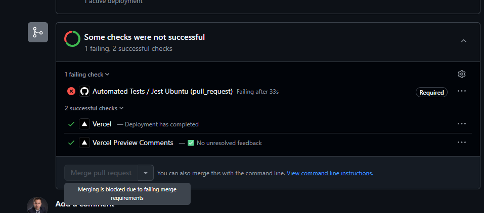

# 📦 GitHub Actions

O `GitHub Actions` é um automatizador de fluxos e um CI.

Ele fica escutando eventos acontecerem dentro do repositório, iniciando uma rotina pra rodar em um sistema operacional.

Tudo começa com a criação de um `Workflow` (fluxo de trabalho). Ex: Testes Automatizados.

Nele especificamos o `Event`, que define qual o evento que vai ficar observando, escutando e esperando acontecer. Ex: Criação de um Pull Request.

Então, quando o evento acontecer, será executado um `Job`, que são os trabalhos que precisam ser executados. Ex: rodar o Jest.

Para rodar o Jest, precisamos de um sistema operacional rodando, aqui teremos então o `Runner`, para definir esse sistema. Ex: Ubuntu, Debian, Windows Server.

> 💡 A escolha do SO sempre deve ser a mais proxima do sistema operacional usado pela aplicação em produção.

Com a base definida, configuramos o `Step` (passo a passo) de execução. Ex: Instalar dependências

> ✅ O GitHub Actions retorna o código 0, quando um passo é executado com sucesso.
> ❌ Retornos diferentes de 0 indicam falha no processo.



Toda essa configuração é feita via código com um arquivo `YAML`.

## Criando o arquivo de configuração

O GitHub trabalha com uma estrutura especial para execução dos scripts, crie ela no projeto:

```tree
📂 .github
└── 📂 workflows
    └── 📜 tests.yaml
```

Agora, podem ser criados diversos fluxos de trabalho a serem executados de forma automatizada via Actions. Ex: linting (formatação) de código, commits, etc.

Estruturando o `tests.yaml`:

```yaml
# Define o nome do fluxo através da chave name
name: Automated Tests

# define qual evento irá executar esse fluxo
# pode ser apenas 1 ou uma lista. Ex: [push, pull_request, etc]
on: pull_request

# define quais os trabalhos serão executados
jobs:
  # definida execução do trabalho jest
  jest:
    # pra ficar mais fácil de localizar na interface do GitHub, definimos o nome
    name: Jest Ubuntu # deixa ainda mais claro que vai rodar o Jest no Ubuntu
    runs-on: ubuntu-latest # define o runner, em qual versão do S.O. será executado
    # define cada passo de execução
    steps:
      # definimos quais ações vão ser executadas
      # existem várias ações prontas disponíveis no marketplace do github

      # ex: usa action checkout fornecida pelo GitHub na versão 4
      - uses: actions/checkout@v4

      # usa action com a versão específica do Node
      - uses: actions/setup-node@v4
        with:
          node-version: "lts/hydrogen"

      # executa um comando dentro do ambiente de forma manual
      - run: npm ci

      # executa de forma manual o npm test
      - run: npm test
```

Diferença entre `npm ci` e `npm install`:

npm ci: Instala exatamente o que está no package-lock.json, ignorando o package.json. É mais rápido, consistente e usado em ambientes de CI/CD. Remove a pasta node_modules antes de instalar.

npm install: Instala as dependências listadas no package.json. Se não existir o package-lock.json, ele cria um. Pode atualizar versões conforme as regras do package.json.

> Por isso não removemos o package-lock.json do .git-ignore nos commits, para reaproveita-lo
> nessa etapa

Para não contarmos com atualizações que podem quebrar de forma inesperada a rotina, optar sempre pelo `npm ci`.

O `npm install` fica responsável por instalar novas dependências e criar o `package-lock.json`

> Dica de push: para configurar o upstream para vincular a branch local com a remota usar o parâmetro -u

```bash
# empurrando pro github as alterações, ja criando e vinculando a branch
# com o mesmo nome
git push -u origin add-github-actions-workflow
```

## Acompanhando Actions

Agora ao fazer o Pull Request, temos a `action` sendo executada.



Se tudo caminha bem, o `merge` pode ser feito. Mas e se algum teste não passar?

```bash
# após simular um erro no teste, pode ser feito o push com esse comando enxuto
# assim forçamos a execução da action nessa branch
git add -A && git commit --amend --no-edit && git push -f
```

Mesmo com erro, o merge ainda está disponível. Isso não é uma coisa boa, vai mandar código quebrado pra produção.



### Proteção de Branch

É necessário criar regras, para evitar enviar código com problemas para produção ou qualquer outro ambiente.

Para isso, o temos a opção de usar o `branch protection rule set`.

No GitHub, podemos acessar dentro do repositório o menu `Settings -> Code and Automation -> Branches`

Opções:

- Ruleset Name: Branch main
- Enforcement Status: Active
- Target Branches: Include default branch (o github considera ela como main)
- Branch Protections: Deletar, PR antes de fazer merge, Require status check, bloquer push force

Habilitando o `Require status check`, podemos adicionar as imposições para barrar o merge.

Aqui pesquisando por Jest, é encontrado o `Jest Ubuntu`, definido no job `tests.yaml`.

Voltando ao PR, agora o merge ficou protegido.


