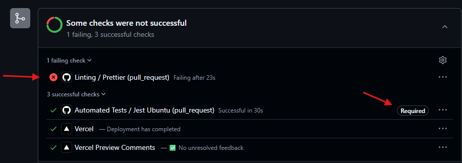
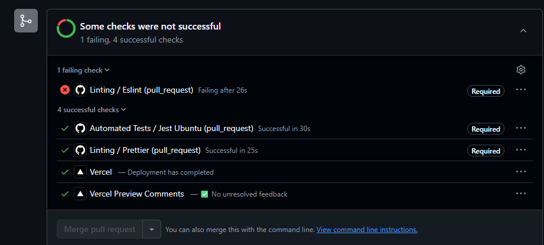

# 🧹 Linting

Já passamos a utilizar de certa forma um linter de código com `editorconfig + prettier`.

Porém, o lint de código não se resume a só isso.

A pratica do linting ou análise estática de código é uma boa prática para evitar que software saia dos eixos.

Então podemos expandir esse conceito em 2 partes:

Pré lint ou pré formatador -> Atuação na formatação de estilo do código.

Quando instalamos o `EditorConfig for VS Code` forçamos o uso de regras e definição de estilos antes de salvar os arquivos. Ex: 2 espaços ao usar tab.

Pós lint -> Atuação na qualidade do código.

Aqui no pós já temos tanto o tratamento de estilização padrão quanto a qualidade do código ao salvar os arquivos.

Bons exemplos são o `Prettier` para estilização e o `ESLint` para qualidade.

> Uma combinação desses 2 tipos de linter é o [Biome](https://biomejs.dev/pt-br/)

## Criando Workflow de linting

Para executar o linting via actions no github, podemos criar um novo fluxo de trabalho.

### Linting de estilo

```yaml
name: Linting

on: pull_request

jobs:
  prettier:
    name: Prettier # Como é apenas formatação, não precisa especificar o S.O.
    runs-on: ubuntu-latest
    steps:
      - uses: actions/checkout@v4

      - uses: actions/setup-node@v4
        with:
          node-version: "lts/hydrogen"

      - run: npm ci

      # script conforme definido no package.json
      - run: npm run lint:prettier:check # roda o comando especifico do prettier
```

Agora, basta fazer o PR... e configurar mais um `RuleSet` no GitHub para tornar essa etapa obrigatória.



Aproveitando que foi detectado problema com o padrão do migration, que é um arquivo gerado sem interação, basta executar um `npm run lint:prettier:fix`.

> Além de usar o fix, podemos adicionar Hooks do GitHub no pre-commit pra já fazer
> Os commits com formato ajustado.

De toda forma, a melhor prática é ter a garantia de tratamento no CI e contar com serviços externos apenas como uma camada adicional de verificação.

### Linting de qualidade

Uma solução muito utilizada é o `ESLint`, que encontra e conserta problemas em código JavaScript. Ele possui uma série de regras internas.

O `Nextjs` já possui uma abstração por ESLint, facilitando o seu uso.

```bash
# instale a versão compatível com o projeto
npm install eslint@8.57.0 eslint-config-next@14.2.4
```

Agora configurando um script de atalho para usar o next lint

```js
// script no package.json
    "lint:eslint:check": "next lint",
```

Ao utilizar o comando, temos as opções strict (rigorosa) ou base. Strict é a recomendada por padrão.

```bash
# log
clone-tabnews on  lint-quality-action
❯ npm run lint:eslint:check

> clone-tabnews@1.0.0 lint:eslint:check
> next lint

✔ No ESLint warnings or errors
```

Esse comando cria um arquivo `.eslintrc.json` que possui as configurações recomendadas pelo Nextjs.

```json
// aqui podemos definir coleções de regras
{
  "extends": "next/core-web-vitals"
}

// adicionando novas regras
{
  "extends": ["eslint:recommended", "next/core-web-vitals"]
}
```

Simulando um erro, criando uma variável sem utilização e sem atribuição no controller status.

```js
// trecho v1/status/index.js
async function status(request, response) {
  const updatedAt = new Date().toISOString();

  let variavelEsquecida;
}

// log no terminal
clone-tabnews on  lint-quality-action
❯ npm run lint:eslint:check

> clone-tabnews@1.0.0 lint:eslint:check
> next lint


./pages/api/v1/status/index.js
6:7  Error: 'variavelEsquecida' is defined but never used.  no-unused-vars
```

Pra facilitar os alertas de erro diretamente na IDE, basta instalar a extensão pro VS Code.

## Melhorando filtro do ESLint

Por padrão o comando next lint é aplicado apenas em pastas pré definidas. Mas nesse projeto precisamos avaliar também outros diretórios e testes.

```js
// adicionando instrução para avaliar todas as pastas
 "lint:eslint:check": "next lint --dir .",


// log
clone-tabnews on  lint-quality-action
❯ npm run lint:eslint:check

> clone-tabnews@1.0.0 lint:eslint:check
> next lint --dir .


./infra/database.js
31:1  Warning: Assign object to a variable before exporting as module default  import/no-anonymous-default-export

./infra/migrations/1748980342283_test-migrations.js
5:15  Error: 'pgm' is defined but never used.  no-unused-vars
7:17  Error: 'pgm' is defined but never used.  no-unused-vars

./pages/api/v1/status/index.js
6:7  Error: 'variavelEsquecida' is defined but never used.  no-unused-vars

./tests/integration/api/v1/migrations/get.test.js
4:1  Error: 'beforeAll' is not defined.  no-undef
9:1  Error: 'test' is not defined.  no-undef
11:3  Error: 'expect' is not defined.  no-undef
15:3  Error: 'expect' is not defined.  no-undef
16:3  Error: 'expect' is not defined.  no-undef
```

Agora temos o retorno mais completo, mas ainda sim, alguns apontamentos não são erros e precisam ser filtrados.

```powershell
# instalando módulo do eslint para jest
npm install --save-dev eslint-plugin-jest@28.6.0

# versão do comando encurtada. i de install e -D (--save-dev)
npm i -D eslint-plugin-jest@28.6.0
```

Adicionando as regras do plugin ao ESLint:

```json
{
  "extends": [
    "eslint:recommended",
    "plugin:jest/recommended",
    "next/core-web-vitals"
  ]
}
```

Agora o filtro fica bem mais orientado, trazendo o foco para potenciais erros e alertas.

```bash
clone-tabnews on  lint-quality-action
❯ npm run lint:eslint:check

> clone-tabnews@1.0.0 lint:eslint:check
> next lint --dir .


./infra/database.js
31:1  Warning: Assign object to a variable before exporting as module default  import/no-anonymous-default-export

./infra/migrations/1748980342283_test-migrations.js
5:15  Error: 'pgm' is defined but never used.  no-unused-vars
7:17  Error: 'pgm' is defined but never used.  no-unused-vars

./pages/api/v1/status/index.js
6:7  Error: 'variavelEsquecida' is defined but never used.  no-unused-vars

./tests/orchestrator.js
22:1  Warning: Assign object to a variable before exporting as module default  import/no-anonymous-default-export
```

> ⚠️ O Prettier pode conflitar com o ESLint se não for configurado. Pra isso é necessário instalar mais um módulo.

```bash
# instala o módulo como dependência de desenvolvimento
npm i -D eslint-config-prettier@9.1.0

# adiciona as regras do eslint
{
  "extends": [
    "eslint:recommended",
    "plugin:jest/recommended",
    "next/core-web-vitals",
    "prettier"
  ]
}
```

Adicionando novo trabalho no fluxo `linting.yaml`

```yaml
name: Linting

on: pull_request

jobs:
  prettier:
    name: Prettier
    runs-on: ubuntu-latest
    steps:
      - uses: actions/checkout@v4

      - uses: actions/setup-node@v4
        with:
          node-version: "lts/hydrogen"

      - run: npm ci

      - run: npm run lint:prettier:check
  # job praticamente igual ao do Prettier, usando os comandos do ESLint
  eslint:
    name: Eslint
    runs-on: ubuntu-latest
    steps:
      - uses: actions/checkout@v4

      - uses: actions/setup-node@v4
        with:
          node-version: "lts/hydrogen"

      - run: npm ci

      - run: npm run lint:eslint:check
```

O proximo passo é fazer commit e push pro GitHub, o que vai disparar as actions.

Como boa prática, adicionar o RuleSet para checar o novo job Eslint.



## Corrigindo efeitos colaterais

> 🧠 ctrl + r no bash permite busca reversa de comandos executados no terminal bash, facilitando encontrar últimos comandos utilizados.
> Ex: ctrl + r e pesquisar por lint:eslint já irá autocompletar o comando. Ai é só apertar enter.

```bash
 npm run lint:eslint:check

> clone-tabnews@1.0.0 lint:eslint:check
> next lint --dir .


./infra/database.js
31:1  Warning: Assign object to a variable before exporting as module default  import/no-anonymous-default-export

./infra/migrations/1748980342283_test-migrations.js
5:15  Error: 'pgm' is defined but never used.  no-unused-vars
7:17  Error: 'pgm' is defined but never used.  no-unused-vars

./pages/api/v1/status/index.js
6:7  Error: 'variavelEsquecida' is defined but never used.  no-unused-vars

./tests/orchestrator.js
22:1  Warning: Assign object to a variable before exporting as module default  import/no-anonymous-default-export
```

O primeiro aviso é sobre o código exportado do database.js não estar atribuído a um objeto. Acessando a documentação, o recomendado é fazer a atribuição a uma variável, pois numa futura pesquisa é padronizado a forma de encontrar o objeto.

```js
// trecho database.js
export default {
  query,
  getNewClient,
};

// ajuste
const database = {
  query,
  getNewClient,
};

export default database;
```

A mesma situação pro aviso do orchestrator.js

```js
// trecho orchestrator.js
export default {
  waitForAllServices,
};

// ajuste
const orchestrator = {
  waitForAllServices,
};

export default orchestrator;
```

Executando novamente o eslint check, temos apenas os erros pra ajuste.

```js
// apenas adicionamos os comentarios especiais do eslint pra desconsiderar os erros
// ja que esse arquivo de migrations será descartado futuramente

/* eslint-disable no-unused-vars */
/* eslint-disable camelcase */

exports.shorthands = undefined;

exports.up = (pgm) => {};

exports.down = (pgm) => {};

// removida a variavelEsquecida no status/index.js
```

Fazendo um novo check, tudo fica OK.

```bash
❯ npm run lint:eslint:check

> clone-tabnews@1.0.0 lint:eslint:check
> next lint --dir .

✔ No ESLint warnings or errors
```
