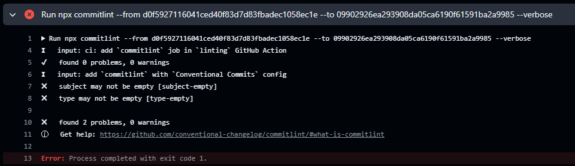

# 🧹 Limpando e padronizando Commits

Assim como fizemos usando o Prettier e ESLint na padronização do estilo e qualidade de código, é possível padronizar os commits via actions.

"As vezes o lento demora mais pois escolheu um caminho mais profundo."

"Ir apenas pelo caminho superficial não faz criar raízes."

## Commit lint

O commitlint.js é uma ferramenta de linha de comando que auxilia na aplicação nas regras de commit. Ele é bem flexível na gestão de regras.

Ele aceita a configurações dos Hooks do GitHub para validação, sendo perfeito para uso no CI.

```bash
# i -D abreviatura para install --save-dev, apenas dependência de desenvolvimento
# instala o core do commitlint
npm i -D @commitlint/cli@19.3.0

# instala o módulo de convenções
npm i -D @commitlint/config-conventional@19.2.2
```

Agora configurando na raiz do projeto:

```js
// commitlint.config.js
// habilita o uso das convenções
module.exports = {
  extends: ["@commitlint/config-conventional"],
};
```

Para testar no terminal, podemos usar o recurso `npx`. Ele executa o módulo (se existir) ou instala de forma temporária e executa.

> 💡 O x é de eXecute -> Node Package Execute

```bash
# executando
npx commitlint
@commitlint/cli@19.3.0 - Lint your commit messages

[input] reads from stdin if --edit, --env, --from and --to are omitted

# ele aceita o entradas padrão, permitindo o echo pra exibir no terminal
echo "Teste" | npx commitlint

# retorno do log, simulando apenas a palavra Teste na mensagem do commit
clone-tabnews on  lint-commits [!?] is 📦 v1.0.0 via  v18.20.8
❯ echo "Teste" | npx commitlint
⧗   input: Teste
✖   subject may not be empty [subject-empty]
✖   type may not be empty [type-empty]

✖   found 2 problems, 0 warnings
ⓘ   Get help: https://github.com/conventional-changelog/commitlint/#what-is-commitlint
```

O log exibe o que faltou no padrão e indica o que fazer. Temos 2 indefinições:

- subject may not be empty [subject-empty] -> assunto indefinido
- type may not be empty [type-empty] -> tipo de commit indefinido

```bash

# realizando novo teste, agora com a definição do tipo e conteúdo
echo "teste: mensagem de commit" | npx commitlint

# log retorna erro, pois o tipo de commit não está contido no array padrão
clone-tabnews on  lint-commits [!?] is 📦 v1.0.0 via  v18.20.8
❯ echo "teste: mensagem de commit" | npx commitlint
⧗   input: teste: mensagem de commit
✖   type must be one of [build, chore, ci, docs, feat, fix, perf, refactor, revert, style, test] [type-enum]

✖   found 1 problems, 0 warnings

# log retorna erro caso o tipo não esteja todo em minúsculo
echo "Feat: mensagem de commit" | npx commitlint
⧗   input: Feat: mensagem de commit
✖   type must be lower-case [type-case]
```

## Configurando CI

```bash
npx commitlint --from ${{ github.event.pull_request.base.sha }} --to ${{ github.event.pull_request.head.sha }} --verbose
```

Essa instrução do `commitlint` serve para verificar se as mensagens de _commit_ de um _pull request_ seguem um padrão definido (como Conventional Commits).

Explicação dos parâmetros:

- `npx commitlint`: executa o commitlint.
- `--from`: SHA do commit base (ponto de partida do PR).
- `--to`: SHA do commit final (último commit no PR).
- `--verbose`: exibe logs detalhados da verificação.

Contexto de uso:

Dentro de um workflow no GitHub Actions, `${{ github.event.pull_request.base.sha }}` representa o commit base do PR, e `${{ github.event.pull_request.head.sha }}` representa o commit mais recente do PR.

Vamos entender como ele faz a análise com base nesse trecho do git log:

```bash
git log
commit 2d167955fad732b585c9682dc440c37e596e6f70 (HEAD -> lint-commits, origin/lint-commits)
Author: Thiago Cajaiba <thiago.cajaiba@gmail.com>
Date:   Mon Jun 23 13:33:09 2025 -0300

    add `commitlint` with `Conventional Commits` config

commit d0f5927116041ced40f83d7d83fbadec1058ec1e (origin/main, origin/HEAD, main)
Merge: 5fb1866 392a2ef
Author: Thiago Cajaíba <51033018+thiagokj@users.noreply.github.com>
Date:   Mon Jun 23 11:10:30 2025 -0300

    Merge pull request #20 from thiagokj/git-commit-best-practices

    docs: add commit best practices

commit 392a2ef96793286fd94d7084ba654a87ccdf906e (origin/git-commit-best-practices)
Author: Thiago Cajaiba <thiago.cajaiba@gmail.com>
Date:   Mon Jun 23 11:07:40 2025 -0300

    docs: add commit best practices

commit fe27a01d378b34531ba7682eb7e6d6276453592c
Author: Thiago Cajaiba <thiago.cajaiba@gmail.com>
Date:   Sun Jun 22 12:43:50 2025 -0300

    add commit documentation
```

No contexto do commitlint com `--from` e `--to`, o que acontece é o seguinte:

--from aponta para o commit base do PR (neste caso: d0f5927, que está na main);

--to aponta para o commit mais recente no PR (neste caso: 2d16795, que está ni lint-commits, o HEAD do PR).

O commitlint verifica todos os commits entre esses dois pontos, exclusivo do from e inclusivo do to.

Ou seja, ele vai analisar:

```bash
2d16795 (add `commitlint` with `Conventional Commits` config)
```

Esse é o único commit novo na branch lint-commits em relação à main, e é ele que será validado.

Resumindo: o HEAD da branch do PR é o ponto final da análise, e o base da main é o ponto de partida. A diferença entre os dois é o conjunto de commits que será checado.

```yaml
# adicionado novo job no linting.yaml
# outros jobs acima...
commitlint:
  name: Commitlint
  runs-on: ubuntu-latest
  steps:
    - uses: actions/checkout@v4
      with:
        fetch-depth: 0 # instrução para analisar todos os commits. sem isso, é analisado apenas o último.

    - uses: actions/setup-node@v4
      with:
        node-version: "lts/hydrogen"

    - run: npm ci

    # executa o comando conforme a documentação do commitlint
    - run: npx commitlint --from ${{ github.event.pull_request.base.sha }} --to ${{ github.event.pull_request.head.sha }} --verbose
```

## Resolvendo erros de CI

Fazendo o commit e depois push, teremos uma situação de erro, pois as mensagens de commits até então não seguiam um padrão.



Essa mensagem de commit "add `commitlint` with `Conventional Commits` config" precisa ser corrigida.

Para resolver isso, podemos usar o `git rebase` no modo interativo.

```bash
# log do git commit
clone-tabnews on  lint-commits [!?] is 📦 v1.0.0 via  v18.20.8
❯ git log
commit 09902926ea293908da05ca6190f61591ba2a9985 (HEAD -> lint-commits, origin/lint-commits)
Author: Thiago Cajaiba <thiago.cajaiba@gmail.com>
Date:   Tue Jun 24 11:07:20 2025 -0300

    ci: add `commitlint` job in `linting` GitHub Action

commit 2d167955fad732b585c9682dc440c37e596e6f70
Author: Thiago Cajaiba <thiago.cajaiba@gmail.com>
Date:   Mon Jun 23 13:33:09 2025 -0300

    add `commitlint` with `Conventional Commits` config

commit d0f5927116041ced40f83d7d83fbadec1058ec1e (origin/main, origin/HEAD, main)
Merge: 5fb1866 392a2ef
Author: Thiago Cajaíba <51033018+thiagokj@users.noreply.github.com>
Date:   Mon Jun 23 11:10:30 2025 -0300

    Merge pull request #20 from thiagokj/git-commit-best-practices

    docs: add commit best practices

# vamos apontar o rebase para o commit anterior ao que está gerando erro e fora do padrão.
# commit com hash d0f5927
# como preciso voltar 2 commits, basta colocar o ponteiro como HEAD~2
git rebase -i HEAD~2
```

Commits serão reaplicados na ordem crescente

```bash
pick 2d16795 add `commitlint` with `Conventional Commits` config
pick 0990292 ci: add `commitlint` job in `linting` GitHub Action

# Rebase d0f5927..0990292 onto d0f5927 (2 commands)
#
# Commands:
# p, pick <commit> = use commit
# r, reword <commit> = use commit, but edit the commit message
```

Como a documentação sugere, temos a opção reword pra usar o commit, alterando somente a mensagem, então:

```bash
# alterado de pick para reword. ao salvar será aberta opção para reescrever o commit
reword 2d16795 add `commitlint` with `Conventional Commits` config
pick 0990292 ci: add `commitlint` job in `linting` GitHub Action
```

Executando um novo git log, temos os hashes recalculados a partir do commit base, com a mensagem atualizada:

> 💡 Como já informado em outros conteúdos, o commit é algo imutável, então o git rebase cria novos commits por baixo dos panos.

```bash
# git log
clone-tabnews on  lint-commits [!?⇕] is 📦 v1.0.0 via  v18.20.8
❯ git log
commit 7a13f151f9464c6fd79d10a58186cc80cc823440 (HEAD -> lint-commits)
Author: Thiago Cajaiba <thiago.cajaiba@gmail.com>
Date:   Tue Jun 24 11:07:20 2025 -0300

    ci: add `commitlint` job in `linting` GitHub Action

commit ad625ea0a643a6e0b7913bb0a709d580d01681a6
Author: Thiago Cajaiba <thiago.cajaiba@gmail.com>
Date:   Mon Jun 23 13:33:09 2025 -0300

    ci: add `commitlint` with `Conventional Commits` config

commit d0f5927116041ced40f83d7d83fbadec1058ec1e (origin/main, origin/HEAD, main)
Merge: 5fb1866 392a2ef
Author: Thiago Cajaíba <51033018+thiagokj@users.noreply.github.com>
Date:   Mon Jun 23 11:10:30 2025 -0300

    Merge pull request #20 from thiagokj/git-commit-best-practices
```

Fazendo um novo commit e push, o CI funciona:

```bash
1s
Run npx commitlint --from d0f5927116041ced40f83d7d83fbadec1058ec1e --to 7633dc4ce8d8e5011213d741ca4f5b98675d2a7c --verbose
⧗   input: docs: update linter commits
✔   found 0 problems, 0 warnings
⧗   input: ci: add `commitlint` job in `linting` GitHub Action
✔   found 0 problems, 0 warnings
⧗   input: ci: add `commitlint` with `Conventional Commits` config
✔   found 0 problems, 0 warnings
```
