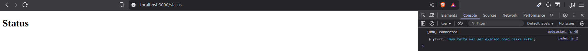
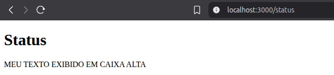

# 🖼️ Frontend com React

Pra entender melhor como funciona o React, não há coisa melhor do que abrir o "capô" e ver como cada input se conecta.

Exemplo com html:

```html
<!-- a tag img é um componente HTML -->

```

No React temos essa oportunidade de criar os **componentes** e mexer com suas **propriedades**.

O React tem 3 partes fundamentais:

- **Visual**: Define a interface: JSX + CSS ou styled components
- **Funcionalidade**: Controla o comportamento: eventos, estados, lógica do componente
- **Memória**: Armazena e gerencia dados: state, props, context, hooks como useState, useReducer

## Criando componente CapsLock

Esse componente para aprendizado faz com que todo o texto dentro dele fique em CAIXA ALTA.

```js
<CapsLock text="texto em caixa alta aqui" />
```

Hora de criar o componente, que nada mais é que `html` e `javascript`:

```js
// componente para testes em pages/status/index.js
<CapsLock texto="meu texto exibido em caixa alta" />;

function CapsLock(props) {
  console.log(props);
}
```

Basicamente é isso. Todas as **propriedades** de um componente são injetadas na função, por isso temos fácil acesso a elas.

Então o React é isso, colocar um componente dentro do outro pra formar um Layout, assim como é feito no Html.

```js
// continuando
<CapsLock texto="meu texto exibido em caixa alta" />;

function CapsLock(props) {
  console.log(props);
}

// função principal que é exibida na tela
export default function StatusPage() {
  return <h1>Status</h1>;
}
```

O `return` consegue exibir apenas um elemento. Então precisamos abraçar tudo o que precisa ser renderizado com tags `<div> </div>`

```js
// organizando o componente
function CapsLock(props) {
  console.log(props);
}

export default function StatusPage() {
  return (
    <div>
      <h1>Status</h1>
      <CapsLock texto="meu texto exibido em caixa alta" />
    </div>
  );
}
```

O único empecilho de colocar 2 componentes pra serem exibidos assim, é que no futuro a estilização com CSS pode ser afetada.

Então pra evitar essa situação, usamos o **React Fragment**, que é um componente especial em branco.

```js
// sim, o React Fragment é declarado apenas como uma tag vazia.
// alterada a tag <div> para <>
function CapsLock(props) {
  console.log(props);
}

export default function StatusPage() {
  return (
    <>
      <h1>Status</h1>
      <CapsLock texto="meu texto exibido em caixa alta" />
    </>
  );
}
```

Acompanhando via `Dev Tools` no navegador ao acessar a pagina /status:



Temos um `objeto` com a propriedade `text`, com o valor `meu texto...`.

### Fazendo o toUpperCase

Como o acesso a propriedade não tem segredo, é só usar javascript pra converter o texto pra maiúsculo.

```js
function CapsLock(props) {
  const textoEmCapsLock = props.texto.toUpperCase();
  console.log(textoEmCapsLock);
}

export default function StatusPage() {
  return (
    <>
      <h1>Status</h1>
      <CapsLock texto="meu texto exibido em caixa alta" />
    </>
  );
}

// saída no console
MEU TEXTO VAI SER EXIBIDO COMO CAIXA ALTA
```

Mas o usuário nem sabe o que é console não é mesmo?! 😅

```js
function CapsLock(props) {
  const textoEmCapsLock = props.texto.toUpperCase();

  return textoEmCapsLock;
}

export default function StatusPage() {
  return (
    <>
      <h1>Status</h1>
      <CapsLock texto="meu texto exibido como caixa alta" />
    </>
  );
}
```

Agora sim, mostrando na tela


