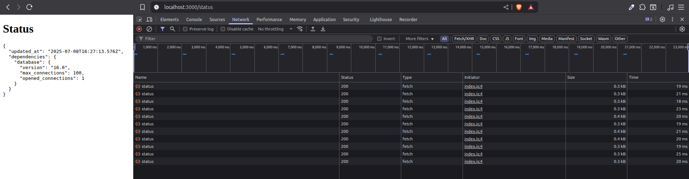
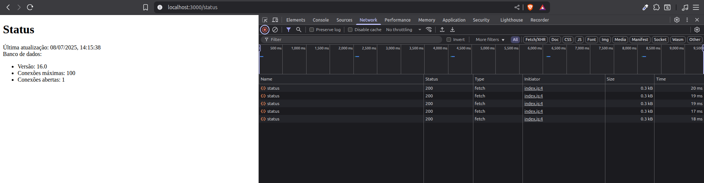

# 1️⃣ Primeira versão da página de Status

Removendo o código de exemplo do componente `<CapsLock />`, vamos recuperar os dados de verdade de status da aplicação.

```js
// assim como é feito no get.test, usamos o fetch do js, que é um client pra fazer requisição
async function fetchStatus() {

  // aqui usamos a url relativa. Deixar fixo no código gera
  // problemas de tunelamento em diversos ambientes.
  // O navegador se encarrega de completar o endereço
  // url completa: http://localhost:3000/api/v1/status
  const response = await fetch("/api/v1/status");
  const responseBody = await response.json();
  return responseBody;
}

export default function StatusPage() {
  // exibindo de forma tosca. haha.
  console.log(fetchStatus());

  return (
    <>
      <h1>Status</h1>
    </>
  );
}

// na console do navegador temos a PromisseResult, retornando um objeto com a resposta do fetch
{
  "updated_at": "2025-07-08T14:34:01.830Z",
  "dependencies": {
    "database": {
        "version": "16.0",
        "max_connections": 100,
        "opened_connections": 1
    }
  }
}
```

Basicamente conectamos o **Frontend** com o **Backend**.

Mas aqui de novo, console é só pra desenvolvedor. Precisamos mostrar pro usuário de forma fácil na tela.

> Esse exemplo é muito simplificado. Acontecem diversos efeitos colaterais com uma abordagem dessas.
> Erros precisam ser tratados e fluxos gerenciados.

## Usando um DataFetcher

Pra tratar o consumo dos dados no Frontend, existem módulos populares como **SWR** e **React Query (Tan Stack)**.

Vamos usar o `SWR` por ele ter sido criado pela Vercel e por ele ter uma sintaxe familiar ao projeto.

```bash
#npm install --save-exact swr@2.2.5 # versão verbosa pra instalar a versão exata
npm install -E swr@2.2.5
```

Adaptando ao código

```js
// o use é uma convenção de HookReact
// então sempre é usado use, seguido pelo recurso utilizado
// ex: useSWR, useFetch, useLocalStorage, useTheme, etc.
// aqui importamos a Interface useSWR do módulo swr
import useSWR from "swr";

async function fetchStatus() {
  const response = await fetch("http://localhost:3000/api/v1/status");
  const responseBody = await response.json();
  return responseBody;
}

export default function StatusPage() {
  // o useSWR precisa de 2 parâmetros
  // o nome da chave e o buscador
  const response = useSWR("status", fetchStatus);

  // como essa é uma interface, há uma serie de abstrações já resolvidas por ela
  console.log(response.isLoading);

  return (
    <>
      <h1>Status</h1>
    </>
  );
}

// retorno na console
// true -> está carregando o retorno da busca pelo fetch
// false -> terminou de carregar e trouxe o retorno da promessa
```

Abstrações feitas pelo SWR:

- async/await: você só fornece o fetcher, sem lidar com promessas direto.

- isLoading: estado de carregamento automático via isLoading ou !data && !error.

- Revalidação automática: ao focar a aba, reconectar, ou via revalidateOnFocus, refreshInterval, etc.

- Cache global inteligente: múltiplos useSWR com mesma chave compartilham dados sem novo fetch.

- Extensível: suporte a fallback, mutation, middlewares, debounce, etc.

- SWR = Stale While Revalidate = mostra cache rápido + atualiza em segundo plano.

Pra ver os dados após o carregamento, basta usar:

```js
console.log(response.isLoading);
console.log(response.data);

// retorno
// false -> retornou os dados da busca fetch
{
  "updated_at": "2025-07-08T16:08:37.279Z",
  "dependencies": {
    "database": {
        "version": "16.0",
        "max_connections": 100,
        "opened_connections": 1
    }
  }
}
```

A natureza do React é ser **reativo** conforme as mudanças na memória de cada componente. A cada mexida na memória, a parte visual responde automaticamente.

Resumindo: A **funcionalidade** altera os dados na **memória**, e isso automaticamente faz a parte **visual** reagir, renderizando (processa para exibição) com as novas informações.

```js
import useSWR from "swr";

async function fetchStatus() {
  const response = await fetch("http://localhost:3000/api/v1/status");
  const responseBody = await response.json();
  return responseBody;
}

export default function StatusPage() {
  const response = useSWR("status", fetchStatus);

  // tag <pre> pré formata códigos a serem exibidos
  // função global JSON.stringify converte um objeto em uma string JSON
  return (
    <>
      <h1>Status</h1>
      <pre>{JSON.stringify(response.data, null, 2)}</pre>
    </>
  );
}
```

O useSWR possui um objeto de configurações, como por exemplo, fazer requisição com intervalo de tempo

```js
const response = useSWR("status", fetchStatus, {
  refreshInterval: 100,
});
```

Temos a atualização em tempo real em tela. Veja no detalhe do Dev Tools -> Network, as requisições sendo realizadas a cada 2 segundos.



> O SWR faz deduplicação de dados. Então requisições realizadas de forma contínua são unificadas e ficam em cache, permitindo que outras chamadas internas reutilizem a mesma resposta sem disparar novos fetches desnecessários.

Se reduzir o refresh para 100ms, o SWR ainda usará seu cache padrão de 2 segundos, entregando a resposta armazenada até 2 segundos atrás, evitando novos fetches até o cache expirar.

```js
const response = useSWR("status", fetchStatus, {
  refreshInterval: 100,
  dedupingInterval: 100, // controlando o intervalo de caching
});
```

> Consultas assim arrebentam o Backend
> Para casos de respostas com baixa latência, o ideal é usar outros métodos como websocket

Refatorando a busca no backend

```js
import useSWR from "swr";

// renomeada função para refletir melhor sua responsabilidade
// por baixo do capô, o SWR injeta a key como argumento
// permitindo identificar qual recurso (URL) deve ser buscado
async function fetchAPI(key) {
  const response = await fetch(key);
  const responseBody = await response.json();
  return responseBody;
}

export default function StatusPage() {
  // reforçando: o nome da key é apenas o identificador
  // estamos aproveitando o identificador para servir
  // como rota da API e passar para função
  const response = useSWR("/api/v1/status", fetchAPI, {
    refreshInterval: 2000,
  });

  return (
    <>
      <h1>Status</h1>
      <pre>{JSON.stringify(response.data, null, 2)}</pre>
    </>
  );
}
```

Nova refatoração, criando mais componentes e separando o código:

```js
import useSWR from "swr";

async function fetchAPI(key) {
  const response = await fetch(key);
  const responseBody = await response.json();
  return responseBody;
}

export default function StatusPage() {
  // criado componente UpdatedAt
  return (
    <>
      <h1>Status</h1>
      <UpdatedAt />
    </>
  );
}

function UpdatedAt() {
  // aqui vamos mexer mais e usar o padrão de mercado
  // desestruturando o objeto
  const response = useSWR("/api/v1/status", fetchAPI, {
    refreshInterval: 2000,
  });
}
```

Finalizando:

```js
import useSWR from "swr";

async function fetchAPI(key) {
  const response = await fetch(key);
  const responseBody = await response.json();
  return responseBody;
}

export default function StatusPage() {
  return (
    <>
      <h1>Status</h1>
      <UpdatedAt />
    </>
  );
}

function UpdatedAt() {
  const { isLoading, data } = useSWR("/api/v1/status", fetchAPI, {
    refreshInterval: 2000,
  });

  let updatedAtText = "Carregando...";

  // após carregar a página e retornar os dados, atualiza o texto na tela
  if (!isLoading && data) {
    updatedAtText = new Date(data.updated_at).toLocaleString("pt-BR");
  }

  return <div>Última atualização: {updatedAtText}</div>;
}
```

## Desafio

E lá vamos nós... criar um componente ou mais componentes para exibir na tela uma pagina de status com as informações disponibilizadas no backend.

```js
import useSWR from "swr";

async function fetchAPI(key) {
  const response = await fetch(key);
  const responseBody = await response.json();
  return responseBody;
}

export default function StatusPage() {
  return (
    <>
      <h1>Status</h1>
      <UpdatedStatus />
    </>
  );
}

function UpdatedStatus() {
  const { isLoading, data } = useSWR("/api/v1/status", fetchAPI, {
    refreshInterval: 2000,
  });

  // garante que o primeiro retorno sempre é a mensagem de carregamento
  // essa é uma boa prática muito recomendada
  if (isLoading && !data) {
    return <div>Carregando...</div>;
  }

  // desestruturado objeto com dados retornados do endpoint status
  const { updated_at, dependencies } = data;
  const db = dependencies.database;

  // colocado em uma lista para exibir as informações
  // mantendo a didática até aqui e seguindo o estilo próximo ao JSON
  return (
    <div>
      <div>
        Última atualização: {new Date(updated_at).toLocaleString("pt-BR")}
      </div>
      <div>Banco de dados:</div>
      <ul>
        <li>Versão: {db.version}</li>
        <li>Conexões máximas: {db.max_connections}</li>
        <li>Conexões abertas: {db.opened_connections}</li>
      </ul>
    </div>
  );
}
```

Saida na tela


