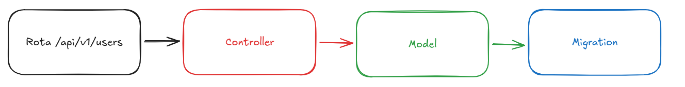

# Criando estrutura para Users

Precisamos criar uma `migration` para criar a tabela no banco de dados. Seguindo o fluxo partindo do endpoint:



1. **Rota /api/v1/users**: recebe a requisição HTTP (ex: GET, POST) e vai rotear, mandar a requisição para algum lugar. No caso, o Controller.

1. **Controller**: interpreta a requisição e chama o model certo.

1. **Model**: lida com as regras de negócio e o acesso aos dados.

1. **Migration**: define e atualiza a estrutura do banco (tabelas, colunas). Aqui é feita a persistência dos dados, salvando os mesmos.

## Modificando um arquivo de migração

Apague o arquivo de migração de teste do controle do git.

> ⚠️ Nunca mais altere arquivos de migração, isso bagunça todo o histórico de alterações no banco. Mexendo nele apenas pra fins acadêmicos.

```bash
# remove do git
git rm infra/migrations/1748980342283_test-migrations.js
```

Agora sim, sem nenhum arquivo de teste na migration. Hora de criar uma migration de verdade.

> Sobre convenções de nome, pense sempre no Model como um Molde. Uma forma padrão que produz muitas coisas.
> Essas "muitas coisas" são armazenadas em tabelas, usando Migrations, com nome no Plural. Ex: Users, tbUsers, tbUsuarios, tabela_usuarios.

Resumindo:

- **Model** é no singular. UsuarioModel, UserModel ou apenas User.
- **Migration** é no plural. Ex: Os Usuários são salvos na tabela de Usuários.

Seguindo a convenção do pessoal do Ruby On Rails, a criação de migrations segue sempre: create [nomeDaTabela]

```bash
npm run migrations:create create users
```

Apos criar o template da migration, ajuste o arquivo.

```js
// infra/migrations/1753029002617_create-users.js
exports.up = (pgm) => {
  // cria a tabela users e informa um objeto com a definição das colunas
  pgm.createTable("users", {});
};

// informa o pg migrate para considerar apenas migrações pra cima
exports.down = false;
```

Nossa tabela precisa ficar assim:

| id  | username        | email                    | password |
| --- | --------------- | ------------------------ | -------- |
| 1   | thiagocajadev   | thiago.cajaiba@gmail.com | abc123   |
| 2   | filipedeschamps | filiped@gmail.com        | 123abc   |
| 3   | cursodev        | contato@curso.dev        | 123456   |

Pra criar a primeira coluna, será usado o nome **id**, que é o identificador.

```js
exports.up = (pgm) => {
  pgm.createTable("users", {
    // define o nome da coluna e permite especificar no objeto de config
    // as propriedades da coluna como tipo, tamanho, etc.
    id: {
      type: "uuid",
    },
  });
};
```

**UUID** -> Universally Unique Identifier ou Identificador Unicamente Universal
É uma sequência única de caracteres usada para identificar algo de forma global, sem depender de banco de dados ou sistemas centralizados.
Exemplo: 550e8400-e29b-41d4-a716-446655440000

A principal vantagem do **UUID** é gerar identificadores únicos de forma segura e **imprevisível**. Diferente de IDs sequenciais, ele dificulta tentativas de adivinhação ou exploração de registros, aumentando a segurança do sistema.

> Claro, sempre há vantagens e desvantagens para cada abordagem.
> Em outros casos, pode ser mais interessante um identificador sequencial
> Talvez para performance ou indexação, mas no momento esse atende perfeitamente.

Realizando testes contra o endpoint:

```bash
# users/post substituído por um ".", para compatibilidade
# nos Sistemas Operacionais mais usados
npm run test:watch -- users.post
```

```js
// código temporário de teste
// tests/users/post.test.js
mport orchestrator from "tests/orchestrator.js";
import database from "infra/database";

beforeAll(async () => {
  await orchestrator.waitForAllServices();
  await orchestrator.clearDatabase();
  // necessário apenas limpeza do banco
  await orchestrator.runPendingMigrations();
});

describe("POST /api/v1/users", () => {
  describe("Anonymous user", () => {
    test("With unique and valid data", async () => {
      const users = await database.query("SELECT * FROM users;");
      console.log(users.rows);

      const response = await fetch("http://localhost:3000/api/v1/users", {
        method: "POST",
      });
      expect(response.status).toBe(201);
    });
  });
});
```

Uma tabela no banco de dados possui uma propriedade chamada **Primary Key**, que garante identificador único, que pode ser usado para relacionar registros com identificadores em outras tabelas.

```js
// detalhes da migration até o momento
exports.up = (pgm) => {
  pgm.createTable("users", {
    id: {
      type: "uuid",
      primaryKey: true,
      // função do pg-migrate para gerar uuid aleatório
      default: pgm.func("gen_random_uuid()"),
    },

    // Como referência, o GitHub limita o nome de usuário a 39 caracteres
    username: {
      type: "varchar(30)",
      notNull: true,
      unique: true,
    },
  });
};

exports.down = false;

// executando o teste
// tests/users/post.test.js
mport orchestrator from "tests/orchestrator.js";
import database from "infra/database";

beforeAll(async () => {
  await orchestrator.waitForAllServices();
  await orchestrator.clearDatabase();
  await orchestrator.runPendingMigrations();
});

describe("POST /api/v1/users", () => {
  describe("Anonymous user", () => {
    test("With unique and valid data", async () => {
      await database.query({
        text: "INSERT INTO users (username) VALUES ($1);",
        values: ["thiagocajadev"],
      });
      const users = await database.query("SELECT * FROM users;");
      console.log(users.rows);
    }
      // demais códigos ...
)})});

// log no console
// criado registro na tabela
console.log
    [
      {
        id: '8acae7c6-e3fc-47ed-a5e7-e10cd27bc840',
        username: 'thiagocajadev'
      }
    ]
```

Então basta seguir essa linha de raciocínio, escolhendo o tipo de dado mais adequado para cada coluna da tabela.

> 💡 No caso colunas registrando a data e hora de criação, preferencialmente
> use TIMESTAMP UTC, evitando problemas futuros com fuso horários
