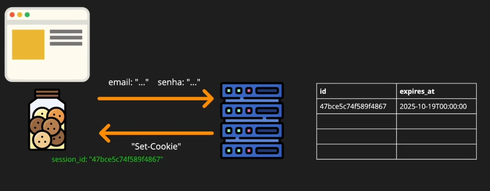

# 🪪 Autenticação e Autorização - Parte 1

O tema segurança tem que estar sempre na discussão principal de qualquer aplicação.

> "Um **sistema inseguro custa mais** caro que qualquer outro."

Não adianta nada uma aplicação que atenda ao negócio, mas que seja vulnerável. Todo o lucro vai pro ralo caso um hacker tenha acesso aos dados e faça ações dentro do sistema, como:

- Exposição dos dados de clientes.
- Obtenção de dados sigilosos do negócio, divulgando publicamente.
- Perda de confiança dos clientes e investidores.
- Corrupção no sistema, excluindo e modificando o banco de dados.
- Fraudes e desvios, gerando prejuízos inestimáveis.

Uma empresa pode fechar dependendo da gravidade de uma falha, igual a essa [aqui](https://www.tabnews.com.br/NewsletterOficial/empresa-de-transporte-com-158-anos-encerra-operacoes-apos-ataque-causado-por-senha-fraca).

Então, pra continuar fechando possíveis brechas, vamos implementar a autenticação e a autorização na aplicação.

## Definições

**Autenticação: Quem é você?**. A autenticação é responsável pela **identificação** do usuário no sistema. Quase todos os lugares hoje em dia pedem seu documento pra provar que você é você. Depois disso, fazem o cadastro, te identificando nos registros internos.

Ex: Em um check-in no hotel, após você apresentar seu documento de identificação, você é **autenticado** e recebe a chave da porta do quarto nº42.

**Autorização: O que você pode fazer?**. A autorização é responsável por **proibir ou permitir** as ações do usuário. Após você se identificar em uma empresa, você pode ou não acessar alguns locais. Pode trocar uma peça ou fazer uma manutenção, tudo conforme seu nível de permissão.

Ex: Com a chave, você pode abrir e entrar no quarto nº42. Mas, se tentar entrar no quarto nº43, não irá conseguir. Essa **chave não é autorizada** pra essa porta e o **acesso** é **negado**.

## Implementando a Autenticação

Pensando na web moderna, a identificação do usuário é feita sempre via **login**. Assim como um check-in, você apresenta as credenciais (usuário e senha), e se autentica no sistema.

Pra fazer isso na web por meio de um client http (como um navegador), basta preencher o formulário do site. Mas onde é salva essa informação que o usuário está autenticado?

Há algumas formas de guardar essa autenticação, provando que esse usuário é ele mesmo dentro do site ou em uma aplicação. A mais usada é utilizando **Cookies**, com o método **Set-Cookie**.

> 🍪 Cookies são pequenos pedaços de informação que o navegador salva para lembrar de você. Eles fazem parte do protocolo HTTP e ficam guardados em um lugar chamado CookieJar, um pote de biscoitos que funciona como um banco de dados do usuário.

Para cada domínio ou site diferente, existe um CookieJar diferente. Então não é possível um site ler cookies de outro site. A cada nova requisição, o navegador envia todo o pote de biscoitos no cabeçalho para o servidor.


Sim, antigamente essa era uma forma de passar o usuário e senha pro servidor. Texto puro, bem fácil de hackear e totalmente inseguro de trafegar. Fora que a cada troca de informações, seria feito uma nova checagem do usuário e senha, gastando mais tempo de processamento e gerando lentidão.

Pra resolver essa questão, foi criada a **Session-based Authentication**. Ao fazer o login, é criado um evento de **Sessão**, e essa sessão é compartilhada entre o servidor e o navegador. Esse compartilhamento pode ser feito através de um Cookie.



Aqui temos Token opaco ou `Opaque Session Token`. Não da pra extrair nada do token, como usuário e senha, sendo apenas uma etiqueta de identificação. O problema aqui é, caso alguém tenha esse ID, pode utiliza-lo para acesso indevido, fazendo um sequestro de sessão com a passagem de cookie.

Para ações mais críticas então, como modificar dados, podem ser consideradas verificações adicionais. O uso de mais estratégias como **impressão digital do navegador**, confirma que é o mesmo dispositivo que está fazendo o acesso com o Token.

Começando pelos testes para criar uma sessão:

```js
// testes feitos contra a rota /sessions
describe("POST /api/v1/sessions", () => {
  describe("Anonymous user", () => {
    // email errado com a senha certa
    test("With incorrect `email` but correct `password`", async () => {
      await orchestrator.createUser({
        password: "senha-correta",
      });

      const response = await fetch("http://localhost:3000/api/v1/sessions", {
        method: "POST",
        headers: {
          "Content-Type": "application/json",
        },
        body: JSON.stringify({
          email: "email.errado@curso.dev",
          password: "senha-correta",
        }),
      });

      // 401 - Acesso não autorizado
      // 403 - Acesso proibido
      expect(response.status).toBe(401);
    });
  });
});
```

Por que usar email e senha ao invés de nome de usuário e senha?

> O nome de usuário pode ser visível em alguns lugares de uma aplicação, se tornando público.

Isso permite um atacante já conhecer metade da informação para fazer um login. Já o email é uma informação privada, dificultando um pouco mais a vida do hacker.

```js
// implementação inicial da rota api/v1/sessions/index.js
import { createRouter } from "next-connect";
import controller from "infra/controller";
import user from "models/user.js";
import { UnauthorizedError } from "infra/errors.js";
import password from "models/password.js";

const router = createRouter();

router.post(postHandler);

export default router.handler(controller.errorHandlers);

async function postHandler(request, response) {
  const userInputValues = request.body;

  try {
    // um pouco bagunçado aqui
    const storedUser = await user.findOneByEmail(userInputValues.email);
    // apos recuperar o usuario, verifico a senha
    const correctPasswordMatch = await password.compare(
      userInputValues.password,
      storedUser.password,
    );

    // trato 2 condições de erro. Organizar esses passos seria melhor
    if (!correctPasswordMatch) {
      throw new UnauthorizedError({
        message: "Senha não confere.",
        action: "Verifique se este dado está correto.",
      });
    }
  } catch (error) {
    throw new UnauthorizedError({
      message: "Dados de autenticação não conferem.",
      action: "Verifique se os dados enviados estão corretos.",
    });
  }

  return response.status(201).json({});
}
```

## Refatorando a autenticação

### Nível 1

Criado um Model chamado de `authetication.js` para organizar a lógica

```js
// centralizada lógica para trabalhar os dados do usuário e senha
import user from "models/user.js";
import password from "models/password.js";
import { UnauthorizedError } from "infra/errors.js";

// toda a complexidade foi abstraída pro método que retorna o usuário autenticado
async function getAuthenticatedUser(providedEmail, providedPassword) {
  const storedUser = await user.findOneByEmail(providedEmail);
  const correctPasswordMatch = await password.compare(
    providedPassword,
    storedUser.password,
  );

  if (!correctPasswordMatch) {
    throw new UnauthorizedError({
      message: "Senha não confere.",
      action: "Verifique se este dado está correto.",
    });
  }

  return storedUser;
}

const authentication = {
  getAuthenticatedUser,
};

export default authentication;
```

### Nível 2

Organizando o tratamento de erros para identificar falha no email e senha.

```js
async function getAuthenticatedUser(providedEmail, providedPassword) {
  let storedUser;

  try {
    storedUser = await user.findOneByEmail(providedEmail);
  } catch (error) {
    throw new UnauthorizedError({
      message: "Email não confere.",
      action: "Verifique se este dado está correto.",
    });
  }

  const correctPasswordMatch = await password.compare(
    providedPassword,
    storedUser.password,
  );

  if (!correctPasswordMatch) {
    throw new UnauthorizedError({
      message: "Senha não confere.",
      action: "Verifique se este dado está correto.",
    });
  }

  return storedUser;
}
```

### Nível 3

Quando um método começa a ter muitos detalhes de implementação, é interessante abstrair as responsabilidades. Blocos menores de código geram clareza.

Uma boa prática é visualizar em poucas linhas o fluxo macro do código, com retorno explicito logo nas primeiras linhas (quando possível, é claro).

```js
async function getAuthenticatedUser(providedEmail, providedPassword) {
  const storedUser = findUserByEmail(providedEmail);
  await validatePassword(providedPassword, storedUser.password);

  return storedUser;
  // detalhes das funções auxiliares findUserByEmail e validatePassword abaixo
}
```

Fica muito melhor o entendimento do método assim! Código completo:

```js
async function getAuthenticatedUser(providedEmail, providedPassword) {
  const storedUser = await findUserByEmail(providedEmail);
  await validatePassword(providedPassword, storedUser.password);

  return storedUser;

  // nada melhor que um fluxo passo a passo
  async function findUserByEmail(providedEmail) {
    let storedUser;

    try {
      storedUser = await user.findOneByEmail(providedEmail);
    } catch (error) {
      throw new UnauthorizedError({
        message: "Email não confere.",
        action: "Verifique se este dado está correto.",
      });
    }

    return storedUser;
  }

  // valida a senha, sem dependência na recuperação do usuário.
  // esse método pode até ser reaproveitado em outros lugares do código futuramente
  async function validatePassword(providedPassword, storedPassword) {
    const correctPasswordMatch = await password.compare(
      providedPassword,
      storedPassword,
    );

    if (!correctPasswordMatch) {
      throw new UnauthorizedError({
        message: "Senha não confere.",
        action: "Verifique se este dado está correto.",
      });
    }
  }
}
```

### Nível 4

Ok, mas o tratamento de erros ainda não está bom. No caso de serviços externos darem problema, como Banco de dados fora ou um novo tipo de erro, será gerado um `Unauthorized Error` sempre!

```js
// trecho da rota "/sessions", mostrando no console o erro lançado
try {
  const authenticatedUser = await authentication.getAuthenticatedUser(
    userInputValues.email,
    userInputValues.password,
  );
} catch (error) {
  // mostrando aqui
  console.log(error.name);

  throw new UnauthorizedError({
    message: "Dados de autenticação não conferem.",
    action: "Verifique se os dados enviados estão corretos.",
  });
}

// trecho do authentication.js, com um erro forçado
async function findUserByEmail(providedEmail) {
  let storedUser;

  try {
    // model e método não existem e geram o erro
    modelQueNaoExiste.retornaUmErroDeJavaScript();
    storedUser = await user.findOneByEmail(providedEmail);
  } catch (error) {
    throw new UnauthorizedError({
      message: "Email não confere.",
      action: "Verifique se este dado está correto.",
    });
  }

  return storedUser;
}

// log no console
✓ Compiled /api/v1/sessions in 25ms (74 modules)
UnauthorizedError
 POST /api/v1/sessions 401 in 31ms
UnauthorizedError
 POST /api/v1/sessions 401 in 1ms
UnauthorizedError
 POST /api/v1/sessions 401 in 1ms
```

Aplicando uma pequena melhoria no lançamento de erro nesse trecho:

```js
// trecho do authentication.js
try {
  modelQueNaoExiste.retornaUmErroEsquisitoAqui();
  storedUser = await user.findOneByEmail(providedEmail);
} catch (error) {
  if (error instanceof NotFoundError) {
    throw new UnauthorizedError({
      message: "Email não confere.",
      action: "Verifique se este dado está correto.",
    });
  }

  // adicionado fallback, borbulhando o erro pra quem chamou esse método
  // até ele ser capturado
  throw error;
}

// log no console
// obs: na rota "/sessions", foi adicionado um (error.message) pra mostrar o método
 ✓ Compiled in 25ms (74 modules)
 GET /api/v1/status 200 in 17ms
ReferenceError
modelQueNaoExiste is not defined
 POST /api/v1/sessions 401 in 2ms
ReferenceError
modelQueNaoExiste is not defined
 POST /api/v1/sessions 401 in 1ms
ReferenceError
modelQueNaoExiste is not defined
 POST /api/v1/sessions 401 in 1ms
```

### Nível 5

```js
// refatorando a rota api/v1/sessions/index.js
try {
  const authenticatedUser = await authentication.getAuthenticatedUser(
    userInputValues.email,
    userInputValues.password,
  );
} catch (error) {
  // explicitando o erro
  if (error instanceof UnauthorizedError) {
    throw new UnauthorizedError({
      message: "Dados de autenticação não conferem.",
      action: "Verifique se os dados enviados estão corretos.",
    });
  }

  // e agora trazendo o fallback pra esse trecho do código,
  // fazendo o erro borbulhar novamente até ser capturado.
  // Nesse caso, irá até o tipo mais genérico, caindo no InternalServerError
  throw error;
}

// log no console resumido
// Vamos dizer que esse trecho é retornado para o cliente que fez a requisição
Compiled /api/v1/sessions in 62ms (74 modules)
  InternalServerError: Um erro interno não esperado aconteceu.
    at onErrorHandler (webpack-internal:/*(api)/./infra/controller.js:15:31*/)

action: 'Entre em contato com o suporte.',
statusCode: 500,
// Já essa parte interna fica para análise do desenvolvedor, no lado do servidor,
// expondo os detalhes do problema
[cause]: ReferenceError: modelQueNaoExiste is not defined
    at findUserByEmail (webpack-internal:/*(api)/./models/authentication.js*/)
```

Essa abordagem é massa, pois não expõe no retorno da api os detalhes de implementação, só retornando um erro 500 para o usuário que fez a requisição. Já para desenvolvedor, fica na stack de logs.

### Nível 6

Pra fechar a refatoração, rota `/sessions` fica apenas com a responsabilidade de retornar o usuário autenticado.

```js
async function postHandler(request, response) {
  const userInputValues = request.body;

  const authenticatedUser = await authentication.getAuthenticatedUser(
    userInputValues.email,
    userInputValues.password,
  );

  return response.status(201).json({});
}
```

O model `authentication.js` é quem acessa serviços externos como banco de dados. Aqui centralizamos os detalhes de implementação pra recuperar o usuário autenticado, tanto no caminho feliz quanto no caminho triste(erros e mais erros...).

```js
// trecho do Model authenticaton.js
async function getAuthenticatedUser(providedEmail, providedPassword) {
  try {
    const storedUser = await findUserByEmail(providedEmail);
    await validatePassword(providedPassword, storedUser.password);

    return storedUser;
  } catch (error) {
    // tratamento de erro que o cliente irá receber como resposta.
    // genérico e não expondo informações sensíveis
    if (error instanceof UnauthorizedError) {
      throw new UnauthorizedError({
        message: "Dados de autenticação não conferem.",
        action: "Verifique se os dados enviados estão corretos.",
      });
    }

    // caso o serviço esteja fora, é pego no Controller, que irá retornar
    // retornar apenas a mensagem genérica
    throw error;
  }

  async function findUserByEmail(providedEmail) {
    let storedUser;

    try {
      storedUser = await user.findOneByEmail(providedEmail);
    } catch (error) {
      if (error instanceof NotFoundError) {
        throw new UnauthorizedError({
          message: "Email não confere.",
          action: "Verifique se este dado está correto.",
        });
      }

      // caso o serviço de banco de dados esteja fora,
      // borbulha até o nível mais genérico do controller.js
      // de erro interno do servidor.
      throw error;
    }

    return storedUser;
  }

  async function validatePassword(providedPassword, storedPassword) {
    const correctPasswordMatch = await password.compare(
      providedPassword,
      storedPassword,
    );

    // aqui o tratamento de erro não envolve nenhum serviço externo.
    // o Bcrypt roda dentro da aplicação, e essa condição atende seu propósito.
    if (!correctPasswordMatch) {
      throw new UnauthorizedError({
        message: "Senha não confere.",
        action: "Verifique se este dado está correto.",
      });
    }
  }
}
```
