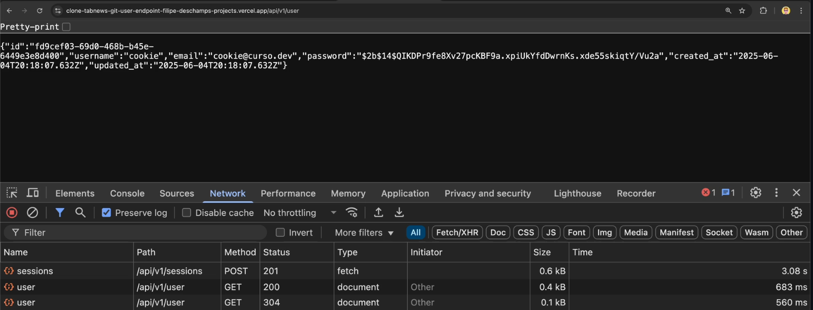
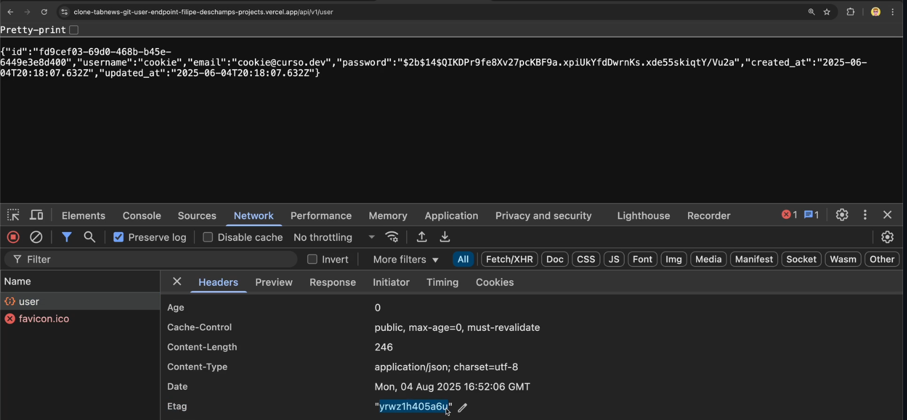

# ETag e Cache-Control

O navegador e servidor buscam economizar recursos. Por padrão, requisições que devolvem o o body idêntico são armazenadas como `cache` no client e a informação fica ali disponível, reduzindo o trafego.

Essa checagem é feita atrás do cálculo de hash.

o impacto do cabeçalho **ETag** e **If-None-Match** pode acelerar a performance dos endpoints através de um cache transparente e automático entre o server e o client, o que é algo ótimo mas, ao mesmo tempo, o retorno `304 Not Modified` envolvido nisso pode evitar que seja trafegado o cabeçalho `Set-Cookie`.



Na primeira requisição, é trafegado o cabeçalho. Já na segunda não, apenas é retornando o mesmo corpo com o código `304`.



Aqui o detalhe do hash. Forçando a requisição sem cache com `Shift + F5`, sempre irá retornar o cabeçalho set-cookie atualizado com data de expiração.

## Cache-Control via código

Ok. Agora isso precisa ser controlado no código, pois não temos como usar o teclado do computador do usuário.

```js
// Trecho do endpoint api/v1/user/index.js
const userFound = await user.findOneById(sessionObject.user_id);

response.setHeader(
  "Cache-Control",
  "no-store, no-cache, max-age=0, must-revalidate",
);
return response.status(200).json(userFound);

// trecho do teste em tests/integration/api/v1/user/get.test.js
const response = await fetch("http://localhost:3000/api/v1/user", {
  headers: {
    Cookie: `session_id=${sessionObject.token}`,
  },
});

expect(response.status).toBe(200);

const cacheControl = response.headers.get("Cache-Control");
expect(cacheControl).toBe("no-store, no-cache, max-age=0, must-revalidate");
```
