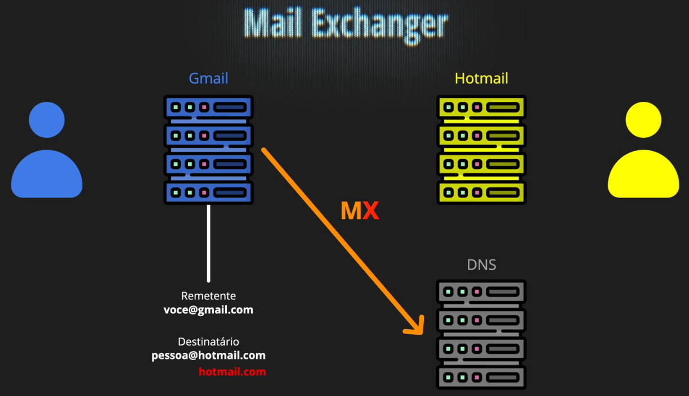
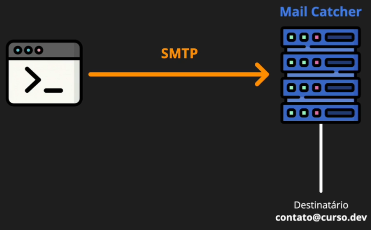
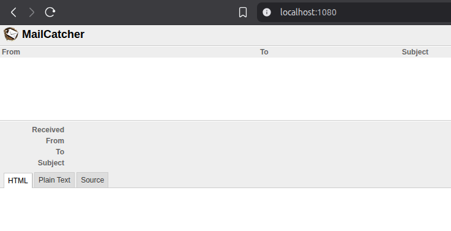

# Trabalhando com Emails

Pra começar, como funciona o envio de mail? Como ele sai do meu PC/Celular e chega até o destinatário? Vamos olhar por baixo dos panos como funciona passo a passo.



Entendendo o fluxo de exemplo:

1. Ao fazer o envio **voce@gmail.com**, o email vai para o servidor do **GMAIL**.
1. O servidor do **GMAIL** irá analisar qual é o destinatário (**pessoa@hotmail.com**).
1. O servidor do destinatário é o **HOTMAIL**.
1. Então, o **GMAIL** faz uma consulta de **MX (Mail Exchanger)** para troca de emails com o **HOTMAIL**.
1. É então retornado o **IP** do servidor do **HOTMAIL** e feito o envio.
1. Por fim, o servidor do **HOTMAIL** entrega o email para o destinatário **pessoa@hotmail.com**.

## Analisando com `dig`

```bash
# Consulta o registro MX (Mailx Exchanger)
dig MX curso.dev

# Saída no terminal
; <<>> DiG 9.18.30-0ubuntu0.24.04.2-Ubuntu <<>> MX curso.dev
# Os servidores utilizados pelo curso.dev são do google (gmail).
;; ANSWER SECTION:
curso.dev.              300     IN      MX      5 alt2.aspmx.l.google.com.
curso.dev.              300     IN      MX      10 alt4.aspmx.l.google.com.
curso.dev.              300     IN      MX      10 alt3.aspmx.l.google.com.
curso.dev.              300     IN      MX      5 alt1.aspmx.l.google.com.
curso.dev.              300     IN      MX      1 aspmx.l.google.com.
```

O número a frente do endereço do servidor representa a prioridade. Então 1 será o servidor principal que fará o envio/recebimento.

```bash
# Consulta o IP do servidor com a maior prioridade pelo registro A (Address)
dig A aspmx.l.google.com

# Saída no terminal
;; ANSWER SECTION:
aspmx.l.google.com.     293     IN      A       108.177.123.26
```

## Comunicação

Toda comunicação entre os pontos de contato é feita por **protocolos**. Então, analisando o fluxo de envio, pra sair da sua caixa de emails e chegar até o servidor de emails do seu domínio, é utilizado o **SMTP — Simple Mail Transfer Protocol**.

O SMTP é utilizado até o servidor de emails do destinatário. Depois para encaminhar para o destinatário, é utilizado o protocolo **IMAP — Internet Message Access Protocol**, que sincroniza os estados das mensagens em diferentes dispositivos do cliente.

## Configurando Mail Catcher

Para realização de testes, precisamos configurar apenas a comunicação local entre o cliente de email e um **servidor outbound (saída)** que apenas simula o processo de envio. Nenhuma mensagem é enviada de verdade pro destinatário final.



O [MailCatcher](https://github.com/sj26/mailcatcher) roda um serviço bem simples de SMTP em uma interface web.

```yaml
# Adicionando a imagem do MailCatcher ao docker com o compose.yaml
mailcatcher:
  container_name: "mailcatcher-dev"
  image: "sj26/mailcatcher"
  ports:
    - "1025:1025" # expõe a porta pro servidor de emails
    - "1080:1080" # expõe a porta pro cliente web
```



## Testando o envio

Aqui usamos o antigo e famoso **`telnet` — Telecommunication Network**.

```bash
# Escrevendo um email na mão
telnet localhost 1025

# Diga olá pro servidor se identificado para o servidor SMTP
HELO thiago

# Informe seu email
MAIL FROM:<thiagocajadev@curso.dev>

# Informe o email do destinatário (Recipient)
RCPT TO:<contato@curso.dev>

# Agora digite DATA para começar informar os dados da mensagem
DATA

# Informe o título da mensagem
Subject: Teste por Telnet

# Pule uma linha para escrever o corpo da mensagem.
# Para indicar que finalizou a escrita, pule uma linha e digite um "." pontinho
Corpo do email.
.

# Para sair do TELNET, digite QUIT
QUIT
```

O fluxo fica dessa forma no terminal:

```bash
❯ telnet localhost 1025
Trying 127.0.0.1...
Connected to localhost.
Escape character is '^]'.
220 EventMachine SMTP Server
HELO thiago
250 Ok EventMachine SMTP Server
MAIL FROM:<thiagocajadev@curso.dev>
250 Ok
RCPT TO:<contato@curso.dev>
250 Ok
DATA
354 Send it
Subject: Teste por Telnet

Corpo do email.
.
250 Message accepted
QUIT
221 Ok
Connection closed by foreign host.
```

Confira sua "caixa de email" na interface web do MailCatcher, o email chegou! 😃
