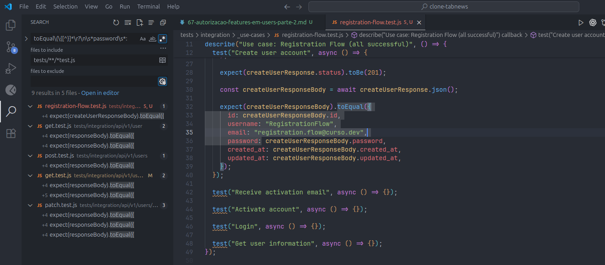

# Authorization - Parte 2

Como foi escolhido por votação, vamos pelo caminho de `consertar` as coisas primeiro.

## Realizando alterações em massa

Vamos usar os atalhos do VS Code para localizar e substituir `Ctrl + Shift + h` termos para ajuste no código.

Pesquisa:

campo: `password`
files to include: `tests/**/*test.js` - Retorna tudo dentro de testes com o final `test.js`.

Trouxe muita coisa -> 62 resultados.

Pra facilitar a vida, vamos usar **RegEx**.

## RegEx - Expressões Regulares

Pra gente atingir exatamente o que é preciso, uma ferramenta incrível para buscas e formatação, são as **Regular Expressions**.

O `RegEx` define o padrão de buscas dentro de textos. Como ele, conseguimos validar e substituir informações.

Então no VS Code, vamos apagar a busca e habilitar o RegEx, clicando no simbolo de asterisco (atalho após clicar no campo `Alt + r`).

Começando a pesquisa:

```regex
^\s*password\s*: #
```

**Resumo**

- ^ → início da linha
- \s\* → zero ou mais espaços em branco antes/depois
- password → a palavra literal "password"
- : → caractere de dois-pontos literal
- (espaço) → espaço obrigatório após o dois-pontos
- \# → sinal de cerquilha

✅ Exemplos que dão match:

```
password: #
password : #
```

Útil para detectar linhas tipo `password: #` usadas como placeholder/comentário.

Ok, mas precisamos pegar o campo password dentro da comparação `toEqual` no teste.



```regex
toEqual\(\{[^}]*\r?\n\s*password\s*:
```

**Resumo**

- `toEqual\(\{` → casa exatamente o trecho `toEqual({`
- `[^}]*` → qualquer sequência de caracteres que **não seja `}`** (até encontrar a quebra de linha)
- `\r?\n` → uma quebra de linha (`\n`), opcionalmente precedida de `\r` (Windows)
- `\s*` → zero ou mais espaços/brancos no início da nova linha
- `password` → a palavra literal "password"
- `\s*:` → zero ou mais espaços seguidos de dois-pontos

✅ Exemplo que dá match:

```
toEqual({
      id: createUserResponseBody.id,
      username: "RegistrationFlow",
      email: "registration.flow@curso.dev",
      password:
```

Útil para detectar objetos passados a `toEqual({ ... })` que tenham a chave `password` **em uma linha separada**.

## RegEx - Grupos de captura

Pra não ter que copiar novamente o RegEx no campo replace, criamos grupos de captura em expressões regulares. Pra definir um grupo, basta colocar um trecho do RegEx entre parenteses `(Grupo1)(Grupo2)(Grupo3)`. Cada grupo recebe automaticamente uma identificação por número sequencial do RegEx.

```regex
# Agora inclui até o conteúdo de password com espaços
(toEqual\(\{[^}]*\r?\n)(\s*)(password\s*:.*)
```

**Resumo dos grupos**

- **Grupo 1** → `(toEqual\(\{[^}]*\r?\n)`
  - Casa `toEqual({` seguido de qualquer coisa que **não seja `}`**, até a quebra de linha.
- **Grupo 2** → `(\s*)`
  - Captura os espaços/indentação dessa linha.
- **Grupo 3** → `(password\s*:.*)`
  - Captura a chave `password:` e todo o conteúdo até o fim da linha.

✅ Exemplo que dá match:

```
toEqual({
      id: createUserResponseBody.id,
      username: "RegistrationFlow",
      email: "registration.flow@curso.dev",
      password: createUserResponseBody.password,
```

**Definindo o Replace**

```
$1$2$3\n$2features: [],
```

O replace mantém a estrutura:

- `$1` → trecho até a quebra de linha depois de `toEqual({`
- `$2` → a indentação existente
- `$3` → a linha `password: ...`
- `\n$2features: [],` → adiciona uma nova linha logo abaixo, mantendo a mesma indentação e inserindo `features: [],`.

Resultado final:

```js
.toEqual({
      id: createUserResponseBody.id,
      username: "RegistrationFlow",
      email: "registration.flow@curso.dev",
      password: createUserResponseBody.password,
      features: [],
      // demais códigos
})
```

Executando um `npm test` pra validar;

```bash
# Saída no terminal
[jest] Test Suites: 12 passed, 12 total
[jest] Tests:       34 passed, 34 total
[jest] Snapshots:   0 total
[jest] Time:        3.257 s
[jest] Ran all test suites.
[jest] jest --runInBand exited with code 0
--> Sending SIGTERM to other processes..
```

Tudo certo!
