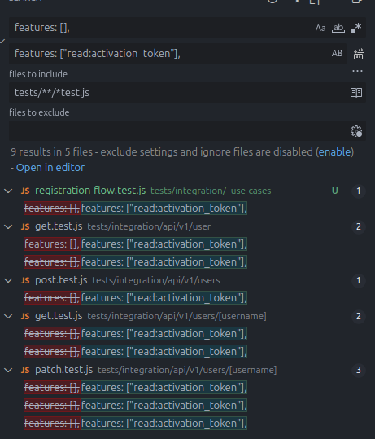

# Authorization - Permissões

Normalmente controlamos se o usuário está ativo ou não. O problema dessa abordagem é compreender se o usuário está desativado por que ainda não realizou o fluxo te ativação ou porque ele foi banido.

Uma decisão de design do sistema pra evitar criar colunas extras (is_banned) é retornar seu acesso a **features** vazio.

Então, o fluxo de ativação do usuário no sistema, habilita a **feature** de leitura de token de ativação. Depois de concluir o fluxo, o usuário perde essa **feature**, pois não precisa mais desse recurso, ele não vai mais ter que ativar sua conta.

```js
// permissão padrão ao criar conta no sistema
features: ["read:activation_token"];
```

## Composição de uma feature

Uma feature é composta por:

```js
// prettier-ignore
ação:objeto:modificador;

// Então, temos as permissões:
// Permite a leitura de token de ativação
// prettier-ignore
read:activation_token;

// Outras permissões possíveis
// Permite atualizar seu próprio conteúdo
// prettier-ignore
update:content;

// Permite atualizar o conteúdo de outras pessoas
// prettier-ignore
update:content:others;
```

Então pra facilitar a atribuição de permissão padrão, deixando de uma forma simplificada, evitando problemas de mudança no padrão, obrigando a criação de uma nova migration:

```js
// models/user.js

// trecho do método create
async function create(userInputValues) {
  await validateUniqueUsername(userInputValues.username);
  await validateUniqueEmail(userInputValues.email);
  await hashPasswordInObject(userInputValues);
  injectDefaultFeaturesInObject(userInputValues);
  // demais códigos ocultados...

  // detalhes de implementação
  function injectDefaultFeaturesInObject(userInputValues) {
    userInputValues.features = ["read:activation_token"];
  }
}
```

E agora, para que esse valor chegue no banco de dados, ajustamos o **insert**:

```js
async function runInsertQuery(userInputValues) {
  // Adicionamos ao final do insert o nome da coluna e o placeholder $4
  const results = await database.query({
    text: `
        INSERT INTO 
          users (username, email, password, features)
        VALUES 
          ($1, $2, $3, $4)
        RETURNING
          *
      ;`,
    values: [
      userInputValues.username,
      userInputValues.email,
      userInputValues.password,
      userInputValues.features, // novo valor adicionado
    ],
  });

  return results.rows[0];
}
```

Bom, os testes passam a quebrar, devido não receberem mais um array em branco `[]`. Ajustando rapidamente com **replace all**



```js
// Search
features: [],

// Replace
features: ["read:activation_token"],

// Files to include
tests/**/*test.js
```
