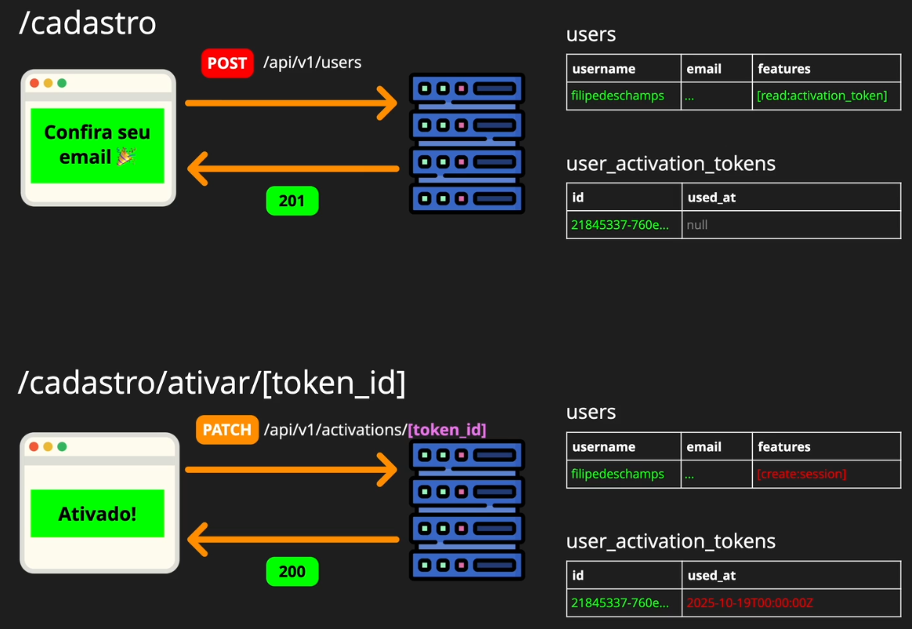

# Ativando o usuário

Alguns testes não refletem bem a realidade. Veja:

```js
// Trecho de tests/integration/_use-cases/registration-flow.test.js
// Esse método só é útil nos testes.
const activationToken = await activation.findOneByUserId(
  createUserResponseBody.id,
);
```

Se um usuário tiver mais do que um código de ativação, um que expirou e um válido. Qual será retornado? Mais recente ou mais antigo?

No mundo real o que teremos: através do **token que chega via e-mail**, conseguimos chegar até o **usuário**.

O token tem que dar match com o usuário criado.

## Desafio surpresa 🎁

Olha que maravilha 🫠. Regras:

1. Extrair o token do corpo do e-mail (regex pode ajudar).
1. Método que busca por um token válido (não expirado e nem utilizado).
1. Comparar os IDs no teste (UserId e Id do usuário criado).
1. Usar o model "session" como inspiração.

## Extraindo o token

```js
// Trecho de tests/orchestrator.js
// Regex recupera uma string de 36 caracteres formada por um grupo de caracteres
// hexadecimais. Eles vão de 0 a 9, e de "a" até "f", minúsculos e maiúsculos,
// separados por traços.
function extractUUID(text) {
  const match = text.match(/[0-9a-fA-F-]{36}/);
  return match ? match[0] : null;
}
```

## Modificando o teste

```js
test("Receive activation email", async () => {
  const lastEmail = await orchestrator.getLastEmail();

  expect(lastEmail.sender).toBe("<contato@fintab.com.br>");
  expect(lastEmail.recipients[0]).toBe("<registration.flow@curso.dev>");
  expect(lastEmail.subject).toBe("Ative seu cadastro no FinTab!");
  expect(lastEmail.text).toContain("RegistrationFlow");

  // Recuperando o token
  const activationTokenId = orchestrator.extractUUID(lastEmail.text);

  // Monitora a URL, garantindo a estrutura
  expect(lastEmail.text).toContain(
    `${webserver.origin}/cadastro/ativar/${activationTokenId}`,
  );

  // Recupera o token válido
  const activationTokenObject =
    await activation.findOneValidById(activationTokenId);

  // Compara o token retornado com o token do email de ativação
  expect(activationTokenObject.user_id).toBe(createUserResponseBody.id);
  expect(activationTokenObject.used_at).toBe(null);
});
```

## Recuperando o token válido

```js
// Trecho de models/activation.js
async function findOneValidById(tokenId) {
  const activationTokenObject = await runSelectQuery(tokenId);
  return activationTokenObject;

  async function runSelectQuery(tokenId) {
    // Verifica se a data de expiração é maior que a data atual
    // e se o campo used_at está vazio.
    const results = await database.query({
      text: `
        SELECT
          *
        FROM
          user_activation_tokens
        WHERE
          id = $1
          AND expires_at > NOW()
          AND used_at IS NULL
        LIMIT
          1
      ;`,
      values: [tokenId],
    });

    // Lança erro caso não encontre o token
    if (results.rowCount === 0) {
      throw new NotFoundError({
        message:
          "O token de ativação utilizado não foi encontrado no sistema ou expirou.",
        action: "Faça um novo cadastro.",
      });
    }

    return results.rows[0];
  }
}
```

Agora temos um código mais assertivo em relação ao token válido de ativação.

# Ativando a conta

Vamos analisar o fluxo de ativação:



1. É realizado uma requisição `HTTP` do tipo `POST` contra o endpoint `/api/v1/users`.

1. O usuário é criado, retornando um e-mail com o link de ativação (status `201 - created`).

1. Ao acessar o link de ativação, é feita uma requisição `HTTP` do tipo `PATCH` (atualização) contra o endpoint `api/v1/activations/[token_id]`.

1. Assim que o usuário é ativado, é preenchida a data em que o token foi usado `used_at` no banco de dados, evitando o reuso desse token.

1. Após ativação, o usuário recebe novas features em seu perfil.

1. E finalmente, o usuário pode fazer login na aplicação.

## Ajustando o teste

Elevamos o activationTokenId para uso em mais testes.

```js
// Trecho de tests/integration/_use-cases/registration-flow.test.js
describe("Use case: Registration Flow (all successful)", () => {
  let createUserResponseBody;
  let activationTokenId;
  // demais códigos...
}
```

Teste de ativação de conta

```js
test("Activate account", async () => {
  // Endpoint que foi representado na imagem acima, atualizando a data de uso do token
  const activationResponse = await fetch(
    `http://localhost:3000/api/v1/activations/${activationTokenId}`,
    {
      method: "PATCH",
    },
  );

  expect(activationResponse.status).toBe(200);

  const activationResponseBody = await activationResponse.json();

  expect(Date.parse(activationResponseBody.used_at)).not.toBeNaN();

  // Após ativação, o usuário possui apenas a feature para criar sessão
  const activatedUser = await user.findOneByUsername("RegistrationFlow");
  expect(activatedUser.features).toEqual(["create:session"]);
});
```

## Criando a rota com segmento dinâmico

Essa rota já foi mostrada nos testes, `api/v1/activations/[token_id]`. Hora de criar a estrutura. Por dentro do controller, será recuperado o UUID do token.

```js
// Trecho de pages/api/v1/activations/[token_id]/index.js
import { createRouter } from "next-connect";
import controller from "infra/controller";
import activation from "models/activation.js";

const router = createRouter();

// Temos apenas a rota para fazer o patch (atualização)
router.patch(patchHandler);

export default router.handler(controller.errorHandlers);

async function patchHandler(request, response) {
  // Recupera o token passado na URL
  const activationTokenId = request.query.token_id;

  // Recupera o token válido
  const validActivationToken =
    await activation.findOneValidById(activationTokenId);

  // Atualiza a data de uso do token
  const usedActivationToken =
    await activation.markTokenAsUsed(activationTokenId);

  // Ativa o usuário, alterando suas features padrão
  await activation.activateUserByUserId(validActivationToken.user_id);

  return response.status(200).json(usedActivationToken);
}
```

E ta ai, PIMBA! temos a ativação concluída.
