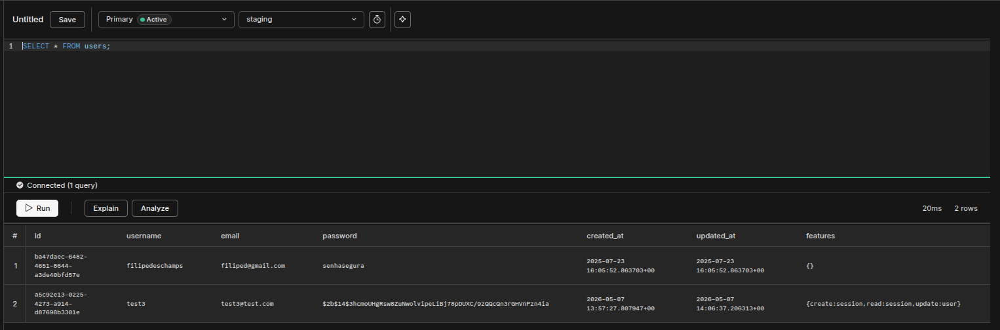

# Melhorando log de e-mails

Bom, erros 500 sempre vão existir e devemos estar preparados para lidar com eles.

O que podemos analisar em primeiro momento é o console do navegador. Num segundo momento, olhando pra aba network e analisando a requisição que gerou o erro. E por fim, olhando os logs do servidor.

Analisando os logs temos erro sobre a porta 465. Esse erro é tipico de SMTP, ou seja, problemas com e-mail.

## Quem lida com e-mails?

Em nosso projeto, quem lida com isso é a ativação da conta.

```js
// Trecho de infra/email.js
// Não temos as váriveis de ambiente no ambiente de staging, por isso vem valores padrão como
// localhost, porta 465.
const transporter = nodemailer.createTransport({
  host: process.env.EMAIL_SMTP_HOST,
  port: process.env.EMAIL_SMTP_PORT,
  auth: {
    user: process.env.EMAIL_SMTP_USER,
    pass: process.env.EMAIL_SMTP_PASSWORD,
  },
  secure: process.env.NODE_ENV === "production" ? true : false,
});
```

Então agora melhorando o retorno do log

```js
// Trecho de infra/email.js
async function send(mailOptions) {
  try {
    await transporter.sendMail(mailOptions);
  } catch (error) {
    throw new ServiceError({
      message: "Não foi possível enviar e-mail",
      action: "Verifique se o serviço de e-mails está disponível",
      cause: error,
      context: mailOptions,
    });
  }
}

// E adicionamos uma nova propriedade context passando como valor as opções
// do e-mail, para facilitar a debug.
export class ServiceError extends Error {
  constructor({ cause, message, action, statusCode, context }) {
    super(message || "Serviço indisponível no momento.", {
      cause,
    });
    this.name = "ServiceError";
    this.action = action || "Verifique se o serviço está disponível";
    this.statusCode = 503;
    this.context = context;
  }

  toJSON() {
    return {
      name: this.name,
      message: this.message,
      action: this.action,
      status_code: this.statusCode,
      context: this.context,
    };
  }
}
```

Isso deve contribuir com a visibilidade do que está acontecendo, com mais metadados.

Agora um teste via console do navegador, contra o endpoint que crie um usuário e envia o e-mail de confirmação:

```js
fetch("api/v1/users", {
  method: "POST",
  headers: {
    "Content-Type": "application/json",
  },
  body: JSON.stringify({
    username: "test3",
    password: "test",
    email: "test3@test.com",
  }),
});
```

Gerado novo erro 500, vamos olhar os logs:

```bash
action: 'Entre em contato com o suporte.',
statusCode: 500,
[cause]: n [ServiceError]: Não foi possível enviar e-mail
```

Maravilha, erro 500 com contexto.

## Repensando o fluxo de cadastro de usuários

Hoje o fluxo é assim:

1. Cadastro de usuário
2. Criação do token de ativação
3. E-mail com token de ativação
4. Ativação efetivada
5. Elevar privilégio

Então, testando vamos colar o token gerado no log só pra ver se cria o usuário mesmo.

```js
fetch("api/v1/activations/5a576b36-1f1d-41aa-9927-fe66c4e60f81", {
  method: "PATCH",
  headers: {
    "Content-Type": "application/json",
  },
  body: JSON.stringify({
    username: "test3",
    password: "test",
    email: "test3@test.com",
  }),
});
```

E sucesso, usuário criado no banco de dados de staging na Neon!



## Atribuindo permissão na marretada

Aproveitando que estamos na conexão no banco, vamos adicionar permissões de usuário privilegiado.

```sql
-- Nota: Nunca faça update sem where, aqui atualiza todos os usuários do banco.
UPDATE users SET features = array_append(features, 'read:status:all')
```

E agora os usuários tem privilégios anexados representados assim no banco:

{create:session,read:session,update:user,read:status:all}

## Testando se o usuário é privilegiado mesmo

Agora continuando os testes no navegador, vamos ver se o usuário consegue criar a sessão e ter acesso a versão do Postgres. Somente
usuários privilegiados conseguem ler essa informação.

```js
fetch("api/v1/sessions", {
  method: "POST",
  headers: {
    "Content-Type": "application/json",
  },
  body: JSON.stringify({
    password: "test",
    email: "test3@test.com",
  }),
});
```

Olhando em network, retorna 201 -> created! E em application -> cookies, temos o cookie de sessão.

Agora testando o status, só dando refresh em ap/v1/status e olha só: "version": "16.12 (761f46d)" é retornado!

É isso ai! Próxima parada: enviar o email de verdade!
