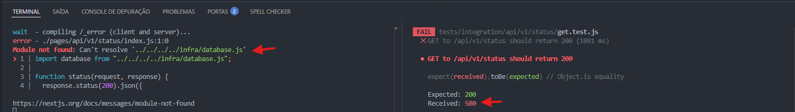

# 🛢️ Banco de dados

Seguindo as configurações realizadas no Docker, vamos continuar evoluindo a configuração para acesso profissional ao Postgres.

## Instalando o pg

O pg é um client para executar scripts dentro do node para o PostgreSQL

```powershell
npm install pg@8.11.3
```

Só um lembrete para subir rápido o ambiente de testes:

```powershell
npm run dev # roda o servidor web
npm run test:watch # roda o jest (agora com watchALL, testando tudo)
docker compose -f infra/compose.yaml up -d # roda o docker em 2º plano com o BD
```

## 📜 Preparando o database.js

Vamos seguir o raciocínio usando TDD, importando o módulo database lá no endpoint, pra que ele faça o teste.

```js
// api/v1/status/index.js
import database from "../../../../infra/database.js";

function status(request, response) {
  response.status(200).json({
    chave: "o status está ok!",
  });
}

export default status;
```

Nesse ponto, teremos 2 logs no terminal para análise:



No log do servidor Web Next - `Module not found`. O arquivo não existe ainda.
No log de testes do Jest - o status code enviado foi `500`, que representa erro interno no servidor.

Isso ajuda a identificar que o banco de dados está indisponível.

Criando o arquivo `database.js` vazio, já passa no teste. Aqui ele retorna um objeto vazio `{}` no log do servidor.

Pra enxergar isso, adicione um `console.log(database)` ao endpoint:

```js
// api/v1/status/index.js
import database from "../../../../infra/database.js";

function status(request, response) {
  console.log(database);
  response.status(200).json({
    chave: "o status está ok!",
  });
}

export default status;
```

log do servidor web:

```powershell
wait  - compiling...
event - compiled successfully in 172 ms (38 modules)
{} # aqui o objeto vazio
```

Então, vamos adicionar código ao módulo:

```js
// infra/database.js
export default {
  query: query,
};

// Aqui só temos a definição dele, ainda precisamos criar a abstração, pra facilitar suas chamadas pelo cliente do pg.
```

E é aqui que entra a abstração do `node-postgres` com o `pg`:

```js
// infra/database.js
// Aqui importamos o cliente do node-pg
import { Client } from "pg";

// Aqui foi criada a definição do método que faz a consulta no banco
// Ele é assíncrono, pois é preciso aguardar a conexão e retorno do banco
// para prosseguir com a aplicação.
async function query(queryObject) {
  const client = new Client();
  await client.connect();
  const result = await client.query(queryObject);
  client.end(); // não deixa a conexão pendurada, finalizando após o uso.
  return result;
}

export default {
  query: query,
};
```

Agora podemos utilizar o objeto `database` para fazer `queries`.

```js
import database from "../../../../infra/database.js";

// a função passou a ser assíncrona, pois precisa esperar o retorno do BD
async function status(request, response) {
  // alterado o log, pra fazer uma consulta
  const result = await database.query("SELECT 1 + 1;");
  console.log(result);
  response.status(200).json({
    chave: "o status está ok!",
  });
}

export default status;
```

Nesse momento é gerado erro, pois não foram definidas as credenciais para uso do client pg, então bora fazer isso de forma provisória:

```js
import { Client } from "pg";

async function query(queryObject) {
  // informando credenciais em texto puro provisoriamente
  const client = new Client({
    host: "localhost",
    port: 5432,
    user: "postgres",
    database: "postgres",
    password: "local_password",
  });
  await client.connect();
  const result = await client.query(queryObject);
  client.end();
  return result;
}

export default {
  query: query,
};
```

Melhorando o retorno para entender o log:

```js
import database from "../../../../infra/database.js";

async function status(request, response) {
  const result = await database.query("SELECT 1 + 1 AS Sum;"); // nome da coluna `Sum`
  console.log(result.rows); // filtra o log pra trazer somente a linha da query
  response.status(200).json({
    chave: "o status está ok!",
  });
}

export default status;
```
