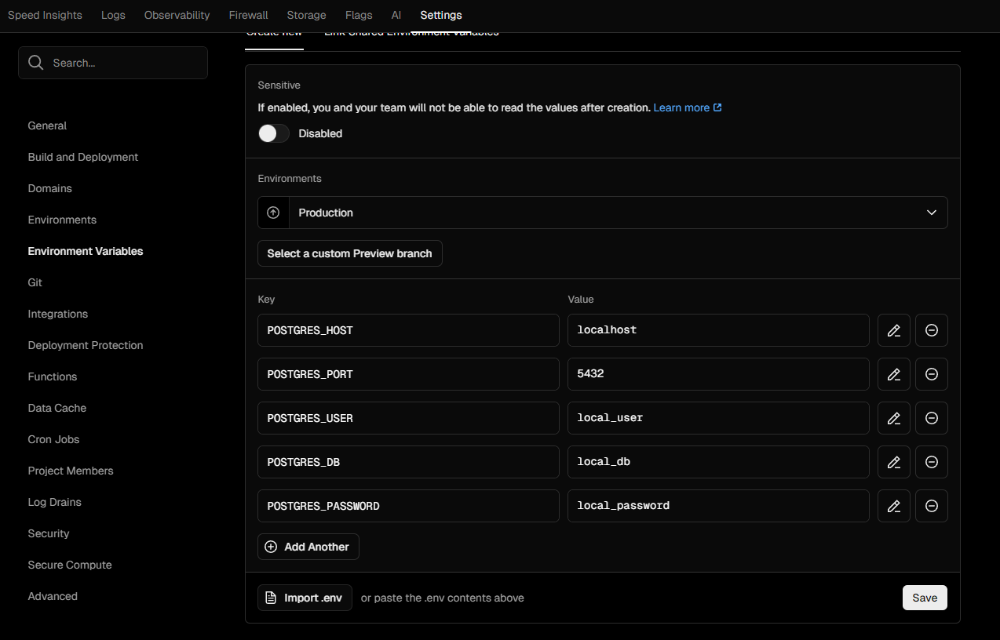
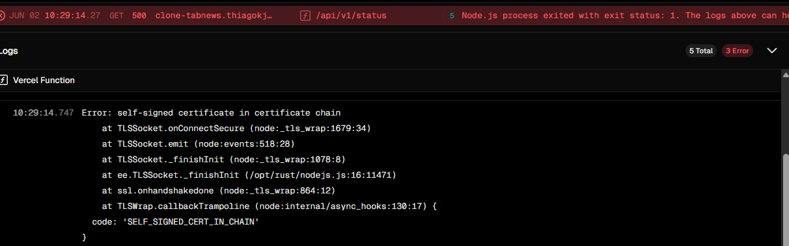
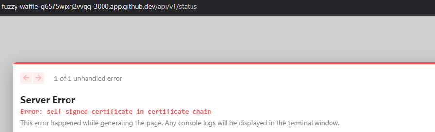
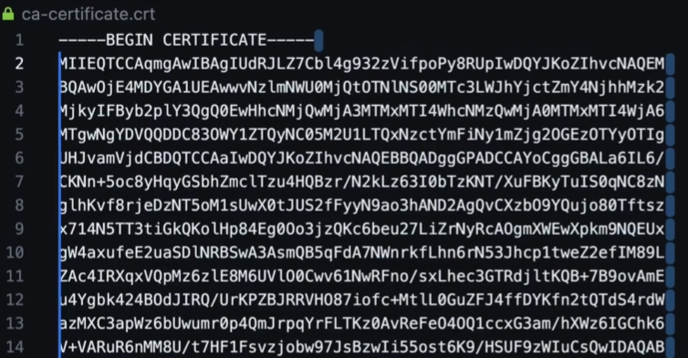

# 🖱️ ClickOps

ClickOps -> Click Operations ou Operações por cliques é uma prática de configurar um serviço por interface, só marcando e clicando nas coisas.

Essa é uma forma mais simples e comum de configurar via interface gráfica.

## 🐘 Configurando Neon

Criar uma conta no Neon é bem simples

Podemos especificar as seguintes informações após criar uma contata gratuita.

- Nome do projeto: `clone-tabnews`
- Versão do Postgres: `16`
- Provedor de Nuvem: `AWS` (Azure opcional)
- Região: `São Paulo`

> Até a data de hoje, o formulário apresentava apenas essas informações

Após isso, acesse o painel e procure `Connect to your database`.

Aqui é possível escolher configurar a conexão por uma `connection string` ou especificando como por parâmetros, via variáveis de ambiente.

### 🔒 SSL e a segurança da conexão

Testando as credenciais no `.env.development` e subindo localmente, é apresentado erro tanto ao abrir a pagina web, quanto no console do terminal:

```powershell
error: connection is insecure (try using `sslmode=require`)
```

Isso ocorre por que até o momento, estávamos trafegando somente via http. O trafego não estava seguro e criptografado, expondo os dados nas requisições e respostas.

O SSL (Secure Socket Layer), é uma camada de segurança que cuida disso. Pra resolver essa questão, basta habilitar o uso do ssl no arquivo de ambiente.

```js
// trecho database.js
const client = new Client({
  host: process.env.POSTGRES_HOST,
  port: process.env.POSTGRES_PORT,
  user: process.env.POSTGRES_USER,
  database: process.env.POSTGRES_DB,
  password: process.env.POSTGRES_PASSWORD,
  ssl: true, // aqui habilita o uso da camada de segurança
});
```

Mas e se precisar usar o banco local pra testes? Essa camada não se aplica a ambiente local.

Pra isso pode ser verificado com um operador `ternário` qual ambiente está sendo executada a aplicação:

```js
// Ex: condição (1 é igual a 1) ? Sim : Não;
condição ? valorSeVerdadeiro : valorSeFalso;

// Ex: condição (process.env.NODE_ENV é "development") ? Sim : Não;
process.env.NODE_ENV === "development" ? false : true;
```

> No ternário, o `primeiro valor` é o que eu quero quando a condição for `verdadeira`. E neste caso, quero `false` quando estiver em `desenvolvimento`.

Com isso, a configuração de banco de dados fica assim:

```js
// trecho database.js
const client = new Client({
  host: process.env.POSTGRES_HOST,
  port: process.env.POSTGRES_PORT,
  user: process.env.POSTGRES_USER,
  database: process.env.POSTGRES_DB,
  password: process.env.POSTGRES_PASSWORD,
  ssl: process.env.NODE_ENV === "development" ? false : true; // agora é feita verificação do ambiente
});
```

## 🌊 Configurando Digital Ocean

Para configurar os serviços de banco de dados na Digital Ocean, basta preencher os dados de cadastro.

Após isso, selecionar o banco de dados e alterar o nome da instancia para `production-postgres`.

> Essa é uma boa prática, colocar um prefixo production, test, qa... isso auxilia na hora de trabalhar e executar comandos em ambientes diferentes

Concluindo o setup inicial, clique para continuar sem a conexão segura, pois vamos nos conectar por fora da infra da Digital Ocean, no caso, da Vercel.

E então finalizar. Agora, basta copiar os dados disponibilizados e colocar nas variáveis de ambiente da Vercel.



> Na imagem deixei com os dados locais. Basta alterar para qualquer serviço de hospedagem de banco de dados

E testando... deu erro 500! Verificando os logs, temos um erro no certificado.



### ✍🏻 Certificado Autoassinado

Aqui temos uma diferença no serviço relacionada a segurança. O serviço exige a instalação de um `certificado autoassinado`.

O ideal é replicar essa situação no ambiente local para testarmos o certificado digital.



Alterando o ambiente para injetar valores:

```js
// trecho database.js
const client = new Client({
  host: process.env.POSTGRES_HOST,
  port: process.env.POSTGRES_PORT,
  user: process.env.POSTGRES_USER,
  database: process.env.POSTGRES_DB,
  password: process.env.POSTGRES_PASSWORD,
  ssl: getSSLValues(), // criado método com abstração da lógica
});

function getSSLValues() {
  if (process.env.POSTGRES_CA) {
    // se existirem dados na variável POSTGRES_CA
    return {
      ca: process.env.POSTGRES_CA, // retorna o conteúdo do certificado dentro da propriedade
    };
  }
  return process.env.NODE_ENV === "development" ? true : true;
}
```

Como o valor de uma variável de ambiente é uma string, tudo deve ficar em uma mesma linha.

Pra resolver isso, podemos adicionar a quebra com a combinação `\n`.

> o `\n` é utilizado de forma invisível em vários editores, a gente acaba nem vendo

Baixe o certificado da Digital Ocean e abra o mesmo... deve vir algo assim:

```
-----BEGIN CERTIFICATE-----
MIIEUDCCArigAwIBAgIUBgS0wppL1p6E4M3HJYqXw6JQ71YwDQYJKoZIhvcNAQEM
... // (muitas linhas aqui)
UC9DWQ==
-----END CERTIFICATE-----

```

Adicione a quebra de linha em cada linha do certificado `\n`, selecionando o espaço em branco ao termino de cada linha e usando `Ctrl + d`.



Crie uma nova variável de ambiente e adicione o certificado.

```powershell
POSTGRES_CA="-----BEGIN CERTIFICATE-----\nMIIEUDCCArigAwIBAgIUBgS0wppL1p6E4...string-longa...==\n-----END CERTIFICATE-----\n";
```

> O conteúdo deve estar dentro de aspas duplas, para interpretar corretamente os caracteres especiais como os barra n `\n`

Realizando testes e deu bom!

```js
// Ambiente Local
// 20250602112404
// https://fuzzy-waffle-g6575wjxrj2vvqq-3000.app.github.dev/api/v1/status

{
  "updated_at": "2025-06-02T14:24:03.446Z",
  "dependencies": {
    "database": {
      "version": "16.9",
      "max_connections": 25,
      "opened_connections": 2
    }
  }
}
```

Agora criando a variável de ambiente na Vercel e adicionando o certificado com quebras de linha.

> Atenção para passar o conteúdo entre as aspas duplas para correta interpretação.
> Em alguns ambientes, também pode haver um tratamento direto do conteúdo de certificado, apenas copiando
> o certificado puro já será aceito
