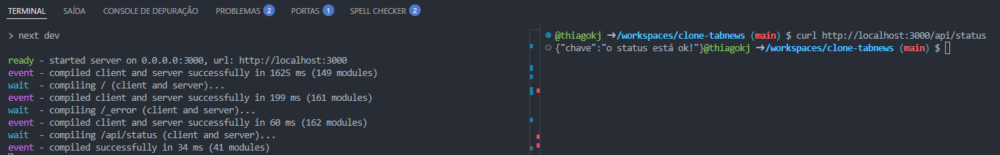
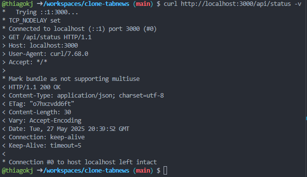

# 🔌 Criando Endpoints

Qualquer endereço na internet pode ser chamado de endpoint — como curso.dev, google.com ou github.com/thiagokj. Também é comum ouvirmos o termo rota nesse contexto.

Mas, geralmente, quando falamos em endpoint, estamos nos referindo a um endereço de API.

🧠 API — é uma interface de comunicação de dados. Ou seja, ela serve para troca de informações, normalmente no formato JSON (objetos JavaScript).

Sim, propositalmente não usei aqui a sigla completa — Interface de Programação de Aplicações — porque o mais importante é entender o objetivo:

🤖 Uma API é feita para ser lida por softwares, robôs e scripts, e não por pessoas.

👀 Já uma interface web (como um site) é voltada para seres humanos, com elementos visuais: menus, textos, botões e links para leitura.

## Rotas no Next.js

O roteamento no Next.js é feito de forma automática e dinâmica.
Basta criar arquivos dentro da pasta `pages/api`, como por exemplo: `pages/api/nome-da-rota.js`.

O nome do arquivo se torna o endpoint da API, e o Next cuida do resto para que você não precise configurar rotas manualmente.

Exemplo:

```js
// pages/api/status.js
// foi criada uma rota pública para acesso ao site.
// ex: clone-tabnews.thiagokj.site/api/status
function status(request, response) {}

// o Next injeta o request e o response aqui.
// request -> solicitação externa, passando parâmetros para API
// response -> retorno de dados da API
```

Melhorando o exemplo:

```js
function status(request, response) {
  // caso seja acessando o endpoint, o mesmo envia a frase abaixo.
  // porém esse envio não sabe interpretar qual charset (teclado de origem), e ai quebra a acentuação e outros caracteres.
  response.status(200).send("o status está ok!");
}

// informa que a propriedade é a função de entrada padrão pra esse endpoint
export default status;
```

Para padronizar a resposta de dados com charset mais usado, podemos fazer assim:

```js
function status(request, response) {
  // usando json, temos o charset utf-8, que ajuda nessa questão de acentuação
  // o json é sempre assim, chave: valor
  response.status(200).json({
    chave: "o status está ok!",
  });
}

// informa que a propriedade é a função de entrada padrão pra esse endpoint
export default status;
```

Use a extensão [JSON Viewer](https://chromewebstore.google.com/detail/json-viewer/gbmdgpbipfallnflgajpaliibnhdgobh) pra visualizar o JSON mais bonito

## Usando CURL - **Client URL**

Essa ferramenta de linha de comando é ótima pra analisar o que acontece na comunicação via HTTP.

Para testar localmente:

```powershell
# sobe o servidor local
npm run dev

# usa o Client URL - CURL para fazer uma request ao endpoint
curl http://localhost:3000/api/status
```



Aqui ele fez a request (requisição) e fez o response (retornou a resposta) de forma assim, trazendo o conteúdo do json (objeto javascript). Mais comandos úteis:

```powershell
# faz a request, requisitando o retorno com todos os dados do cabeçalho http
curl http://localhost:3000/api/status --verbose

# faz a mesma coisa, com o comando enxuto
curl http://localhost:3000/api/status -v
```



Agora fazendo a requisição com cabeçalho, temos todos os detalhes com o cabeçalho http, mostrando inclusive o charset definido.

Detalhes:

- **Asterisco \*** - cabeçalho do cURL
- **Seta >** - o que o cURL enviou para o endpoint
- **Seta <** - o que foi retornado pelo endpoint para o cURL
- **Entre Chaves {}** - o body (corpo) da resposta no cURL

### ⛏️ Cavucando um pouco mais

Se formos mais a fundo para entender como funcionam as requisições via HTTP, conseguimos compreender por que vários domínios podem apontar para um mesmo endereço IP.

Em hospedagens como Vercel, Cloudflare ou Hostinger, é comum o uso de `Virtual Hosts` (ou Hosts Virtuais), que permitem que múltiplos sites compartilhem o mesmo servidor e IP. O servidor então decide qual site entregar com base na informação enviada no cabeçalho da requisição HTTP.

Por padrão, essa informação é enviada no campo Host do cabeçalho HTTP. Vamos ver isso na prática com `cURL`:

```powershell
# Requisição direta ao IP da Vercel, sem indicar um domínio específico
curl 76.76.21.21 -v
```

Saída relevante

```powershell
> GET / HTTP/1.1
> Host: 76.76.21.21
...
< HTTP/1.1 308 Permanent Redirect
< Location: https://vercel.com/
```

Agora veja o que acontece ao enviar explicitamente um domínio personalizado no cabeçalho:

```powershell
# Forçando a requisição HTTPS diretamente no IP, informando o domínio correto

# --insecure -> certificado SSL ignorado
# --verbose -> cabeçalho completo da requisição
# --header -> especifica quais campos do cabeçalho serão informados
curl https://76.76.21.21 --insecure --verbose --header 'Host: fintab.com.br'

# Outro exemplo, acessando um subdomínio hospedado no mesmo IP
curl https://76.76.21.21 --insecure --verbose --header 'Host: clone-tabnews.thiagokj.site'

# mrufQLUecQuPlQ2IG49/_buildManifest.js" defer=""></script><script src="/_next/static/tlmrufQLUecQuPlQ2IG49/_ssgManifest.js"
# defer=""></script></head><body><div id="__next"><h1>Testando com sub-domínio</h1></div><script id="__NEXT_DATA__"
# type="application/json">{"props":{"pageProps":{}},"page":"/","query":{},* Connection #0 to host 76.76.21.21 left intact

# Saída relevante:
<h1>Testando com sub-domínio</h1>
```

Aqui, mesmo acessando diretamente via IP, o cURL trouxe o conteúdo correto com base no Host especificado no cabeçalho. Isso mostra como o servidor entende qual site deve responder, mesmo que o IP seja o mesmo.

Como o curl não é um navegador, ele apenas exibe o HTML bruto. Para visualizar a página renderizada (com estilos e scripts), é preciso abrir o domínio real em um navegador.

## 📋 Versionamento de API

Ao desenvolver uma API, é comum que, com o tempo, você precise **adicionar novos campos, alterar comportamentos ou até mudar regras de negócio**. Para evitar que essas mudanças **quebrem o funcionamento de sistemas que já consomem a API**, é prática recomendada utilizar **versionamento**.

### 🧭 Como fazer isso?

Uma forma simples e clara de versionar sua API é usando a versão no **caminho da rota**:

```
/api/v1/clientes
/api/v2/clientes
```

Assim, mesmo que a versão 2 tenha alterações, quem estiver usando a v1 **continua funcionando normalmente**.

### ✅ Benefícios

- **Evita quebras** em sistemas que usam versões anteriores
- Permite **evoluir a API** sem medo de causar impacto imediato
- Facilita **testes, migrações e comparações** entre versões

### 🧱 Aplicando isso no Next.js

No Next.js, a estrutura de rotas da API segue a pasta `pages/api`. Para versionar, basta organizar as rotas em subpastas:

```
📂 api
├── 📂 v1
│   └── 📂 status
│       └── 📜 index.js
└── 📂 v2
    └── 📂 status
        └── 📜 index.js
```

Com essa estrutura, as URLs geradas serão:

```
/api/v1/status
/api/v2/status
```

Você pode manter versões antigas, desenvolver novas com calma e deixar que cada cliente da API **escolha qual versão quer usar**, com base na rota que consome.

---

### 📦 Dica extra

Se quiser tornar isso mais elegante no futuro, dá pra implementar **controle de versão por cabeçalho**, por exemplo:

```
Accept-Version: v1
```

Mas para a maioria dos casos, especialmente APIs públicas ou internas simples, **versionar na URL já resolve muito bem**.

## 🧪 Teste de Integração com HTTP, Fetch e Async/Await

Para realizar testes de integração em APIs, o mais comum é simular requisições HTTP, como os navegadores fazem ao acessar páginas. Essas requisições utilizam os **métodos (ou verbos) HTTP**.

### 🔧 Verbos HTTP mais usados

- `GET` – busca dados do servidor (ex: acessar uma lista de produtos)
- `POST` – envia dados para o servidor (ex: cadastrar um usuário)
- `PUT` – atualiza dados existentes (ex: editar um perfil)
- `DELETE` – remove dados (ex: excluir um post)
- `PATCH` – atualiza parcialmente um recurso (ex: mudar só o nome)

---

### 🚀 Estruturando o teste com `fetch`

O `fetch` é uma função nativa no JavaScript para fazer requisições HTTP. Ele **retorna uma Promise**, ou seja, **algo que ainda não chegou**, mas chegará. Para lidar com isso corretamente, usamos `async/await`.

Vamos montar um teste básico com Jest.

```js
// tentativa inicial de teste - ainda incompleto
test("GET to /api/v1/status should return 200", () => {
  const response = fetch("http://localhost:3000/api/v1/status");
});
```

Se colocarmos um `console.log(response)`, veremos algo assim:

```js
Promise { <pending> }
```

Isso acontece porque `fetch` retorna uma **Promise pendente**, e o código continua executando sem esperar o resultado.

### ❌ O que dá errado:

```js
// isso vai dar erro!
test("GET to /api/v1/status should return 200", () => {
  const response = fetch("http://localhost:3000/api/v1/status");
  expect(response.status).toBe(200); // erro: status é undefined
});
```

O teste falha porque `response` ainda não chegou — `fetch` não bloqueia a execução até terminar.

⚠️ Por padrão, **funções anônimas em JavaScript () => são síncronas** — para usar `await` ou trabalhar com Promises, é necessário declará-las com `async`.

### ✅ Corrigindo com `async/await`

```js
// teste correto com async/await
test("GET to /api/v1/status should return 200", async () => {
  const response = await fetch("http://localhost:3000/api/v1/status");
  expect(response.status).toBe(200);
});
```

Com `async/await`, o teste **espera a resposta da requisição** antes de fazer a asserção.

### 💡 Resumo rápido

- `fetch` retorna uma **Promise**
- Para esperar o resultado, use `await` dentro de uma função marcada com `async`
- Em testes, isso é essencial para **garantir que a resposta seja processada antes das verificações**

Com isso, seu teste de integração fica estável, confiável e alinhado com a forma como APIs realmente funcionam.
