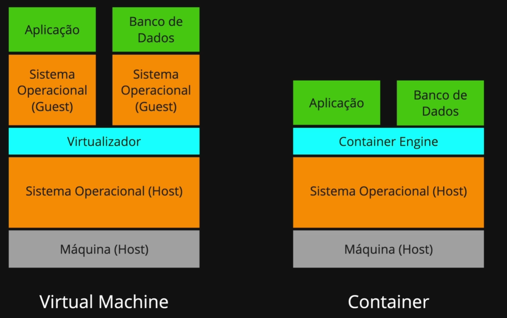

# 🚢 Introdução ao Docker e à Evolução dos Ambientes

## 🏗️ Como era antes do Docker?

No passado, os ambientes de desenvolvimento e produção eram montados “na mão”. Isso incluía:

- O desenvolvedor configurava tudo localmente (banco, servidor, dependências).
- Havia um servidor de testes com configurações _parecidas_, mas não idênticas.
- Já a produção, geralmente, tinha ajustes ainda mais diferentes.

**Resultado?** Funcionava no dev, mas quebrava na produção.  
Ambientes distintos geravam erros difíceis de rastrear e reproduzir. Um verdadeiro caos.

## 🖥️ A chegada das Máquinas Virtuais (VMs)

Para organizar esse cenário, surgiram as **máquinas virtuais**:

- Cada app rodava em um sistema operacional isolado.
- Era possível simular melhor o ambiente de produção.
- Porém, VMs consomem **muita memória e processamento**.
- O provisionamento ainda era **lento e trabalhoso**.

## 🐳 A chegada do Docker

O Docker mudou o jogo com os **containers**:

- Leves, rápidos e fáceis de replicar.
- Compartilham o kernel do sistema operacional, ocupando **menos recursos** que uma VM.
- Permitem empacotar o app com tudo que ele precisa (dependências, configs, SO) em **um único container**.
- Ideal para **desenvolvimento, testes, produção e backups**, promovendo **padronização e agilidade**.



> **Resumo**: Docker tornou possível criar ambientes confiáveis, portáveis e previsíveis — do desenvolvimento à produção.

---

# 🐋 Usando Docker

## ✅ Verificando a instalação

Verifique se o Docker está disponível via terminal. Caso ainda não tenha instalado, acesse o site oficial e baixe o Docker Desktop para o seu sistema operacional.

```powershell
# Verifica a versão do Docker
docker --version

# Verifica a versão do docker-compose (modo legado)
docker-compose --version

# Forma atual recomendada (sem hífen)
docker compose version
```

---

## 📄 Criando o arquivo `compose.yaml`

**YAML** — acrônimo recursivo para "YAML Ain’t Markup Language".  
É um formato legível para humanos, baseado em indentação (sem uso de chaves ou colchetes).

Em versões anteriores, o arquivo compose era chamado de `docker-compose.yaml`.

> Dica: use **espaços** em vez de **tabs** — alguns editores convertem automaticamente.

### Estrutura básica

```yaml
services:
  database: ...
  mailcatcher: ...
  outros-serviços: ...
```

---

## 🐋 Estrutura de uso do Docker

1. Criamos um **Dockerfile**
2. Compilamos esse Dockerfile para gerar uma **imagem** (um binário, como um `.exe`)
3. Essa imagem é usada para subir um **container**
4. Imagens podem ser compartilhadas via **Docker Hub** (como fazemos com códigos no GitHub)

---

## 🔝 Subindo uma imagem de banco de dados

Vamos especificar uma imagem do PostgreSQL, preferencialmente uma versão Alpine (mais leve).

```yaml
services:
  database:
    image: "postgres:16.0-alpine3.18"
```

> Versões _alpine_ são otimizadas para consumo mínimo de recursos, baseadas no Alpine Linux.

Suba o container:

```powershell
docker compose up
```

---

## ⚙️ Adicionando variáveis de ambiente e portas

Vamos configurar a senha padrão e mapear a porta local:

```yaml
services:
  database:
    image: "postgres:16.0-alpine3.18"
    environment:
      POSTGRES_PASSWORD: "local_password"
    ports:
      - "5432:5432"
```

> `ports`: `"host:container"` — porta externa (máquina local) mapeada para a interna (container).

---

## 🔍 Comandos úteis do Docker

```powershell
# Ver containers ativos
docker ps

# Ver todos os containers (inclusive parados)
docker ps -a

# Ver logs de um container
docker logs NOME-DO-CONTAINER
```

### Códigos de saída

Se o container falhar, analise o **Exit Code**:

- `255` — erro inesperado (saída abrupta)
- `0` — execução bem-sucedida

---

## 🔄 Rodando o container em background (modo detach)

```powershell
# Sobe os containers e libera o terminal
docker compose up -d

# Força a recriação dos containers após alterações
docker compose up -d --force-recreate
```

---

## 🧪 Acessando o PostgreSQL via cliente oficial

Para realizar consultas no banco PostgreSQL direto do terminal, use o cliente oficial:

```powershell
# Atualiza os pacotes do Ubuntu
sudo apt update

# Instala o cliente do PostgreSQL
sudo apt install postgresql-client
```

Acesse com o comando `psql`:

```powershell
psql --host=localhost --username=postgres --port=5432

# Informe a senha definida no compose.
# Para sair do console, use: \q
```

---

## 🧹 Encerrando e organizando os serviços

Para parar os containers:

```powershell
docker compose down
```

Por padrão de organização, o `compose.yaml` pode ficar dentro de uma pasta `infra`. Nesse caso, utilize:

```powershell
docker compose -f infra/compose.yaml up
```
