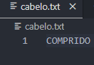

# Git Branches

Uma Branch no git pode ser traduzida como um galho de uma arvore.

Seria uma ramificação, que se olharmos bem, se integra a arvore como um todo.

Fora do Git, se quisermos controlar alguma versão do código, fazemos um copia e cola

## Compreensão Nível 1

da pasta, colocando no final v1, v2 ou a data 202506061442...

O Git faz algo assim internamente, ele cria uma cópia do código.

A branch padrão do git é a principal ou `main`.

Até o momento, todas as alterações estavam sendo feitas diretamente nela.

Mas essa não é uma boa prática. E se quisermos trabalhar com uma versão paralela?

Ou testar configurações diferentes que podem quebrar todo o código da main?

```powershell
# verifica qual a branch atual em uso
git branch

# retorno do console. O asterisco indica a branch atual
* main
```

Então pra testar alterações, vamos criar um novo arquivo e fazer um commit.

```powershell
# criado cabelo.txt
# conteúdo: COMPRIDO
# então verifico se esse arquivo esta no controle do git
git status

# Untracked files:
# cabelo.txt

# adiciono ele ao controle de versão do git e gravo ele com um commit
# na branch atual, que é a main
git add cabelo.txt
git commit -m 'adicionando cabelo.txt'
```

### Tabela rápida de desfazer no Git

| Situação                                      | Comando                     | Observação                                                                         |
| --------------------------------------------- | --------------------------- | ---------------------------------------------------------------------------------- |
| Adicionei arquivo com `git add` por engano    | `git reset HEAD <arquivo>`  | Remove do staging (seguro).                                                        |
| Adicionei tudo com `git add .`                | `git reset HEAD`            | Remove tudo do staging (seguro).                                                   |
| Quero remover o arquivo do staging e do disco | `git rm --cached <arquivo>` | Remove do staging, mantém no disco (caso sem `--cached`, apaga do disco).          |
| Comitei algo errado (último commit)           | `git reset --soft HEAD~1`   | Volta o commit, mantém alterações no staging.                                      |
| Comitei algo errado e quero editar            | `git commit --amend`        | Edita o último commit.                                                             |
| Desfazer mudanças no arquivo (antes do add)   | `git checkout -- <arquivo>` | Restaura o arquivo como está no último commit (perigoso, perde alterações locais). |
| Desfazer tudo (perigoso)                      | `git reset --hard`          | Reseta tudo (commit, staging, working dir). Cuidado!                               |

### Criando outra Branch

Para criar outra branch, use `git branch nome-da-nova-branch`.

```powershell
# cria nova branch
git branch tamanho-do-cabelo

# verifica as branches disponíveis
git branch

# log
# @thiagokj ➜ /workspaces/clone-tabnews (main) $ git branch
# * main
#   tamanho-do-cabelo
```

No log foi criada a nova branch, porem, ainda estamos trabalhando na main.

Para trabalhar na nova branch, temos que fazer um `checkout` e mudar pra ela:

```powershell
# sai da branch atual e começa a trabalhar na branch selecionada
git checkout tamanho-do-cabelo

# log:
# @thiagokj ➜ /workspaces/clone-tabnews (main) $ git checkout tamanho-do-cabelo
# D       qual-branch-eu-estou.txt
# Switched to branch 'tamanho-do-cabelo'
# @thiagokj ➜ /workspaces/clone-tabnews (tamanho-do-cabelo) $ git branch
#   main
# * tamanho-do-cabelo
# @thiagokj ➜ /workspaces/clone-tabnews (tamanho-do-cabelo) $
```

Então, tudo o que for feito a partir de agora na branch `tamanho-do-cabelo`, não reflete para branch `main`.

Se apagar um arquivo aqui, ele será apagado apenas nessa `cópia` do projeto. Na main ele vai continuar existindo.

Ex: exclui o cabelo.txt.

Se voltar para main, ele ainda estará la.

Obs: se quiser voltar um arquivo excluído, use `git checkout -- nome-do-arquivo.extensao`

alterando o conteúdo de cabelo.txt -> COMPRIDO para CURTO

```powershell
# verificando alteração com git diff
git diff
# @thiagokj ➜ /workspaces/clone-tabnews (tamanho-do-cabelo) $ git diff
# diff --git a/cabelo.txt b/cabelo.txt
# index 96da7dc..ccdf642 100644
# --- a/cabelo.txt
# +++ b/cabelo.txt
# @@ -1 +1 @@
# -COMPRIDO
# +CURTO

# feito git add e git commit
git add tamanho-do-cabelo.txt
git commit -m 'altera `cabelo.txt` para `curto`'
```

Agora com o arquivo txt aberto, se fizer um checkout entre as branches, o conteúdo dele muda.

Isso porquê são cópias diferentes. Na branch main não mudou o valor, ja na branch tamanho-do-cabelo, mudamos para CURTO.

Detalhe da branch `tamanho-do-cabelo`


Detalhe da branch `main`



Inspecionando o git log

```powershell
# git log na main
git log

# @thiagokj ➜ /workspaces/clone-tabnews (main) $ git log
# commit 8e9a24ad153f8a55dc7150c02bd242a170910ea5 (HEAD -> main)
# Author: Thiago Cajaíba <51033018+thiagokj@users.noreply.github.com>
# Date:   Fri Jun 6 18:11:24 2025 +0000
#
# adicionando cabelo.txt

# git log na branch tamanho-do-cabelo
git log

# @thiagokj ➜ /workspaces/clone-tabnews (tamanho-do-cabelo) $ git log
# commit b590e27f729b65fb227f4f85d73c28e747ea67b6 (HEAD -> tamanho-do-cabelo)
# Author: Thiago Cajaíba <51033018+thiagokj@users.noreply.github.com>
# Date:   Fri Jun 6 18:34:27 2025 +0000
#
# altera `cabelo.txt` para `curto`
#
# commit 8e9a24ad153f8a55dc7150c02bd242a170910ea5 (main)
# Author: Thiago Cajaíba <51033018+thiagokj@users.noreply.github.com>
# Date:   Fri Jun 6 18:11:24 2025 +0000
#
# adicionando cabelo.txt
```

Veja que temos os histórico de commits, onde primeiro foi criado o arquivo cabelo.txt na `main`. Depois criamos a branch `tamanho-do-cabelo`, que é uma copia da main.

Foi feita alteração no cabelo.txt, apenas na branch `tamanho-do-cabelo`.

## Compreensão Nível 2

Entendendo que as branches são como cópias do projeto, vamos descer um pouco mais a fundo.

Na verdade é feita uma cópia dos blobs dos commits.

Ou seja, o Git gera linhas do tempo com base nos commits realizados. Veja abaixo:


A cada vez que fazemos um `git add` e depois `git commit`, é gerado um blob com informações das alterações no projeto.

> Quando criamos um novo projeto e executamos o comando `git init`, o git
> cria uma pasta oculta `.git`, com toda a estrutura para controlar a versão do projeto.
> No caso do `git clone`, ele copia um projeto e também cria a estrutura de controle.

## Compreensão Nível 3

Aqui vamos entender um pouco mais sobre as branches. Na verdade, cada branch é como se fosse um apontamento para um commit especifico. Esse commit, está vinculado a uma arvore que está vinculada aos respectivos blobs.

O Git possui um ponteiro chamado de `HEAD`. Esse é o cara que demarca qual commit o git está olhando, usando o `hash` dele.


Vendo isso pelo terminal

```powershell
# o HEAD guarda a referencia
@thiagokj ➜ /workspaces/clone-tabnews (tamanho-do-cabelo) $ cat .git/HEAD
ref: refs/heads/tamanho-do-cabelo

# explorando mais, temos varios HEADS no git, e aqui na pasta
# o head para cada branch
@thiagokj ➜ /workspaces/clone-tabnews (tamanho-do-cabelo) $ cat .git/refs/heads/
main               tamanho-do-cabelo
@thiagokj ➜ /workspaces/clone-tabnews (tamanho-do-cabelo) $ cat .git/refs/heads/

# se quisermos ver o que tem dentro da branch tamanho-do-cabelo
# vemos o valor do rash
@thiagokj ➜ /workspaces/clone-tabnews (tamanho-do-cabelo) $ cat .git/refs/heads/tamanho-do-cabelo
b590e27f729b65fb227f4f85d73c28e747ea67b6
```

E pra ver agora no git log, ficou mais fácil:

```powershell
# a frente do commit, temos o exato hash b590...
@thiagokj ➜ /workspaces/clone-tabnews (tamanho-do-cabelo) $ git log
commit b590e27f729b65fb227f4f85d73c28e747ea67b6 (HEAD -> tamanho-do-cabelo)
Author: Thiago Cajaíba <51033018+thiagokj@users.noreply.github.com>
```

Então se listarmos o que tem dentro dessa pasta:

```powershell
# aqui temos o apontamento para cada commit
@thiagokj ➜ /workspaces/clone-tabnews (tamanho-do-cabelo) $ ls -l .git/refs/heads
total 8
-rw-rw-rw- 1 codespace codespace 41 Jun  6 18:11 main
-rw-rw-rw- 1 codespace codespace 41 Jun  6 18:34 tamanho-do-cabelo
```

Toda vez que é feito um novo commit, o ponteiro é atualizado dinamicamente para o novo hash, conforme a branch.


Vimos na imagem que o HEAD é movido para nova branch no momento da criação.

Agora, se for feito um novo commit, é criado um novo hash, e o head será movido pra ele, conforme a branch que ele estiver apontando.


É tão flexível, que podemos mover na linha do tempo não só pelas branches, mas também
por qualquer hash, bastando usar o `git checkout +4-primeiros-digitos-do-hash`

```powershell
# voltando pro 1º commit desse projeto
@thiagokj ➜ /workspaces/clone-tabnews (tamanho-do-cabelo) $ git checkout 60ab
Note: switching to '60ab'.

You are in 'detached HEAD' state. You can look around, make experimental
changes and commit them, and you can discard any commits you make in this
state without impacting any branches by switching back to a branch.

If you want to create a new branch to retain commits you create, you may
do so (now or later) by using -c with the switch command. Example:

  git switch -c <new-branch-name>

Or undo this operation with:

  git switch -

Turn off this advice by setting config variable advice.detachedHead to false

HEAD is now at 60ab175 Create README

# olha que legal, não tinha quase nada, só mato kkk
@thiagokj ➜ /workspaces/clone-tabnews (60ab175) $ ls
README  docs  models  node_modules

# voltando pra branch nova
@thiagokj ➜ /workspaces/clone-tabnews (60ab175) $ git checkout tamanho-do-cabelo
Previous HEAD position was 60ab175 Create README
Switched to branch 'tamanho-do-cabelo'

# olha os arquivos e pastas de novo
@thiagokj ➜ /workspaces/clone-tabnews (tamanho-do-cabelo) $ ls
README.md   docs   jest.config.js  models        package-lock.json  pages
cabelo.txt  infra  jsconfig.json   node_modules  package.json       tests
```
