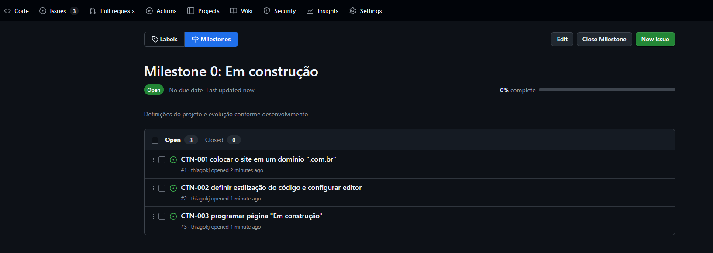
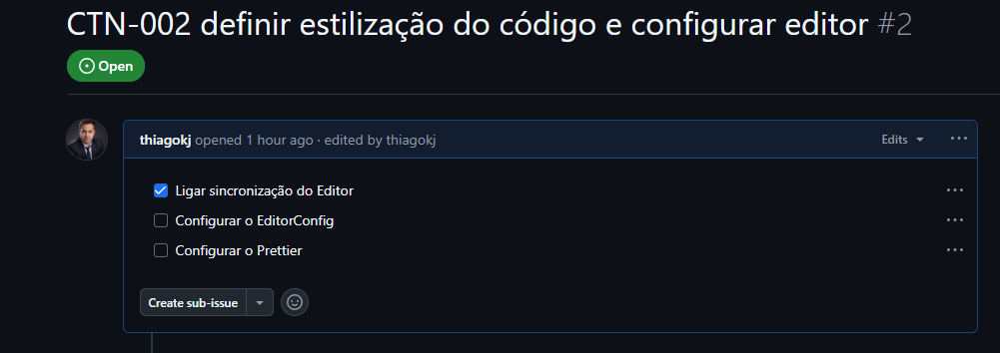

# ☑️ Organização

Tudo o que fazemos na vida, pode ser feito de uma forma mais efetiva.

Planejamento sobre as tarefas, nos da clareza e organização.

Pra valer a pena algo, pra ter aquela motivação pra realizar algo, o cérebro sempre faz o calculo do SALDO.

Esse SALDO vai nos dizer pra fazer ou não qualquer coisa. Por isso, devemos sair dessa armadilha mental.

Organizar é necessário. Quebrar um projeto em tarefas, passando do MACRO para o MICRO, tornando cada pequeno progresso algo viável e massa de se atingir.

Vamos aplicar isso no GitHub, usando os Milestones e Issues. 

## 🪨 Milestones e Issues

**Milestone** - Tarefa Macro representando uma grande entrega.
**Issue** - Tarefa micro representando uma parte de uma grande entrega, atendendo uma necessidade especifica, resolvendo um problema e cenários menores.

A melhor prática é criar uma tarefa inicial ZERO, ou Milestone 0: Em construção.

Acesse o repositório do projeto no GitHub, e acesse Issues -> Milestones.

Não da pra acertar tudo ao criar um novo projeto, mas aqui é possível ir trabalhando as ideias que serão revisadas conforme evolução.

Temos que buscar a dopamina aqui. Sim, somos guiados pela dopamina pra jogos, sair com amigos, ir pra festas, igreja, bares, etc.

E aqui não é diferente. Se tiver coisas positivas acontecendo, teremos o estimulo pra realizar.

Siga o fluxo : Início, Progresso e Conclusão. Abaixo exemplo da organização proposta:



Obs: **CTN-XXX** significa **C**lone **T**ab **N**ews - Numero sequencial da tarefa.

É isso!

## 👨🏻‍💻 Code Styles

A melhor forma de trabalhar sozinho ou equipe é seguir as regras de padronização do estilo de código.

Pular ou não linhas, aspas simples, palavras chaves pulando linhas e usando tabs ou espaços, letras maiúsculas, camelCase, snake_case, PascalCase...

Isso facilita a manutenção e integração da equipe.

Para criar sub-tarefas dentro da issue, use traços e colchetes assim:

```powershell
# - [ ] tarefa1
# - [ ] tarefa2
```
- [ ] tarefa1
- [ ] tarefa2



Assim fica muito fácil de atualizar os status!

Habilite a sincronização do editor no GitHub com sua conta do VSCode.

### 📝 Padronizando com EditorConfig

Crie um arquivo na raiz do projeto chamado **.editorconfig**. Adicione as seguintes linhas

```bash
root = true // Delimita a aplicação da configuração ao diretório.

[*] // Aplica em todas as linguagens. Pode ser delimitado com [*.{js,cs}]. No caso Csharp e javascript

indent_style = space
indent_size = 2
```

Instale a extensão do [EditorConfig](https://marketplace.visualstudio.com/items?itemName=EditorConfig.EditorConfig).