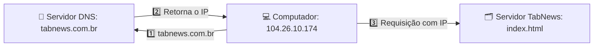

# 📡 DNS - Sistema de nomes de domínio

A comunicação entre computadores na internet é feita via TCP/IP. Partindo pra um resumo do resumo: pense como números de celular e sua agenda de contatos.

Dificilmente decoramos o numero pra ligar, colocamos o NOME do contato. Ex: Contato `Thiago Dev` - 11 9 9999-9999

O DNS faz a essa identificação / resolução / tradução do nome do site para o IP. Ex: `tabnews.com.br` - 104.26.10.174

É como um grande banco de dados com a lista que faz o DE/PARA para cada endereço na internet.

Fluxo:

Passo a passo:

1. O computador solicita o `endereço IP` do site `tabnews.com.br` ao servidor DNS.
1. O servidor DNS responde informando o `IP correspondente` ao domínio.
1. Com o IP em mãos, o computador acessa o `servidor do TabNews` e requisita a página desejada.

# 📝 Registro de domínio

Podemos comprar e registrar um domínio em `registradores` como o registro.br ou a hostinger.com, por exemplo.

Após a compra, o domínio `thiagokj.site` fica registrado nos servidores padrão do provedor onde foi adquirido.

Para hospedar o domínio em outra plataforma, basta seguir as instruções do serviço desejado e configurar os novos servidores DNS conforme indicado.

Ex: Para usar o serviço da CloudFlare, pode ser indicado o servidor de DNS `tony.ns.cloudflare.com` onde foi feito o registro do seu domínio.

Exemplo na Vercel

Após alterar o DNS na CloudFlare, Vercel e outros - acompanhe a propagação com ferramentas como o [WhatsMyDNS](https://www.whatsmydns.net/).

Dica extra: É possível criar sub-domínios para cada projeto, aumentando as possibilidades de organização. Ex: [Clone Tabnews](https://clone-tabnews.thiagokj.site/)
