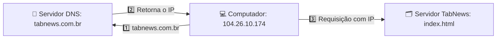
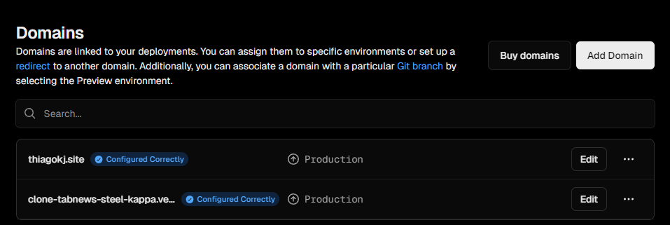

# 📡 DNS - Sistema de nomes de domínio

A comunicação entre computadores na internet é feita via TCP/IP. Partindo pra um resumo do resumo: pense como números de celular e sua agenda de contatos.

Dificilmente decoramos o numero pra ligar, colocamos o NOME do contato. Ex: Contato `Thiago Dev` - 11 9 9999-9999

O DNS faz a essa identificação / resolução / tradução do nome do site para o IP. Ex: `tabnews.com.br` - 104.26.10.174

É como um grande banco de dados com a lista que faz o DE/PARA para cada endereço na internet.

Fluxo:



Passo a passo:

1. O computador solicita o `endereço IP` do site `tabnews.com.br` ao servidor DNS.
1. O servidor DNS responde informando o `IP correspondente` ao domínio.
1. Com o IP em mãos, o computador acessa o `servidor do TabNews` e requisita a página desejada.

## 📝 Registro de domínio

Podemos comprar e registrar um domínio em `registradores` como o registro.br ou a hostinger.com, por exemplo.

Após a compra, o domínio `thiagokj.site` fica registrado nos servidores padrão do provedor onde foi adquirido.

Para hospedar o domínio em outra plataforma, basta seguir as instruções do serviço desejado e configurar os novos servidores DNS conforme indicado.

Ex: Para usar o serviço da CloudFlare, pode ser indicado o servidor de DNS `tony.ns.cloudflare.com` onde foi feito o registro do seu domínio.

Exemplo na Vercel



Após alterar o DNS na CloudFlare, Vercel e outros - acompanhe a propagação com ferramentas como o [WhatsMyDNS](https://www.whatsmydns.net/).

Dica extra: É possível criar sub-domínios para cada projeto, aumentando as possibilidades de organização. Ex: [Clone Tabnews](https://clone-tabnews.thiagokj.site/)

## ⛏️ Cavando com DIG

Pra termos mais exemplos aqui, abaixo temos o esquema de consulta de registros:


🧭 Fluxo de consulta DNS (papéis):
Registrant (Você): A pessoa ou empresa que registra um domínio, como seu-dominio.br.

Registrar (Ex: Registro.br): A empresa autorizada a vender domínios. Você interage com ela para registrar, renovar e configurar o domínio.

Registry (Ex: NIC.br): A entidade responsável por manter a base de dados oficial de todos os domínios de um TLD específico (como .br). Ela repassa ao TLD os servidores DNS responsáveis.

Root Server: É o ponto inicial da busca DNS. Ele aponta para os servidores responsáveis por cada TLD (como .br, .com, etc.).

TLD Server (Ex: a.auto.dns.br): Servidores que cuidam de domínios de nível superior. Eles informam quais são os servidores autoritativos para domínios como seu-dominio.br.

Authoritative Server (Ex: DNS da sua hospedagem): Tem a resposta final e correta, como o IP do seu site. Esse servidor resolve o domínio para um endereço IP.

Um pouco mais sobre TLD e AS:

**TLD (Top-Level Domain)**: É a parte final de um domínio, como `.com`, `.org` ou `.br`. Indica a categoria ou país do site.

**Authoritative Server**: É o servidor DNS que tem a resposta oficial para um domínio — ele sabe o IP correto. Normalmente, é o servidor da sua hospedagem, do seu provedor de DNS (como Cloudflare, Vercel, etc.) ou até um servidor seu, se você gerenciar o DNS diretamente.

No Codespaces, podemos usar a ferramenta DIG pra cavucar informações sobre rastreio de domínios.

```bash
# Atualiza pacotes
sudo apt update

# Instala o dig
sudo apt install dnsutils

# Versão do dig
dig -v
```

Comandos uteis com o dig

```bash
# Consulta básica de DNS. Ex: dig curso.dev
dig nome-do-dominio.net

# Consulta com todo o caminho percorrido de DNS. Ex: dig curso.dev +trace
dig nome-do-dominio.net +trace

# Consulta por tipo de registro. Ex: dig curso.dev TXT
dig nome-do-dominio.com TXT

# Filtrar a saída de um txt
dig nome-do-dominio.io TXT +short
```

Com o `dig`, é possível ver onde o domínio está registrado e qual IP é retornado. Esse IP pode variar por causa do **GeoDNS**, um recurso do **BIND** — o software DNS mais usado — que responde com base na localização do usuário.
