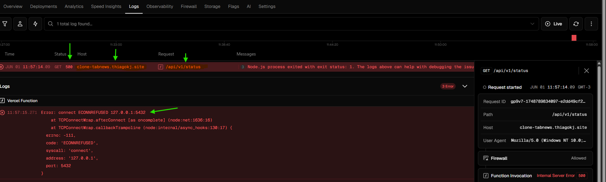
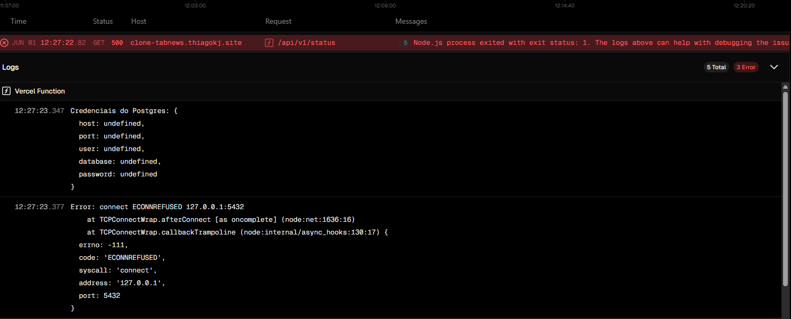

# 🐞 Resolvendo Bugs em Produção

Legal, fizemos os ajustes no endpoint `status` e ele ficou limpo e funcional.

Porém, o que funcionou perfeitamente nos testes locais... em produção quebrou! Apareceu um erro 500 (erro interno no servidor).

Vamos então ajustar isso e entender a causa.

## Isolando o Problema

Uma das melhores estratégias é **isolar o problema** para poder tratá-lo com mais precisão.

Se o problema ocorre sempre da mesma forma (ou seja, não é intermitente), já temos uma vantagem: o comportamento é previsível.

Neste projeto, podemos inspecionar os `logs` que são gerados no servidor de produção.

> 💡 Curiosidade: "LOG" vem dos navios antigos, onde se registrava a velocidade e outros dados de navegação em um diário de bordo.

Por exemplo, ao tentar acessar o endpoint em produção `https://clone-tabnews.thiagokj.site/api/v1/status`, recebemos um erro 500.

Para investigar, acessamos a hospedagem (neste caso, a **Vercel**) e vamos em:  
`Menu -> Nome do Projeto -> Logs`.



Sempre que estiver analisando logs, procure por palavras-chave como:  
**porta, ip, mensagem de erro, tipo de exceção, variável de ambiente**.

Na imagem acima, o log destaca o endereço que causou o problema, mostrando uma falha na conexão com o IP do servidor e a porta do banco de dados.

## 🚀 Lançando os erros

Para obter logs mais claros e facilitar a identificação do problema, podemos melhorar a forma como tratamos as exceções durante a conexão com o banco:

```js
// trecho database.js
try {
  await client.connect(); // Tenta abrir a conexão com o banco de dados
  const result = await client.query(queryObject);
  return result;
} catch (error) {
  console.log(error); // Loga o erro no console (será capturado nos logs da Vercel)
  throw error; // Lança o erro para que o Next.js trate e gere o erro 500
} finally {
  client.end(); // Fecha a conexão com o banco de dados
}
```

> 📝 **Dica prática:**  
> Usar `throw` garante que o erro continue sendo propagado. No caso do Next.js, ele transforma a falha em um erro 500 e mantém o log visível.

Após fazer um novo deploy e acompanhar os logs, agora temos informações mais detalhadas:



> 💡 Essa é uma excelente prática durante testes: habilitar logs nos pontos críticos, executar os testes normalmente e inspecionar os registros para obter diagnósticos precisos.

Analisando o log, identificamos dois pontos:

- As variáveis de ambiente necessárias estão indefinidas na Vercel.
- Ainda não configuramos um banco de dados para produção, estamos apenas com o banco local (via Docker).

---

Com esses diagnósticos em mãos, conseguimos agora seguir para a próxima etapa: **preparar as variáveis de ambiente e o banco de dados de produção**.
