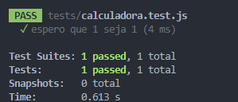
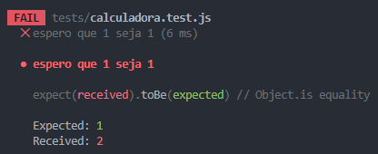

# 🟢 Testes Automatizados

Continuando na mesma linha de raciocínio, construir uma aplicação em 2025 e não aproveitar e inserir a parte de testes é um desperdício.

Só há vantagens ao longo do processo. Sim, se perde um pouco mais de tempo para configurar e criar os testes.

Porém, se recupera esse tempo posteriormente, pois não será necessário ficar testando manualmente o sistema a cada alteração.

E o que é esse tal de teste automatizado?

Resumindo, é um código que testa o código o seu código. 🔴🟢

Então, você define o retorno esperado criando casos de teste. Ai basta executar a rotina que faz essa verificação.

## ✔️ Instalando o Test Runner

Vamos usar o Jest, uma ferramenta popular, simples e atualizada.

```powershell
npm install --save-dev jest@29.6.2
```

Adicione aos scripts no package.json, o uso do `jest` por linha de comando:

```js
  "scripts": {
    "dev": "next dev",
    "lint:check": "prettier --check .",
    "lint:fix": "prettier --write .",
    "test": "jest",
    "test:watch": "jest --watch"
  },
```

Pra executar, utilize `npm run test` ou apenas `npm test`. Se quiser ficar vigiando e testando a cada alteração, use o `npm test:watch`.

## 🏹 Criando testes

Para identificar arquivos de teste para o Jest, salve com a extensão `.test.js`. Ex: `calculadora.test.js`.

A estrutura básica de um caso de teste é usar uma função `test(param1, param2)`, passando o nome do teste primeiro e depois uma função de `callback`.

```js
// calculadora.test.js
test("nome do teste", callbackFunction);

function callbackFunction() {}
```

Uma função de `callback` é uma função passada como argumento para outra função, que será executada depois de algum momento específico. 🧠

Tipo: "Ei, quando terminar essa tarefa, chame essa função aqui por mim."

```js
// "Quero rodar um teste com esse nome: soma numero, e a lógica do teste está dentro da função de callback: somaNumero."
test("soma numero", somaNumero);
```

Callback é só isso: **uma função que você passa para outra, e ela vai chamar quando quiser**.

Deixando o teste mais limpo com uma função anônima:

```js
test("chama função anônima", function () {
  console.log("chamando a função anônima");
});
```

Escrevendo menos código e fazendo a mesma coisa com a função anônima:

```js
test("chama função anônima com arrow function", () => {
  console.log(
    "chamando a callbackFunction, que no caso é uma função anônima, com a setinha, arrow function",
  );
});
```

### 🫷🏻 Expect e ToBe, testes com retorno esperado

Os testes de exemplo apenas mostraram um log, uma mensagem. Precisamos agora testar uma condição, **esperando** que retorne algo positivo ou negativo.

```js
test("espero que 1 seja 1", () => {
  expect(1).toBe(1);
});
```



O valor no `expect` deve ser gerado dinamicamente pela aplicação e o valor no `toBe` de ser de fato o valor **Hardcoded**, o valor esperado que fica gravado na rotina de teste.

```js
test("espero que 1 seja 1", () => {
  expect(2).toBe(1);
});
```



Nesse exemplo, o valor recebido foi o **2**, mas o esperado era pra ser o **1**.
